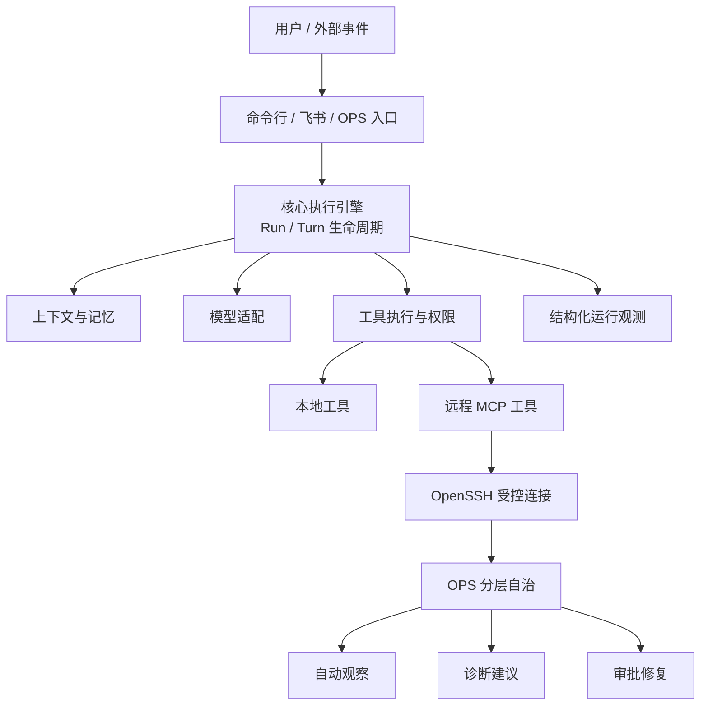
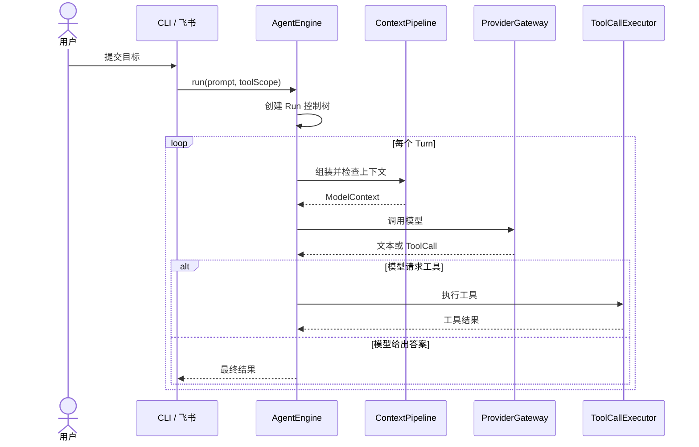
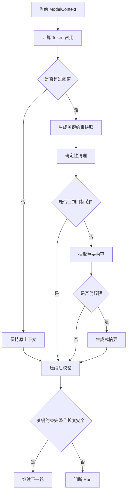
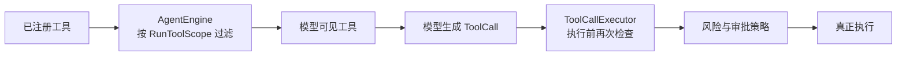
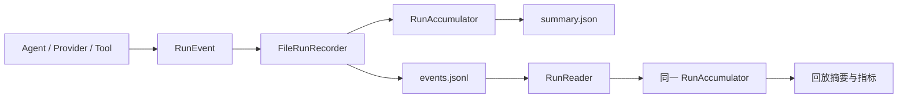
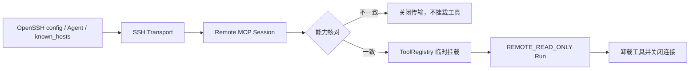
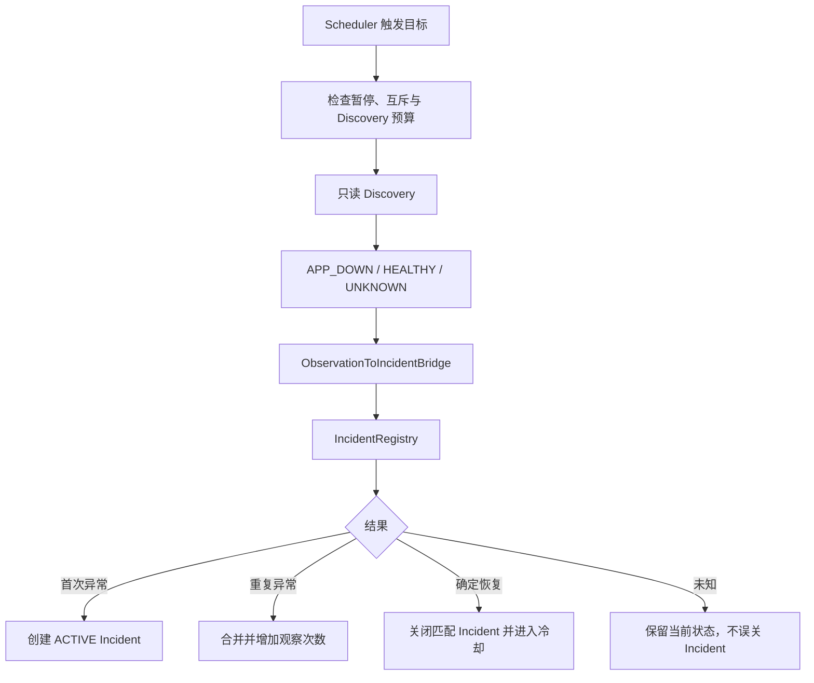
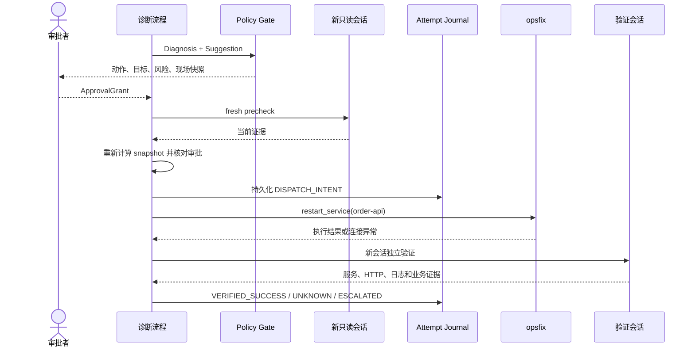
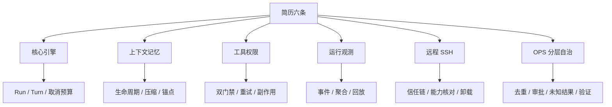

# Clawkit 简历与面试叙事指南

> 私人面试准备手册，不作为对外产品承诺
>
> 代码快照：2026-09-20 当前工作区（含 OPS-3A CLI Fixture 演练与离线 Console）
>
> 使用原则：简历表述以当前代码为依据；测试能力、真实使用和生产能力必须分开说明

---

## 目录

0. [这份手册怎么使用](#0-这份手册怎么使用)
1. [简历最终版本](#1-简历最终版本)
2. [先建立完整的项目故事](#2-先建立完整的项目故事)
3. [核心执行引擎](#3-核心执行引擎)
4. [上下文与记忆](#4-上下文与记忆)
5. [工具与权限](#5-工具与权限)
6. [运行观测](#6-运行观测)
7. [远程 SSH](#7-远程-ssh)
8. [OPS 分层自治](#8-ops-分层自治)
9. [三条端到端案例](#9-三条端到端案例)
10. [面试表达与反方追问](#10-面试表达与反方追问)
11. [事实边界与代码索引](#11-事实边界与代码索引)

---

## 0. 这份手册怎么使用

这不是第二份技术百科，也不要求背下全部类名。现有的 [项目全览与深度学习指南](project-deep-dive-guide.md) 继续承担技术参考作用；本手册只解决三个问题：

1. 简历中的六句话分别在讲什么；
2. 面试官从一句话继续追问时，怎样由浅入深展开；
3. 怎样保持强叙事，同时不把代码建设、测试验收和生产效果混为一谈。

### 0.1 三种阅读方式

| 准备时间 | 阅读范围 | 应达到的结果 |
| --- | --- | --- |
| 5 分钟 | 第 1、2 章 | 能说出项目定位和六项能力的关系 |
| 30 分钟 | 每章的“30 秒”和“3 分钟”部分 | 能完成一轮常规项目面试 |
| 深度准备 | 每章完整阅读，再沿代码链接核对 | 能应对实现、取舍和边界追问 |

### 0.2 每项能力都按三层准备

```text
第一层：30 秒
回答“这句话是什么意思、解决了什么问题”

第二层：3 分钟
回答“整体怎样工作、关键组件怎样协作”

第三层：10 分钟
回答“代码怎样实现、失败时怎样处理、为什么这样取舍”
```

三层不是三份互相独立的答案。第一层给结论，第二层补流程，第三层才进入状态、持久化、并发和失败语义。

### 0.3 判断术语是否应该出现在简历中

一个技术词可以保留，前提是它至少说明下列两项：

- 处理对象是谁；
- 做了什么；
- 解决了什么问题；
- 能对应到哪段代码。

例如“实时摘要与离线回放复用同一聚合逻辑”可以保留，因为它明确说明两条路径共享统计规则。单独写“版本化、原子、限量、治理体系”则信息不足，应留到深挖层解释。

---

## 1. 简历最终版本

### 1.1 项目名称与介绍

**Clawkit｜Java 智能体执行平台（个人项目）**

**技术栈：** Java 21、Maven、MCP、OpenSSH、Docker、JUnit 5

**项目介绍：** 基于 Java 21 自研的智能体平台，围绕任务执行、上下文记忆、工具安全与过程追踪构建通用底座；以远程运维验证从只读诊断、审批修复到独立验证的受控闭环。

### 1.2 工作内容

- 设计智能体核心执行引擎，按任务和轮次统一调度模型、上下文、记忆与工具；命令行和飞书复用同一执行链路，子任务共享预算并支持级联取消。

- 分层管理本轮上下文、会话历史、任务状态与长期记忆，按相关性召回；上下文超限时分级压缩并校验关键约束，信息丢失则阻断执行。

- 统一内置与外部工具的注册、风险分级和执行入口，按任务过滤可见范围并在调用前二次校验；只读工具支持并行和安全重试，写工具经审批进入副作用状态机。

- 以结构化事件记录模型、工具、审批与上下文压缩过程，实时摘要与离线回放复用同一聚合逻辑；记录任务关系、工具重试、输出截断和参数脱敏，定位复杂执行链路。

- 复用系统 SSH 配置接入远程工具，握手时校验协议、服务身份、工具清单与能力指纹；每个任务仅开放白名单只读工具，连接结束自动移除。

- 面向远程服务故障将权限拆分为观察、诊断建议和审批执行；通过故障去重、执行前复查、结果未知阻断与独立验证避免重复修复和误操作。持续观察与写修复均在可丢弃 Fixture 中验收，真实服务器保持只读。

### 1.3 六条内容为什么这样排列

| 顺序 | 作用 | 回答的问题 |
| --- | --- | --- |
| 1. 核心执行引擎 | 建立平台主干 | 智能体怎样推进一次任务？ |
| 2. 上下文与记忆 | 管理模型输入和跨任务信息 | 模型每轮应该看到什么？ |
| 3. 工具与权限 | 控制模型可以采取的行动 | 模型怎样安全使用真实工具？ |
| 4. 运行观测 | 记录执行过程 | 出错后怎样还原发生了什么？ |
| 5. 远程 SSH | 把能力延伸到服务器 | 怎样接入远端而不开放任意命令？ |
| 6. OPS 分层自治 | 形成领域闭环 | 怎样从自动观察逐步走向受控执行？ |

前四条是通用 Agent 底座，第五条是能力接入，第六条是完整业务落地。这样讲可以避免项目被理解成“SSH 工具集合”，也避免只讲底层类而没有产品目标。

---

## 2. 先建立完整的项目故事

### 2.1 一句话定位

Clawkit 不是单纯的聊天机器人，也不是通用 SSH 客户端。它首先是一套能够组织多轮模型调用、上下文、记忆和工具执行的智能体底座，然后选择远程运维作为副作用风险最高、最适合验证这套底座的场景。

### 2.2 总体架构



### 2.3 一次普通任务怎样经过底座

```text
用户从命令行或飞书输入目标
→ 核心引擎创建 Run，建立预算和取消控制
→ 召回相关记忆，组装当前轮次上下文
→ 根据当前任务过滤模型可见工具
→ 调用模型，得到文本或工具请求
→ ToolCallExecutor 再次检查权限并执行工具
→ 工具结果回到下一轮上下文
→ 结构化事件持续记录模型、工具和审批过程
→ 模型给出最终结果或系统因取消、预算、超限而停止
```

这条主链是项目的稳定内核。ReAct、两阶段推理、计划执行和子任务只是不同的任务推进方式，不能各自复制工具权限、上下文和观测逻辑。

### 2.4 为什么选择运维作为落地场景

普通代码问答即使回答错误，通常只产生错误文本。运维工具可能访问真实服务器、修改服务状态，而且网络超时无法证明动作没有发生。它同时暴露出五类难题：

1. 证据可能过期、缺失或相互冲突；
2. 模型建议不能直接成为写操作；
3. 人工审批期间现场可能发生变化；
4. 远程超时后不能盲目重试；
5. 命令执行成功不代表业务已经恢复。

因此，OPS Loop 不是与 Agent 底座无关的第二个项目，而是对上下文、工具权限、过程追踪和失败恢复的综合验收。

### 2.5 30 秒项目介绍

> 我设计并实现了一个基于 Java 21 的智能体执行平台。核心引擎按任务和轮次统一组织模型、上下文、记忆和工具，并由命令行与飞书复用；工具调用经过可见范围过滤、执行前复查和写操作审批，整个过程记录为可回放事件。在此基础上，我通过 SSH 接入受限的远程工具，并把运维能力拆成自动观察、诊断建议和审批修复三个层级，形成从发现异常到独立验证的闭环。

### 2.6 三分钟项目介绍的顺序

1. 先说为什么需要一个统一的智能体执行引擎；
2. 再说上下文、记忆和工具为什么不能完全交给模型管理；
3. 接着说明结构化事件怎样还原复杂执行；
4. 然后讲 SSH 怎样把预定义能力安全接入当前任务；
5. 最后用 OPS 的观察、建议、审批执行三级说明如何控制自治权限；
6. 主动说明真实服务器保持只读，写操作闭环在可丢弃 Fixture 中验证。

---

## 3. 核心执行引擎

### 3.1 简历原句

> 设计智能体核心执行引擎，按任务和轮次统一调度模型、上下文、记忆与工具；命令行和飞书复用同一执行链路，子任务共享预算并支持级联取消。

### 3.2 这句话到底在讲什么

核心执行引擎是智能体接到目标后真正推进任务的部分。代码里经常称为 Agent Runtime，但面试时可以先说“核心执行引擎”：它负责什么时候调用模型、给模型哪些上下文、开放哪些工具、工具结果如何回到下一轮，以及任务什么时候结束。

### 3.3 第一层：30 秒回答

> 我没有把模型调用、工具执行和会话状态分别写在命令行或飞书入口中，而是集中到 `AgentEngine`。每次用户目标形成一个 Run，Run 内按 Turn 反复调用模型和工具；入口只负责收发消息。复杂任务可以拆成子任务，但主任务与子任务共享调用预算，主任务取消时子任务也会停止，避免入口切换或任务拆分破坏执行边界。

### 3.4 第二层：3 分钟架构

先区分三个执行层级：

| 层级 | 表达什么 | 典型数据 |
| --- | --- | --- |
| Run | 一次完整用户目标 | `runId`、父 Run、预算、截止时间、最终状态 |
| Turn | 一次模型判断和后续处理 | 当前上下文、模型响应、工具调用数量 |
| Tool Call | 一个具体外部动作 | 工具名、参数、权限、结果、失败类别 |



入口复用的含义不是“命令行和飞书代码相同”，而是二者最终进入同一个 `AgentEngine.run`。飞书负责接收回调、发送占位消息、批量更新流式内容；命令行负责终端输入和渲染。任务循环、上下文、权限和工具执行不因入口不同而改变。

### 3.5 第三层：10 分钟深挖

#### Run 怎样开始

[`AgentEngine.run`](../clawkit-engine/src/main/java/com/clawkit/engine/impl/AgentEngine.java) 接收用户目标和本次任务的工具范围，随后：

1. 创建 `runId` 和父 Run 关联；
2. 建立 [`CancellationTree`](../clawkit-reliability/src/main/java/com/clawkit/reliability/CancellationTree.java)；
3. 绑定 deadline、Token 预算、模型调用次数和工具调用次数；
4. 召回长期记忆与相关旧会话；
5. 进入 Turn 循环；
6. 在完成、取消、超时、预算耗尽或上下文失败时写入明确终态。

#### 子任务为什么要共享控制信号

假设主任务把代码审查拆成三个子任务。如果每个子任务都重新获得完整预算，拆分本身就会绕过限制；如果用户停止主任务，而子任务继续调用模型或执行工具，就会产生后台残留执行。

`CancellationTree.childOf(parent)` 继承父任务的截止时间和预算账本，并监听父任务取消。父任务取消后，Provider、Tool、SubAgent 和计划任务都收到相同的停止信号。

#### 为什么入口不能拥有自己的 Agent 循环

如果 CLI 和飞书各写一套循环，会出现：

- 工具过滤规则不一致；
- 一端支持审批，另一端绕过审批；
- 上下文压缩和记忆召回行为不同；
- 同一个错误在两个入口产生不同终态；
- 修复问题时必须同步修改多条主链。

[`AbstractImChannel`](../clawkit-im/src/main/java/com/clawkit/im/AbstractImChannel.java) 因此只负责把消息映射到同一个引擎，并监听 Token 与 AgentState 更新。飞书实现还对重复回调做事件去重，并限制消息编辑频率，避免流式 Token 直接打满接口。

### 3.6 一个具体场景

用户在飞书发送“检查项目里的远程工具为什么不可用”：

```text
飞书接收消息
→ 检查引擎是否正在处理其他任务
→ AgentEngine 创建 Run
→ 召回相关会话和记忆
→ ContextPipeline 组装本轮输入
→ 模型请求代码搜索或只读检查工具
→ ToolCallExecutor 执行并回注结果
→ 飞书根据 AgentState 更新“分析中 / 执行中 / 回复中”
→ 最终结果编辑到同一条消息
```

这个案例要表达的不是“做了飞书机器人”，而是同一执行内核可以被不同交互入口复用。

### 3.7 反方追问与回答

**问：为什么不用一个 while 循环直接调模型？**

因为真实任务还需要预算、取消、权限、观测和失败终态。如果这些能力散落在循环分支里，计划任务、子任务和不同入口很容易形成旁路。项目把 Run 控制、上下文、Provider 和工具都放到明确网关中。

**问：父子任务和线程父子关系一样吗？**

不一样。这里描述的是业务执行关系，不要求父子任务运行在同一线程。它们共享预算和取消语义，并通过 `parentRunId` 关联观测记录。

**问：支持很多执行模式是不是亮点？**

模式数量不是主要亮点。更重要的是不同模式复用同一工具入口、权限边界和运行观测。当前对这些模式的日常使用深度有限，面试中不把数量当作成熟度证据。

### 3.8 证据与边界

- `AgentEngine`、计划执行和子任务均有针对性测试；
- 飞书入口完成过真实端到端运行和基础体验优化；
- 当前飞书通道是轻量单用户关联，不是多租户 IM 会话平台；
- 多种推理模式完成了功能建设，但不是简历的主要效果指标。

---

## 4. 上下文与记忆

### 4.1 简历原句

> 分层管理本轮上下文、会话历史、任务状态与长期记忆，按相关性召回；上下文超限时分级压缩并校验关键约束，信息丢失则阻断执行。

### 4.2 这句话到底在讲什么

模型没有自动、永久且可靠的记忆。每次调用模型前，系统都要决定哪些信息进入当前输入；任务结束后，还要决定哪些事实只属于本次会话，哪些值得跨会话保留。

这项能力解决两个不同问题：

1. **信息生命周期**：本轮上下文、会话历史、任务临时状态和长期记忆不能混在一起；
2. **长度控制**：上下文过长时不能简单删除旧消息，必须保住任务目标、关键事实和安全约束。

### 4.3 第一层：30 秒回答

> 我把模型当前看到的材料、真实会话历史、任务临时状态和跨会话记忆分开管理，每轮只召回与当前目标相关的内容。上下文接近上限时，系统先确定必须保留的目标和约束，再逐级清理、抽取或生成摘要；压缩后重新校验关键内容，丢失约束或仍然超限时停止任务，而不是带着失真的上下文继续执行。

### 4.4 第二层：先理解四种信息

| 信息 | 生命周期 | 典型内容 | 是否直接长期保存 |
| --- | --- | --- | --- |
| 本轮上下文 | 一次模型调用 | 系统提示、会话片段、工具定义、相关记忆 | 否，每轮重建 |
| 会话历史 | 多个连续 Run | 用户消息、模型回复、工具调用与结果 | 用户保存或会话切换时落盘 |
| 任务临时状态 | 当前会话或任务 | 子目标、进度、临时结论 | 清空会话后消失 |
| 长期记忆 | 跨会话 | 用户偏好、项目决策、长期反馈 | 保存到独立记忆文件 |

关键原则是：**发给过模型的信息，不等于应该成为永久事实。** 工作区快照、运行提醒和召回的旧摘要都可以影响本轮判断，但不应被反复写回会话，造成信息自我复制。

### 4.5 一个具体的压缩场景

假设智能体正在完成一个跨文件修复任务，已经执行十几轮：

```text
用户目标：修复远程工具权限泄漏，并保持真实服务器只读

已经完成：
- 找到工具注册入口
- 确认 RunToolScope 的过滤位置
- 新增执行前校验测试

仍未完成：
- 运行相关回归测试
- 检查计划执行是否存在旁路

不可丢失的约束：
- 不开放真实服务器写权限
- 不覆盖用户已有修改
- 所有工具必须经过执行端校验

占用空间的大量内容：
- 多次代码搜索结果
- 重复的编译输出
- 已处理的旧工具日志
```

如果直接删除最旧消息，可能删掉最初的用户约束；如果只让模型自由总结，摘要可能保留“修复权限问题”，却遗漏“真实服务器只读”。正确流程是先确定不可丢失的最小任务状态，再压缩其他内容。



### 4.6 第三层：分级压缩怎样工作

[`DefaultContextPipeline`](../clawkit-context/src/main/java/com/clawkit/context/impl/DefaultContextPipeline.java) 根据预算报告选择不同等级：

| 等级 | 做什么 | 为什么先后这样安排 |
| --- | --- | --- |
| L0 不压缩 | 当前长度安全，保持原始上下文 | 不为了“优化”而主动损失信息 |
| L1 确定性清理 | 删除可重建、重复或低价值内容 | 不调用模型，结果稳定、成本低 |
| L2 抽取 | 从旧内容中保留与任务相关的片段 | 比完整历史短，比自由摘要更可控 |
| L3 生成摘要 | 对仍然过长的历史做语义压缩 | 成本和失真风险最高，最后使用 |
| L4 失败保护 | 关键约束丢失或压缩后仍超限 | 明确停止，不用错误上下文继续行动 |

这里的“分级”不是为了展示五个枚举，而是贯彻一个顺序：**先使用确定性、低损失的方法，只有仍然超限时才引入模型摘要。**

### 4.7 关键约束怎样保留下来

代码中的 `CompactionAnchor` 可以理解为“压缩后必须仍然成立的最小任务状态”。典型锚点包括：

- 用户确认的目标和约束；
- 已确认事实与反证；
- 当前未完成步骤；
- 外部动作的审批边界；
- 不能从普通历史重新推导的现场状态。

[`AnchorSnapshotPlanner`](../clawkit-context/src/main/java/com/clawkit/context/impl/AnchorSnapshotPlanner.java) 会：

1. 合并本次任务显式提供的锚点与历史兼容信息；
2. 优先选择 required 锚点；
3. 限制锚点数量和 Token 占用，防止保护区本身无限增长；
4. 为锚点生成规范快照和哈希；
5. 在压缩后检查 required 锚点是否仍然存在。

锚点还带来源约束。用户确认的事实可以作为强锚点；模型推导内容不能随意升级成“已确认事实”，避免模型先猜测、再通过压缩把猜测固化为事实。

### 4.8 Session 与 Memory 怎样协作

一次 Run 开始时，核心路径大致是：

```text
当前用户目标
→ 追加到 ConversationSession
→ 从长期记忆中召回最多 5 条相关内容
→ 从旧 Session 中选择最多 3 条相关摘要
→ 加入任务临时状态和运行提醒
→ ContextPipeline 组装本轮 ModelContext
```

[`ConversationSession`](../clawkit-engine/src/main/java/com/clawkit/engine/impl/ConversationSession.java) 保存真实对话和工具协议历史；[`DefaultMemoryHooks`](../clawkit-engine/src/main/java/com/clawkit/engine/impl/DefaultMemoryHooks.java) 负责 Run 前召回和 Run 后提取；[`DiskMemoryService`](../clawkit-memory/src/main/java/com/clawkit/memory/impl/DiskMemoryService.java) 将长期记忆保存为 Markdown 与索引。

长期记忆当前采用轻量关键词召回。它透明、无需向量数据库，但对同义表达和隐含语义的识别有限。自动提取也设置了轮数、消息数和上下文占用门槛，避免每轮都调用模型保存大量临时信息。

### 4.9 为什么不能采用更简单的方案

**方案一：只保留最近 N 条消息。**

优点是实现简单，但用户目标通常在最早位置，工具失败和未完成事项可能跨越多个 Turn。按位置删除无法区分冗余输出与关键约束。

**方案二：每次超限都让模型总结全部历史。**

模型摘要具有成本、延迟和失真风险，也可能把推测写成事实。项目先做确定性清理和抽取，只在必要时进入生成式摘要，并在摘要后验证锚点。

**方案三：把所有内容都保存进长期记忆。**

这会把工具输出、旧现场和临时结论带到未来任务中，造成事实污染。长期记忆只保存跨会话仍然有价值的信息。

### 4.10 失败语义

上下文管理失败不应该表现为“模型回答质量可能下降”，而应该形成明确终态：

- required 锚点过多或保护区超出预算：压缩失败；
- 压缩后 required 锚点丢失：压缩失败；
- 压缩后仍超过硬限制：压缩失败；
- 记忆召回失败：记录警告并降级为空，因为记忆不是安全控制事实；
- Session 文件损坏或版本无法读取：返回结构化错误，不把损坏内容交给模型。

这体现了不同信息的重要性：辅助记忆可以降级，关键任务约束不能带病继续。

### 4.11 反方追问与回答

**问：为什么叫锚点，不直接把用户原话全部保留？**

完整保留所有原话会让保护区本身无限增长。锚点保存的是维持任务正确性所需的最小状态，并限制数量和 Token；用户原始消息仍保存在 Session，压缩只影响本轮模型视图。

**问：生成摘要时模型把事实写错怎么办？**

关键事实不依赖摘要自由生成，而是通过规范锚点快照重新插入并在压缩后校验。无法证明 required 锚点仍完整时，Run 进入失败保护。

**问：关键词记忆是不是比较弱？**

是。当前选择轻量、透明和本地可解释的实现，适合项目阶段；语义召回、来源引用、可信度和有效期仍是后续方向。简历强调分层管理和召回机制，不宣称已经实现成熟知识库。

**问：这套压缩真实跑过多长的会话？**

当前完成了机制建设和针对性测试，但没有长期真实会话数据。可以解释压缩不变量和失败路径，不能声称已经证明长时间稳定运行或支撑极大 Token 规模。

### 4.12 证据与边界

- 分级压缩、预算判断、required anchor 保留和失败保护均有测试覆盖；
- Session 与长期记忆的保存、召回、冲突和损坏路径有独立测试；
- 当前没有长会话 dogfood 数据，不提供压缩率、任务成功率等效果指标；
- 长期记忆仍以关键词召回为主，不包装成完整 RAG 系统。

更详细的生命周期、存储格式和提取门槛见 [Dive Guide 第 4 章](project-deep-dive-guide.md#4-上下文sessionmemory-为什么不能混在一起)。

---

## 5. 工具与权限

### 5.1 简历原句

> 统一内置与外部工具的注册、风险分级和执行入口，按任务过滤可见范围并在调用前二次校验；只读工具支持并行和安全重试，写工具经审批进入副作用状态机。

### 5.2 这句话到底在讲什么

模型生成一个 Tool Call，只代表“建议调用这个工具”，不代表系统必须执行。真正执行前仍要确定：工具是否存在、当前任务是否有权看到它、参数是否合法、是否需要人工批准、能否重试，以及失败后是否可能已经产生副作用。

### 5.3 第一层：30 秒回答

> 我把内置工具和 MCP 外部工具统一注册到工具中心，并为每个工具描述只读性、风险等级和审批要求。工具交给模型前先按当前任务过滤，模型发起调用后执行器再检查一次，避免模型猜出隐藏工具名形成旁路。只读工具可以并行，并只在确认无副作用的失败类型下重试；写工具必须审批，并通过持久化状态记录派发和验证过程。

### 5.4 第二层：两道工具门禁



当前任务工具范围由 [`RunToolScope`](../clawkit-tools/src/main/java/com/clawkit/tools/RunToolScope.java) 表达：

| 范围 | 允许能力 |
| --- | --- |
| `ALL` | 默认兼容路径，使用全部已注册工具 |
| `LOCAL_ONLY` | 本地项目工具，不包含远程 MCP 工具 |
| `REMOTE_READ_ONLY` | 当前远程连接中的只读工具，不包含本地 Shell 和远程写工具 |
| `NO_TOOLS` | 纯聊天，不向模型提供工具 |

第一道门禁减少模型误选工具的可能；第二道门禁是真正的安全边界。即使模型从历史上下文中知道某个工具名，或者构造出一个隐藏工具调用，[`ToolCallExecutor`](../clawkit-engine/src/main/java/com/clawkit/engine/impl/ToolCallExecutor.java) 仍会返回 `BLOCKED`。

### 5.5 第三层：工具元数据为什么重要

工具名字没有安全含义。`read_logs` 可能偷偷写文件，`restart_service` 也可能被伪装成只读工具。项目通过 `ToolMetadata` 描述：

- 是否只读；
- 风险等级；
- 是否具有破坏性；
- 是否必须审批；
- 默认执行策略；
- 元数据来源是否可信。

外部工具提供的注解不能自动成为可信事实。来源未知或描述不完整时采用保守默认值；副作用工具还必须能生成 `ActionDescriptor`，否则 Side Effect Gate 未装配时直接拒绝执行。

### 5.6 为什么只读工具可以并行，写工具不可以

同一轮模型可能同时请求读取文件、搜索代码和查看状态。若所有工具串行，延迟会线性增加。执行器只在整批调用均满足只读、无副作用且元数据可信时并行执行，并设置统一 deadline；取消时为未完成槽位回填明确的 `CANCELLED` 结果，避免工具协议缺失返回值。

写操作不能直接并行，原因包括：

- 多个动作可能修改同一目标；
- 前一个动作会改变后一个动作的前置条件；
- 审批者看到的现场可能在派发前漂移；
- 其中一个结果未知时，其他动作会污染后续验证证据。

### 5.7 安全重试的边界

项目不按“异常就重试”处理工具失败。只有满足下列条件的读取调用才允许自动重试：

1. 工具声明只读且无副作用；
2. 元数据来源可信；
3. 失败类别在决策表中允许重试；
4. 仍有调用预算和剩余时间；
5. 取消信号尚未触发。

执行器在每次重试前重新申请预算，并把尝试次数、失败类别、恢复建议和最终停止原因记录到 RunEvent。写操作即使网络超时也不能自动套用这条逻辑，因为客户端无法证明服务端没有执行。

### 5.8 副作用状态机

写工具通过 [`SideEffectGate`](../clawkit-reliability/src/main/java/com/clawkit/reliability/gate/SideEffectGate.java) 进入 [`AttemptState`](../clawkit-reliability/src/main/java/com/clawkit/reliability/attempt/AttemptState.java) 状态机：

```text
CREATED
→ WAITING_APPROVAL / PRECHECKING
→ READY
→ DISPATCH_INTENT
→ EXECUTION_REPORTED
→ VERIFICATION_PENDING
→ VERIFYING
→ VERIFIED_SUCCESS
```

最关键的分界是 `DISPATCH_INTENT`。动作真正发往远端前，系统先持久化“即将派发”的事实。这个状态之后发生超时、进程崩溃或连接中断，不能再当作“确定没有执行”，而要进入 `OUTCOME_UNKNOWN`，保持目标互斥并重新采证。

这套状态机不是为了让简单文件写入变复杂，而是为远程副作用提供统一失败语义。OPS 修复只是第一个完整使用者。

### 5.9 反方追问与回答

**问：既然工具已经从模型可见列表隐藏，为什么执行前还要检查？**

模型输入属于软边界，历史消息、恶意提示或程序错误都可能构造隐藏工具名。真正的权限必须在执行点强制检查，不能依赖模型是否“看见”。

**问：人工审批是不是已经足够安全？**

审批只能证明人同意了某个动作，不能证明执行时现场仍然相同，也不能解决超时后的结果未知。因此还需要现场快照、执行前复查、派发记录和独立验证。

**问：为什么不让所有工具都串行，换取简单实现？**

可以，但会牺牲多个只读查询的延迟。项目把并行条件写成可验证规则：只读、无副作用、元数据可信；一旦存在内部工具或写工具就回到保守路径。

### 5.10 证据与边界

- 工具范围在模型可见列表和执行器中均有隔离测试；
- 只读并行、取消回填、失败分类和安全重试有针对性测试；
- 副作用状态机覆盖派发前失败、派发后未知、验证成功与人工接管；
- 当前不能声称通用分布式写入 exactly-once，只能通过持久化事实和结果未知阻断降低重复副作用风险。

---

## 6. 运行观测

### 6.1 简历原句

> 以结构化事件记录模型、工具、审批与上下文压缩过程，实时摘要与离线回放复用同一聚合逻辑；记录任务关系、工具重试、输出截断和参数脱敏，定位复杂执行链路。

### 6.2 这句话到底在讲什么

智能体的最终文本无法回答“为什么慢、在哪一轮失败、哪个工具重试过、审批是否被拒绝、上下文是否压缩”。运行观测把任务过程记录为有类型的事件，再由事件生成摘要和指标。

### 6.3 第一层：30 秒回答

> 我没有只记录最终回答，而是把 Run 开始结束、模型调用、工具执行、审批和上下文压缩写成结构化事件。任务进行中由聚合器生成实时摘要，事后回放历史事件时复用同一个聚合器，避免两套统计口径漂移。事件还记录任务关联、重试次数、输出截断和失败类别，敏感工具参数在落盘前脱敏。

### 6.4 第二层：事件怎样变成摘要



每个 Run 目录包含：

```text
.clawkit/runs/<run-id>/
├── events.jsonl
└── summary.json
```

- `events.jsonl` 保存按序发生的运行事实；
- `summary.json` 是可以重新生成的当前视图；
- [`FileRunRecorder`](../clawkit-observability/src/main/java/com/clawkit/observability/FileRunRecorder.java) 在记录事件时更新 [`RunAccumulator`](../clawkit-observability/src/main/java/com/clawkit/observability/RunAccumulator.java)；
- [`RunReader`](../clawkit-observability/src/main/java/com/clawkit/observability/RunReader.java) 回放时重新消费相同事件，也使用 `RunAccumulator`。

“复用同一聚合逻辑”是这条简历最值得追问的设计：事实只有一份，实时查看和离线分析只是两个消费时机。

### 6.5 第三层：事件记录哪些信息

事件 envelope 包含：

- `runId` 与 `parentRunId`；
- 当前 Turn；
- Run 内单调递增的 sequence；
- 事件发生时间与记录时间；
- 类型化 payload。

主要事件覆盖：

| 领域 | 记录内容 |
| --- | --- |
| Run / Turn | 开始、结束、最终状态、错误码 |
| Provider | 调用次数、失败、重试、耗时、输入输出 Token |
| Tool | 工具名、成功失败、耗时、尝试次数、失败类别 |
| Approval | 请求、批准、拒绝、参数修改 |
| Context | 峰值 Token、压缩次数、压缩失败、丢失锚点 |
| Output | 原始与返回字节、行数、截断原因、输入是否完整 |

工具输出统计不仅回答“有没有截断”，还区分原始数据、保留数据和实际返回模型的数据。这样可以判断问题来自远端输出过大、清洗策略还是模型只看到了不完整证据。

### 6.6 兼容与脱敏

[`RunEventCodec`](../clawkit-observability/src/main/java/com/clawkit/observability/RunEventCodec.java) 负责事件结构的编码与读取。遇到未来新增、当前版本不认识的事件类型时，保留为 `UnknownEventPayload`，不因一个未知事件让整条历史无法读取；旧字段缺失时使用兼容默认值。

[`ObservabilityRedactor`](../clawkit-observability/src/main/java/com/clawkit/observability/ObservabilityRedactor.java) 在事件落盘前遮蔽 token、password、secret 等敏感参数，避免工具参数和错误信息把连接凭据带入运行记录。

### 6.7 为什么运行事件不能代替副作用日志

两者的失败策略不同：

| 记录 | 用途 | 写入失败时怎样处理 |
| --- | --- | --- |
| RunEvent | 定位、统计、回放 | 可以降级，不能篡改工具真实结果 |
| Attempt Journal | 判断写操作是否已派发、是否允许重试 | 必须阻断写操作 |

如果把观测日志当作安全状态，一次磁盘写失败就可能导致重复写；如果把安全状态当作普通日志，系统又可能在证据缺失时继续派发。项目故意把两者分开。

### 6.8 反方追问与回答

**问：为什么不用普通日志加搜索？**

普通日志适合排查文本线索，但字段含义、事件关联和统计口径不稳定。结构化事件可以明确表达 Run、Turn、工具尝试和审批结果，并支持确定性聚合。

**问：`summary.json` 会不会和 `events.jsonl` 不一致？**

异常退出时摘要可能不完整，因此事件仍是事实源。读取器可以重新回放事件生成摘要；实时和离线共用聚合器减少了逻辑漂移，但不把摘要当作不可重建的安全事实。

**问：这算事件溯源架构吗？**

可以说运行观测采用追加事件和投影思想，但不要泛化成整个业务系统的 Event Sourcing。副作用状态仍有独立 Journal 和状态机，两者职责不同。

### 6.9 证据与边界

- 事件编解码、未知事件兼容、实时聚合和回放有独立测试；
- Provider、工具、审批、压缩和父子 Run 关联均有事件入口；
- 运行观测用于定位和评测，不承诺强持久化；
- 当前重点是文件事件与摘要，没有建设分布式链路追踪平台。

---

## 7. 远程 SSH

### 7.1 简历原句

> 复用系统 SSH 配置接入远程工具，握手时校验协议、服务身份、工具清单与能力指纹；每个任务仅开放白名单只读工具，连接结束自动移除。

### 7.2 这句话到底在讲什么

项目没有让模型拼接 `ssh host command`，也不读取和托管用户私钥。它复用 OpenSSH 已有的 Host 别名、Agent 和 known_hosts 建立受控传输，再通过 MCP 暴露预定义工具。连接成功后还要确认远端提供的能力与本地预期完全一致。

### 7.3 第一层：30 秒回答

> 我复用用户已有的 OpenSSH 配置发现和连接服务器，不在项目中保存私钥路径或密钥内容。SSH 只负责启动受限的远程 MCP 服务，握手后校验服务名、协议版本、能力配置和工具集合；任何不一致都会关闭连接。通过校验后，远程只读工具才临时加入当前任务，断开时先从工具中心移除，避免能力泄漏到后续任务。

### 7.4 第二层：一次远程连接

```text
读取 OpenSSH Host 别名
→ 用户选择并登记目标
→ 解析内置只读能力配置
→ 使用系统 ssh 建立进程传输
→ MCP initialize
→ tools/list
→ 核对服务身份、协议、profile、工具集合与合同哈希
→ 全部一致后挂载远程工具
→ 当前 Run 使用 REMOTE_READ_ONLY
→ 断开时先卸载工具，再关闭 MCP 与 SSH
```



### 7.5 第三层：能力指纹解决什么问题

SSH 认证成功只说明“某把密钥登录了某台主机”，不能证明远端启动的是预期版本、预期 profile 和预期工具集合。远端组件可能升级、配置漂移，甚至错误暴露写工具。

[`RemoteMcpSession`](../clawkit-tools/src/main/java/com/clawkit/tools/remote/RemoteMcpSession.java) 因此核对：

- server name；
- protocol version 与 probe version；
- capability profile；
- 服务端声明的 toolSetHash；
- 本地根据 `tools/list` 重新计算的工具集合哈希；
- 工具名称和合同哈希。

只有所有字段与本地固定描述一致，状态才进入 `READY`。任何不一致都进入失败状态并立即关闭 transport，不通过“少用几个工具”静默降级。

### 7.6 为什么说远程工具是临时能力

[`RemoteConnectionService`](../clawkit-cli/src/main/java/com/clawkit/cli/remote/RemoteConnectionService.java) 将远程连接看成有 owner 的工具挂载：

1. 握手和核对完成前，工具中心没有远程能力；
2. 完成后，以当前 target 和 generation 作为 owner 挂载工具；
3. 连接断开或重连时，先关闭旧 mount，阻止新调用；
4. 再关闭 MCP 与 SSH 资源；
5. 后续本地任务不会看到已经失效的远程工具。

这比“连接对象仍在不在”更重要：工具是否可见才决定模型是否可能发起远程动作。

### 7.7 远端为什么不开放任意 Shell

只读账号 `opsro` 通过 forced-command 只能启动预定义 MCP 服务：

- 没有交互式终端；
- 没有通用 sudo；
- 不向模型开放任意 Shell、SQL 或 Docker 命令；
- 工具参数和输出结构由合同固定；
- 客户端和服务端分别校验能力与参数。

修复账号 `opsfix` 使用独立身份，只允许固定的 `restart_service(order-api)`。普通远程目标目录不登记写 profile，真实 `test-server` 始终保持只读。

### 7.8 反方追问与回答

**问：为什么不直接用成熟 SSH 库？**

项目目标是复用用户已有的 OpenSSH config、Agent、ProxyJump 和 known_hosts 信任链，避免再次托管密钥配置。核心设计与具体传输库无关，当前通过系统 ssh 进程承载字节流，并同时读取 stdout/stderr、设置超时和清理进程树。

**问：工具列表都拿到了，为什么还需要预先固定哈希？**

如果只相信远端返回的列表，远端暴露额外写工具时客户端仍可能接受。固定预期和本地重算可以把配置漂移变成显式失败。

**问：远程工具已经是只读，为什么还需要 RunToolScope？**

远程 profile 约束远端能做什么，RunToolScope 约束当前任务能看到什么。两者位于不同边界；即使工具中心同时存在本地和远程工具，本次远程调查也不能顺带获得本地 Shell。

### 7.9 证据与边界

- OpenSSH 目标发现、导入、doctor、握手和能力核对有完整测试；
- 真实测试机完成过 SSH、MCP initialize、tools/list 和只读工具调用；
- 真实服务器不开放写权限，修复能力只在可丢弃 Fixture 中使用；
- 项目不是通用 SSH 管理平台，不提供任意远程命令执行。

---

## 8. OPS 分层自治

### 8.1 简历原句

> 面向远程服务故障构建分层自治闭环，从自动巡检、模型诊断到审批修复逐级放权；通过故障去重、执行前复查和独立验证避免重复修复与误操作。

这句话适合作为“运维场景”成果，但不能替代 CLAWKIT 的项目定位，否则会把本地智能体平台误写成单一运维工具。简历应保持两层叙事：

> **项目定位：** 自研本地智能体平台，统一任务执行、上下文管理和工具接入，并以权限边界控制模型、只读工具与副作用工具。
>
> **场景闭环：** 在远程运维场景实现 A0 只读观察、A1 诊断建议和 A2 审批修复的分层自治闭环；A0 当前限 Fixture 持续运行，真实服务器保持只读，写动作仅在可丢弃 Fixture 验证。

简历 bullet 可使用可复现数据补强 A0，但要保留测试对象和口径：

> 构建 Fixture-only Observe-only Loop，支持持久化状态、Incident 指纹去重、暂停/恢复、预算与重启恢复；100 次重复 APP_DOWN 收敛为 1 个 ACTIVE Incident、99 次合并，Provider 调用为 0，并在停止排空后生成绑定 state、registry、timeline 及白名单观测事实的证据快照供离线 Console 校验回放。

若需要在面试中补充“持续运行”证据，再单独说明当前 CLI Fixture profile 的加速演练：72 个**逻辑**小时内请求/启动 `68/68`、完成/合并/失败 `22/46/0`、最终 1 个 ACTIVE Incident、Provider `0/0`。这是带 SHA-256 页脚且绑定 snapshotId 的机器可读报告，不是自然墙钟 72 小时，也不应和上面的 100 次重复异常测试混成同一个样本。

### 8.2 这句话到底在讲什么

系统没有把“人工运维”和“全自动修复”做成一个开关，而是把观察、建议和执行拆成不同权限层级。低风险只读工作可以自动运行；模型可以解释证据和提出建议；真正改变服务状态的动作仍要经过确定性策略、人工审批和独立验证。

### 8.3 第一层：30 秒回答

> 我把远程运维拆成三个已经落地的自治层级：A0 自动观察负责定时采证、识别服务异常并合并重复故障；A1 由模型解释证据，但确定性规则会校准结论，建议本身不可执行；A2 只允许白名单动作进入人工审批，批准后重新检查现场，持久化派发状态，并由新的只读会话验证服务是否恢复。A3 已在 Fixture 中完成零副作用反事实决策、100 例合成边界评测和可校验的人工反事实选择记录，但还没有真实 dogfood 的人工对账数据，所以我不会把它说成自动修复；A4 仍未开放。

### 8.4 第二层：分层自治全景

| 层级 | 系统权限 | 当前状态 |
| --- | --- | --- |
| A0 观察 | 自动只读采证、确定性分类、事件合并 | 已实现；限 Fixture 持续运行，待真实墙钟证据 |
| A1 建议 | 模型诊断、规则校准、生成不可执行建议 | 已实现 |
| A2 审批执行 | 策略准入、人工批准、受限执行、独立验证 | 代码闭环已实现；写动作在 Fixture 验证，当前产品入口保持远程只读；可复现报告覆盖“验证成功 / 结果未知不重派发” |
| A3 Shadow | 记录本来会执行的动作，但不派发 | Fixture 内已验证“旧证据保持 ASK、新鲜双证据最多进入 A2 候选”，100 例合成矩阵和人工反事实记录已实现；dogfood 用唯一 `reviewId` 拒绝重复样本，同一 review 的重放不会重复计入，仍缺真实 dogfood 对账与产品验证，暂不写入简历 |
| A4 有限自动 | Fixture / Canary 中单一白名单动作自动执行 | No-Go |

两条轴必须分开：

- Scheduler 决定任务由谁、何时触发；
- 自治等级决定任务最多可以观察、建议还是执行。

定时巡检可以自动触发，但仍只有 A0 只读权限；人工发起的调查可以在满足条件时进入 A2。接入 Cron 不等于获得自动修复权限。

### 8.4.1 90 秒 Console 走读

这不是把项目讲成“一个运维网页”，而是用一个可离线复核的产品界面证明平台的权限边界。建议按下面的顺序走：

1. **0—15 秒：先定平台主线。** “前面是通用 Agent Runtime；这里用远程运维验证它如何把模型候选、工具范围和副作用门禁组合成一条受控链。” 同时看“分层自治飞行记录”：A0 已校验、A2 仍待人工审批、A4 永远是 No-Go；页面本身只离线读取，不具备网络、调度、模型或修复入口。
2. **15—35 秒：展示 A0 证据来源。** 导入同一 snapshot 的 state、registry、timeline 与 manifest；页面先校验哈希和关联关系，且只读本地文件。
3. **35—50 秒：展示为什么能提出候选。** 观察时间线中每条 `fixture://` 引用都绑定受限事实，例如 `SERVICE_STATE=stopped` 与 `HTTP_STATUS=503`；页面不显示原始日志、命令或连接信息。
4. **50—70 秒：展示为什么旧证据不能越权。** 选择 72 逻辑小时演练的 A3 decision，页面显示 `ASK_REQUIRED / EVIDENCE_STALE` 与“必须重新观察”；这不是失败，而是过期快照不能提升权限。
5. **70—85 秒：展示正例仍不执行。** 切换到新鲜双证据 snapshot，`ELIGIBLE_SHADOW` 只表示“本会进入 A2 审批（未执行）”，仍有 `side effects 0` 和 A2 重新审批/独立验证。
6. **85—90 秒：收束边界。** “页面没有批准、修复或策略编辑按钮；A4 仍是 No-Go。它展示的是系统如何克制地不做事，而不是自动修复成绩。”

如被追问“那 A2 怎么证明不是只写了流程图”，再导入独立的 `a2-fixture-evidence-report.json`：它把“脚本化模拟批准后的独立验证成功”与“派发后 I/O 中断必须停在 NEEDS_HUMAN、continue 不会重派发”并列展示，并明确 `remoteWrites=0`。这能证明 Fixture 编排和失败语义，不能表述为真实人工审批或远程恢复。

如被追问“模型会不会直接决定修复”，再导入 `a1-fixture-reconciliation-report.json`：页面只显示一个显式标注的 Fixture 候选 `APP_DOWN` 如何被当前 `fixture-db-lock-1` 证据改写为 `DB_LOCK_WAIT`。这能证明候选、裁决和安全证据是分层保存的，不能说成模型准确率。

演示中不要声称这代表生产故障命中率、真实人工采纳率或自然墙钟稳定性。它是可丢弃 Fixture 的工程证据，真实 dogfood 仍需单独积累。

### 8.5 A0：自动观察和故障去重



#### 确定性信号

[`ObservedSignal`](../extensions/clawkit-ops-loop/src/main/java/com/clawkit/ops/loop/automation/ObservedSignal.java) 只有三个结果：

- `APP_DOWN`：证据明确说明服务停止或退出；
- `HEALTHY`：当前证据明确说明服务恢复；
- `UNKNOWN`：证据不足、冲突或无法确定。

`UNKNOWN` 不能被当作健康，也不能关闭已有 Incident。这条规则防止采证失败掩盖真实故障。

#### 故障指纹

[`IncidentFingerprint`](../extensions/clawkit-ops-loop/src/main/java/com/clawkit/ops/loop/automation/IncidentFingerprint.java) 根据目标、服务、profile、信号和版本生成稳定指纹。相同异常连续出现时，[`IncidentRegistry`](../extensions/clawkit-ops-loop/src/main/java/com/clawkit/ops/loop/automation/IncidentRegistry.java) 合并到同一个 ACTIVE Incident，而不是每次创建新事故。

Registry 使用文件锁、校验和和强制落盘保护跨进程写入。未知结构、校验失败、锁失败或中段损坏均拒绝继续，避免在状态不可信时制造重复 Incident。

#### 调度状态

[`ObservationAutomationCoordinator`](../extensions/clawkit-ops-loop/src/main/java/com/clawkit/ops/loop/automation/ObservationAutomationCoordinator.java) 与状态存储共同管理：

- 全局和单目标暂停、恢复；
- 同目标只允许一个观察任务进行；
- Discovery 与 Provider 分开计费；
- 恢复后的冷却窗口；
- 进程重启后识别未完成 Run；
- 状态写入失败时在调用外部依赖前停止。

预算不是性能优化，而是故障风暴下的安全边界。Provider 预算耗尽时仍可以保留确定性观察，但不继续调用模型诊断。

#### 可复现证据快照与 Console

[`FixtureEvidenceSnapshot`](../extensions/clawkit-ops-loop/src/main/java/com/clawkit/ops/loop/automation/FixtureEvidenceSnapshot.java) 只允许在 loop 停止并排空后导出。每次导出创建新的 `fixture-snapshot-<UUID>` 目录，复制 automation state、Incident Registry 和 observation timeline；timeline 对每条引用附带一一对应的白名单事实（服务状态、HTTP 状态或采集不可用），再由带校验页脚的 manifest 绑定三份文件的精确字节数与 SHA-256；旧快照不会被覆盖。

本地 [`Observe-only Console`](../ops-console/dist/index.html) 一次选择或直接拖入同一目录的四份文件，先拒绝缺失、修改或跨批次混搭，再校验单一 Fixture target、事件白名单、run 与 evidence 归属、白名单事实与引用一一对应、时间顺序、Provider 0/0，以及 timeline 数量与 state 计数。若该目录是加速演练输出，还可同时选择第五份 `accelerated-soak-report.json`：页面会校验其页脚、snapshotId、事件数、计数关系和固定的逻辑时间场景，并明确标成“72h · 加速时间 · 非自然墙钟”。它没有网络、调度、模型、审批或修复入口。

这能证明“演示数据来自同一次可复验运行”，但不是不可抵赖数字签名，也不能证明真实服务器或 72 个自然小时已经运行。

### 8.6 A1：模型诊断与确定性校准

模型擅长阅读多类证据、解释关联和生成面向人的说明，但不适合单独承担：

- 证据是否齐全；
- 当前状态能否机械判断；
- 工具和动作是否在白名单；
- 写操作是否允许。

流程因此分成两条：

```text
Evidence Bundle → DeepSeekDiagnosisGate → 模型诊断候选
Evidence Bundle → DiagnosticSignals → 确定性信号
两者 → DiagnosisReconciler → 最终 Diagnosis
```

如果当前证据明确为 APP_DOWN，而模型返回 `INCONCLUSIVE`，[`DiagnosisReconciler`](../extensions/clawkit-ops-loop/src/main/java/com/clawkit/ops/loop/DiagnosisReconciler.java) 可以校准根因；但报告必须区分“模型独立判断”和“系统确定性协调后的结果”，不能把校准后的正确答案计为模型准确率。

[`RepairSuggestion`](../extensions/clawkit-ops-loop/src/main/java/com/clawkit/ops/loop/repair/RepairSuggestion.java) 只是建议数据，不具备执行方法。建议进入 [`RepairPolicyGate`](../extensions/clawkit-ops-loop/src/main/java/com/clawkit/ops/loop/repair/RepairPolicyGate.java) 后，只有确定的 APP_DOWN 和固定服务动作才可能进入审批。

### 8.7 A2：审批修复与独立验证



#### 审批绑定现场

`ApprovalGrant` 绑定 Incident、目标、动作指纹、现场快照和有效期。审批不是“以后都可以重启”，而是“允许在这次事故、这台机器、这份现场仍然成立时执行这个动作”。

#### 执行前复查

[`RepairOrchestrator`](../extensions/clawkit-ops-loop/src/main/java/com/clawkit/ops/loop/repair/RepairOrchestrator.java) 在审批后创建新的只读会话，重新检查证据完整性、时效和 APP_DOWN 前置条件。如果服务已经自愈、证据冲突或现场哈希变化，写调用次数必须保持为零。

#### 结果未知阻断

`DISPATCH_INTENT` 之后 SSH 超时，只能说明客户端没有收到结果，不能说明重启没有发生。系统将 Attempt 标记为 `OUTCOME_UNKNOWN`，保持目标互斥，禁止自动重复写，并要求重新采证或人工接管。

#### 独立验证

执行返回成功只说明修复工具报告成功，不代表服务端口、HTTP 和业务行为已经恢复。系统使用新的只读会话采集验证证据，避免执行者复用旧缓存或自己声明成功；只有验证通过才进入 `VERIFIED_SUCCESS`。

### 8.8 为什么下一步是 Shadow，不是直接 AUTO

Shadow 的含义是：系统记录“如果拥有权限会执行什么”，但不真正调用写工具。它需要积累假阳性、越权建议、自恢复和证据冲突等反例，再评审是否允许极小范围的有限自动化。

当前准入条件仍未满足：

- PRODUCT-3 需要真实七天 dogfood 数据；
- OPS-3A 需要真实墙钟连续运行的原始证据；
- Shadow 需要足够判定样本证明没有假阳性修复和越权副作用；
- 第一个自动动作仍只能是 Fixture / Canary 中固定目标的 `restart_service(order-api)`。

### 8.9 反方追问与回答

**问：既然最终要人工审批，为什么还叫自治？**

自治不是“是否完全无人值守”的二元概念。A0 可以自主观察，A1 可以自主整理和建议，A2 可以在人工授予一次性权限后完成执行与验证。分层的意义是让权限与证据成熟度匹配。

**问：模型诊断被规则校准，还算 Agent 吗？**

算。模型负责解释不规则证据和生成候选，确定性代码负责守住可机械验证的事实和权限边界。高风险系统不应为了“模型纯度”放弃规则校验。

**问：故障去重和幂等是不是同一件事？**

不是。故障指纹用于把重复观察合并到同一 Incident；动作幂等用于识别是否为同一个逻辑写操作；目标互斥用于避免多个动作同时影响同一对象。

**问：为什么不在真实公司服务器上直接验证？**

当前真实目标明确保持只读。写能力需要受控账号、可丢弃目标、审计和回滚边界，不能因为“有服务器”就制造写操作。现阶段用 Fixture 证明工程闭环，再用 Shadow 和 Canary 逐级收集证据。

### 8.10 证据与边界

- A0 Registry、去重、同目标互斥、暂停、预算、冷却和重启恢复已有测试；停止排空后的 manifest 快照可绑定并离线回放同一次 state、registry 和 timeline；
- 加速 72 小时 Fixture soak 覆盖稳定异常、恢复、抖动、暂停、重启和预算耗尽；当前 CLI Fixture profile 的机器可读报告为 68 启动、22 完成、46 合并、0 失败、Provider 0/0，但不能替代真实墙钟运行；
- A1 模型诊断与确定性协调有独立测试，统计时必须区分两者贡献；
- A2 审批、fresh precheck、快照绑定、写入、结果未知和独立验证形成 Fixture 闭环；
- 真实 `test-server` 始终只读；A3 Shadow 已有 Fixture 的零副作用决策、100 例合成矩阵和人工反事实记录，但缺真实 dogfood；A4 有限自动化仍 No-Go。

详细状态和准入门槛见 [OPS-3A 计划](ops-3a-plan.md) 与 [Dive Guide 第 7—9 章](project-deep-dive-guide.md#7-ops-loop-与分层自治)。

---

## 9. 三条端到端案例

单独解释六个模块容易形成“功能清单”。下面三条案例用于说明它们怎样在同一项目中协作。面试时根据追问选择一条，不需要一次讲完全部细节。

### 9.1 案例一：从飞书发起普通代码任务

**用户目标：**“检查远程工具为什么会出现在本地代码任务中，并给出修复建议。”

```text
飞书接收消息并完成事件去重
→ AbstractImChannel 将文本交给同一 AgentEngine
→ AgentEngine 创建 Run，限制预算和工具范围
→ Session 追加用户消息，MemoryHooks 召回相关记忆
→ ContextPipeline 组装本轮 ModelContext
→ 模型只能看到 LOCAL_ONLY 范围内的代码与搜索工具
→ ToolCallExecutor 执行前再次检查工具范围
→ 工具结果回注下一 Turn
→ RunEvent 记录模型、工具和最终状态
→ 飞书按 AgentState 更新同一条回复
```

这条链证明：

- 命令行和飞书复用的是同一个任务执行内核；
- 工具范围是本次 Run 的参数，不是入口中的全局开关；
- 会话、记忆和工具结果通过同一上下文管线进入模型；
- 入口只负责交互体验，不拥有独立权限逻辑。

如果任务很长并接近上下文限制，才进入分级压缩。第 4 章的跨文件修复是教学案例，用于解释机制，不能描述成已经完成长期飞书会话实测。

### 9.2 案例二：真实服务器只读 Quick Check

**用户目标：**“看看 test-server 上的 order-api 是否正常。”

```text
解析 test-server OpenSSH Host 别名
→ 使用系统 SSH 配置和 Agent 建立 transport
→ MCP initialize 与 tools/list
→ 核对协议、server、profile、toolSetHash 和工具合同
→ 通过后临时挂载远程只读工具
→ 本次 Run 使用 REMOTE_READ_ONLY
→ 调用预定义服务、容器、HTTP 和日志工具
→ 形成中文 Quick Check 结论和证据引用
→ 断开时卸载远程工具并关闭资源
```

这条链证明：

- 项目复用了真实 OpenSSH 信任链，而不是 Mock 连接；
- 模型没有获得任意 Shell，只能调用预定义只读工具；
- SSH 成功之后仍有 MCP 能力核对；
- 工具能力只在当前连接和任务中存在；
- 真实远端验收覆盖只读链路，不包含写操作。

### 9.3 案例三：APP_DOWN 审批修复 Fixture

**环境：** 可丢弃 APP_DOWN Fixture；唯一允许动作是 `restart_service(order-api)`。

```text
Scheduler 或用户触发只读 Discovery
→ 确定性分类为 APP_DOWN
→ IncidentFingerprint 查找已有 ACTIVE Incident
→ 重复异常合并，首次异常创建 Incident
→ 模型读取 Evidence 生成诊断候选
→ DiagnosisReconciler 用确定性信号校准
→ RepairPolicyGate 判断是否允许生成修复卡片
→ 用户批准具体 Incident、目标、动作和现场快照
→ 新只读会话执行 fresh precheck
→ 快照一致后持久化 DISPATCH_INTENT
→ opsfix 执行唯一白名单动作
→ 新只读会话验证服务、HTTP 和相关证据
→ VERIFIED_SUCCESS，或进入 UNKNOWN / ESCALATED
```

这条链同时使用六项简历能力：

| 简历能力 | 在案例中的位置 |
| --- | --- |
| 核心执行引擎 | 推进诊断、审批、执行和验证 Run |
| 上下文与记忆 | 向模型提供当前 Evidence 和任务约束 |
| 工具与权限 | 隔离 opsro/opsfix，所有写动作经过审批状态机 |
| 运行观测 | 记录 Run、工具、审批和终态 |
| 远程 SSH | 建立只读和修复两类受限会话 |
| 分层自治 | 观察自动、建议受校准、修复经人工授权 |

这个案例的正确结论是“Fixture 内的完整工程闭环已验证”，不是“生产服务器已经实现自动修复”。

---

## 10. 面试表达与反方追问

### 10.1 项目介绍的三个长度

#### 15 秒

> Clawkit 是我用 Java 21 实现的智能体执行平台，统一管理上下文、记忆、工具权限和运行观测，并在远程运维场景中实现自动观察、诊断建议和审批修复的分层闭环。

#### 30 秒

> 我设计并实现了一个基于 Java 21 的智能体执行平台。核心引擎按任务和轮次统一组织模型、上下文、记忆和工具，并由命令行与飞书复用；工具调用经过可见范围过滤、执行前复查和写操作审批，整个过程记录为可回放事件。在此基础上，我通过 SSH 接入受限远程工具，并把运维能力拆成自动观察、诊断建议和审批修复三个层级。

#### 3 分钟

1. 项目首先解决多轮模型、上下文和工具调用缺少统一生命周期的问题；
2. `AgentEngine` 以 Run 和 Turn 组织任务，不同入口复用同一主链；
3. Context、Session、任务状态和长期 Memory 分开管理，超限时分级压缩并保护关键约束；
4. 工具先按任务过滤，执行前再校验；只读工具可以并行重试，写工具进入审批与 Attempt 状态机；
5. 运行过程记录为结构化事件，实时摘要与离线回放复用同一聚合逻辑；
6. OpenSSH 只承担受控传输，远端通过 MCP 暴露固定工具，握手后核对能力指纹；
7. OPS 将权限拆成 A0 观察、A1 建议和 A2 审批执行，结果未知时不自动重试，执行后由新会话独立验证；
8. 真实服务器完成只读端到端验证，写动作只在可丢弃 Fixture 中验证；A3 Shadow 已完成 Fixture-only 的零副作用候选回放与合成边界评测，仍缺真实 dogfood 对账，A4 保持 No-Go。

### 10.2 面试官从六条简历怎样继续追问



回答时遵循：先给结论，再画流程，最后进入类和字段。不要一上来背包名。

### 10.3 项目级反方评审

#### 质疑一：这是不是过度设计？

如果目标只是调用一次模型、执行一个无副作用的本地工具，确实不需要 Attempt Journal、能力指纹和独立验证。项目选择远程运维作为场景后，网络部分失败、重复写和现场漂移都成为真实问题。设计复杂度应与副作用风险匹配：只读路径保持轻量，写路径才进入强状态机。

#### 质疑二：这还是 Agent 吗，为什么有这么多确定性规则？

Agent 的价值是让模型理解目标、选择工具和解释不规则证据，不是让模型替代所有程序逻辑。权限、状态迁移、证据时效和写操作准入必须可验证。模型与确定性代码分工，比完全依赖提示词更适合高风险工具场景。

#### 质疑三：为什么用 Java，不直接用 Python 生态？

项目重点不是训练模型，而是执行生命周期、类型化合同、并发、文件持久化、进程管理和失败恢复。Java 21 的 record、sealed interface、虚拟线程和成熟测试工具适合构建这类长期运行的执行系统；Provider 和 MCP 通过接口隔离，不依赖某个模型 SDK。

#### 质疑四：为什么没有以 Spring Boot 为核心？

Clawkit 主要是本地 CLI、子进程和长任务执行，不是 HTTP CRUD 服务。显式依赖组装更容易看清单例、资源所有权和关闭顺序。需要远端 MCP 服务时仍可以独立使用服务端框架，但不让 Web 容器决定核心执行模型。

#### 质疑五：模型诊断被规则改对，准确率怎样计算？

必须分别统计模型原始诊断和最终协调结果。确定性代码修正后的成功属于工程闭环能力，不能计入模型独立准确率。Pipeline、Diagnosis 和 Closed-loop 三类评测也不能合并成一个通过率。

#### 质疑六：为什么真实服务器一直只读？

真实服务器缺少可丢弃目标、固定回滚边界和允许制造故障的授权。写闭环先在 Fixture 中覆盖批准、拒绝、自恢复、现场漂移和结果未知；后续也应先 Shadow，再在 Canary 上评审单一动作，而不是为了简历制造真实写操作。

### 10.4 高频问题速答

**Run 和 Turn 的区别是什么？**

Run 是一次完整用户目标，包含预算、取消、父任务和最终状态；Turn 是 Run 中一次模型判断及其工具处理。一个 Run 可以有多个 Turn。

**为什么 Session 和 Memory 不能合并？**

Session 保存连续对话事实，Memory 保存跨会话仍然有价值的信息。本轮 Runtime 提醒和召回摘要只是临时视图，不能因为进入过 prompt 就永久保存。

**压缩为什么不能简单截断？**

位置早不等于价值低。用户目标和安全约束常在最早位置，工具冗余输出反而较新。项目先保护关键约束，再按确定性清理、抽取、生成摘要逐级压缩。

**为什么工具要校验两次？**

模型可见列表是降低误选的软边界，执行器检查才是真正权限边界。历史上下文或恶意输入仍可能构造隐藏工具名。

**为什么超时不能自动重试写操作？**

超时只能证明客户端没有收到响应，不能证明远端没有执行。自动重试可能产生重复副作用，因此进入 `OUTCOME_UNKNOWN` 并重新采证。

**执行成功为什么还要验证？**

工具成功只说明动作返回成功，不能证明 HTTP、日志和业务状态恢复。验证必须使用新的只读会话，降低执行者自证和旧证据污染。

**分层自治与权限模式有什么区别？**

权限模式控制一次工具调用是否需要审批；分层自治描述整个 OPS 流程最多能自动推进到观察、建议、审批执行、Shadow 还是有限自动。

### 10.5 不建议使用的表达

| 不建议写法 | 问题 | 准确表达 |
| --- | --- | --- |
| 生产级自动运维平台 | 没有生产写入验证和自治准入 | Fixture 内完成审批修复闭环，真实服务器保持只读 |
| 支持超长上下文 | 没有长期真实会话数据 | 实现分级压缩和关键约束保护 |
| 长期记忆准确召回 | 当前主要是关键词匹配 | 实现跨会话记忆保存和相关性召回 |
| Exactly-once 远程写入 | 通用分布式环境无法仅靠客户端保证 | 通过派发记录和结果未知阻断降低重复副作用 |
| 多智能体协作平台 | 子任务功能有实现但使用深度有限 | 核心引擎支持子任务拆分、共享预算和取消传播 |
| 飞书多用户会话平台 | 当前是轻量单用户关联 | 命令行与飞书复用同一 Agent 执行链路 |
| 模型诊断准确率 100% | 规则校准与模型能力混淆 | 分别评估模型原始诊断与最终工程闭环 |

### 10.6 如果被问到个人贡献

可以按真实边界回答：

> 核心执行引擎、上下文记忆和工具体系是项目最初由我设计并实现的主干；运行观测是在主链稳定后补充的工程能力；OPS Loop 则是在现有 Agent 底座上搭建的领域闭环。我重点负责模块边界、失败语义、安全门禁和验收标准，并通过代码、测试和真实只读链路核对实现。

不要用“所有代码完全手写”证明贡献。面试官更关心能否解释设计、定位代码、判断测试结论和承担取舍。

### 10.7 面试前自检

每条简历至少完成一次下面的口述：

- [ ] 不看文档，30 秒说明解决的问题；
- [ ] 画出 3 分钟流程图；
- [ ] 找到 3 个主要代码入口；
- [ ] 讲出一个正常路径和两个失败路径；
- [ ] 比较一个更简单的替代方案；
- [ ] 明确已有证据和当前边界；
- [ ] 回答“如果重新设计会改什么”。

---

## 11. 事实边界与代码索引

### 11.1 简历结论、证据和边界

| 简历结论 | 当前证据 | 不能扩大的结论 |
| --- | --- | --- |
| 核心执行引擎 | Run/Turn、预算取消、入口复用和子任务测试 | 不等于多种模式都经过长期日常使用 |
| 上下文与记忆 | 生命周期隔离、召回、分级压缩、锚点和损坏路径测试 | 不等于超长会话效果已验证 |
| 工具与权限 | 双门禁、风险分级、并行、重试和 Attempt 状态测试 | 不等于任意写工具都能安全自动执行 |
| 运行观测 | 事件编解码、实时聚合、回放和脱敏测试 | 不等于强一致分布式追踪系统 |
| 远程 SSH | 真实 OpenSSH、MCP 握手、tools/list 和只读调用 | 不等于真实服务器写能力已开放 |
| OPS 分层自治 | A0—A2 代码闭环与 Fixture 验收；A3 有零副作用 Fixture 原型、新鲜/过期双侧回放、100 例合成矩阵和反事实 review | 不等于真实 A3 dogfood、A4 AUTO 或生产修复 |

### 11.2 当前最需要诚实说明的不足

1. 上下文和记忆有机制与测试，没有长期真实会话数据；
2. 长期记忆主要依赖关键词召回，缺少成熟语义检索、来源和有效期；
3. 飞书完成真实端到端运行，但仍是轻量单用户关联；
4. 多种推理和子任务模式完成建设，个人实际使用深度有限；
5. 真实测试机保持只读，写操作只在可丢弃 Fixture 中验证；
6. OPS-3A 缺少真实墙钟持续运行证据；
7. A3 Shadow 的 Fixture 契约评测与人工反事实记录已具备，但缺少真实 dogfood 人工对账；A4 有限自动化仍 No-Go；
8. 产品体验仍需要 dogfood 验证接入、结果密度和审批摩擦。

### 11.3 六项能力的代码入口

#### 核心执行引擎

- [`AgentEngine`](../clawkit-engine/src/main/java/com/clawkit/engine/impl/AgentEngine.java)
- [`ToolCallExecutor`](../clawkit-engine/src/main/java/com/clawkit/engine/impl/ToolCallExecutor.java)
- [`CancellationTree`](../clawkit-reliability/src/main/java/com/clawkit/reliability/CancellationTree.java)
- [`AbstractImChannel`](../clawkit-im/src/main/java/com/clawkit/im/AbstractImChannel.java)
- [`FeishuChannel`](../clawkit-im/src/main/java/com/clawkit/im/feishu/FeishuChannel.java)

#### 上下文与记忆

- [`DefaultContextPipeline`](../clawkit-context/src/main/java/com/clawkit/context/impl/DefaultContextPipeline.java)
- [`AnchorSnapshotPlanner`](../clawkit-context/src/main/java/com/clawkit/context/impl/AnchorSnapshotPlanner.java)
- [`ConversationSession`](../clawkit-engine/src/main/java/com/clawkit/engine/impl/ConversationSession.java)
- [`DefaultMemoryHooks`](../clawkit-engine/src/main/java/com/clawkit/engine/impl/DefaultMemoryHooks.java)
- [`DiskMemoryService`](../clawkit-memory/src/main/java/com/clawkit/memory/impl/DiskMemoryService.java)

#### 工具与权限

- [`RunToolScope`](../clawkit-tools/src/main/java/com/clawkit/tools/RunToolScope.java)
- [`ToolCallExecutor`](../clawkit-engine/src/main/java/com/clawkit/engine/impl/ToolCallExecutor.java)
- [`SideEffectGate`](../clawkit-reliability/src/main/java/com/clawkit/reliability/gate/SideEffectGate.java)
- [`AttemptState`](../clawkit-reliability/src/main/java/com/clawkit/reliability/attempt/AttemptState.java)
- [`ActionAttemptCoordinator`](../clawkit-reliability/src/main/java/com/clawkit/reliability/attempt/ActionAttemptCoordinator.java)

#### 运行观测

- [`FileRunRecorder`](../clawkit-observability/src/main/java/com/clawkit/observability/FileRunRecorder.java)
- [`RunAccumulator`](../clawkit-observability/src/main/java/com/clawkit/observability/RunAccumulator.java)
- [`RunReader`](../clawkit-observability/src/main/java/com/clawkit/observability/RunReader.java)
- [`RunEventCodec`](../clawkit-observability/src/main/java/com/clawkit/observability/RunEventCodec.java)
- [`ObservabilityRedactor`](../clawkit-observability/src/main/java/com/clawkit/observability/ObservabilityRedactor.java)

#### 远程 SSH

- [`SshTargetDiscovery`](../clawkit-cli/src/main/java/com/clawkit/cli/remote/SshTargetDiscovery.java)
- [`RemoteDoctorService`](../clawkit-cli/src/main/java/com/clawkit/cli/remote/RemoteDoctorService.java)
- [`RemoteConnectionService`](../clawkit-cli/src/main/java/com/clawkit/cli/remote/RemoteConnectionService.java)
- [`RemoteMcpSession`](../clawkit-tools/src/main/java/com/clawkit/tools/remote/RemoteMcpSession.java)
- [`RemoteAttestationSnapshot`](../clawkit-tools/src/main/java/com/clawkit/tools/remote/RemoteAttestationSnapshot.java)

#### OPS 分层自治

- [`ObservationAutomationCoordinator`](../extensions/clawkit-ops-loop/src/main/java/com/clawkit/ops/loop/automation/ObservationAutomationCoordinator.java)
- [`IncidentRegistry`](../extensions/clawkit-ops-loop/src/main/java/com/clawkit/ops/loop/automation/IncidentRegistry.java)
- [`DeepSeekDiagnosisGate`](../extensions/clawkit-ops-loop/src/main/java/com/clawkit/ops/loop/DeepSeekDiagnosisGate.java)
- [`DiagnosisReconciler`](../extensions/clawkit-ops-loop/src/main/java/com/clawkit/ops/loop/DiagnosisReconciler.java)
- [`RepairPolicyGate`](../extensions/clawkit-ops-loop/src/main/java/com/clawkit/ops/loop/repair/RepairPolicyGate.java)
- [`RepairOrchestrator`](../extensions/clawkit-ops-loop/src/main/java/com/clawkit/ops/loop/repair/RepairOrchestrator.java)

### 11.4 深度资料索引

| 想继续深挖 | 参考位置 |
| --- | --- |
| 全局架构、模块依赖 | [Dive Guide 第 2 章](project-deep-dive-guide.md#2-从全局看系统) |
| Run、Turn、工具循环 | [Dive Guide 第 3 章](project-deep-dive-guide.md#3-一次普通-agent-任务是怎么跑的) |
| Context、Session、Memory | [Dive Guide 第 4 章](project-deep-dive-guide.md#4-上下文sessionmemory-为什么不能混在一起) |
| 副作用状态机和 Journal | [Dive Guide 第 5 章](project-deep-dive-guide.md#5-为什么写操作需要单独的可靠性内核) |
| RunEvent 与评测 | [Dive Guide 第 6 章](project-deep-dive-guide.md#6-观测和评测为什么不能只看最终输出) |
| OPS 领域模型与自治路线 | [Dive Guide 第 7 章](project-deep-dive-guide.md#7-ops-loop-与分层自治) |
| SSH 与远程边界 | [Dive Guide 第 8 章](project-deep-dive-guide.md#8-远程-ssh从接入体验到底层安全边界) |
| 审批修复完整时序 | [Dive Guide 第 9 章](project-deep-dive-guide.md#9-mvp-3-审批修复闭环) |
| 当前 OPS-3A 状态 | [OPS-3A 计划](ops-3a-plan.md) |

### 11.5 最终需要记住的十句话

1. Clawkit 首先是智能体执行平台，OPS 是完整验证场景。
2. Run 管理一次目标，Turn 管理一次模型判断，Tool Call 才是具体动作。
3. 命令行和飞书复用同一引擎，不复制上下文和权限主链。
4. Context 是本轮视图，Session 是对话事实，Memory 是跨会话知识。
5. 上下文压缩先保护关键约束，再压缩其他内容；保不住就停止。
6. 工具权限既过滤模型可见范围，也在真正执行前再次检查。
7. 实时摘要与离线回放复用同一聚合逻辑，但 RunEvent 不代替安全 Journal。
8. SSH 连接不是开放 Shell，而是临时挂载经过核对的预定义工具。
9. 自动触发和自治权限是两条轴，定时巡检不等于自动修复。
10. 当前完成观察、建议和审批执行三级，真实只读与 Fixture 写入必须分开表述。

---

## 结语

这份手册的目标不是让项目显得复杂，而是让每条简历内容都能形成一条清楚的因果链：

```text
遇到了什么问题
→ 为什么简单方案不够
→ 在总体架构中怎样解决
→ 代码靠什么机制保证
→ 失败时怎样处理
→ 当前证据能证明到哪里
```

能够脱离类名讲清这条因果链，再根据追问准确落到代码，才算真正拥有这段项目经历。
