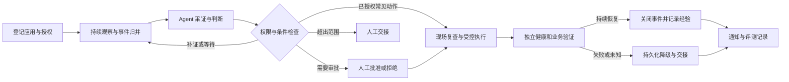

# CLAWKIT 分层自治运维：需求与实施合同

> 基线日期：2026-09-30。用户已确认：Docker Compose 服务、本地 CLI 与飞书通知、指定无状态服务的启动／重启。
>
> 本文长期维护需求、技术决策、模块合同和阶段退出条件；完成状态只在 [TODO](../TODO.md) 维护。方案、测试通过、真实运行和已发布能力分别记录。

## 1. 产品目标与首轮交付

CLAWKIT 面向个人和小团队，持续发现服务异常；Agent 根据证据决定继续调查、等待、执行已授权的常见修复或升级人工；系统检查授权和动作条件，执行后独立验证恢复结果。

首轮交付一份可安装的 CLI 包，在隔离 Docker Compose 环境中走通持续发现、事件归并、模型决策、有限自主重启、审批／人工交接、独立验证、失败降级和原始结果导出。飞书通知适配器与可靠投递合同属于交付范围；实际发送需要用户配置并明确选择接收会话。验证通知可以先用受控传输，不能称作真实飞书送达。

自主权具体包括：选择允许的只读采证工具、基于反证继续调查、选择已登记处置流程、等待自恢复、请求审批和主动停止。授权范围由用户配置；模型不能给自己提升权限。成功必须同时有新采集的健康状态和业务检查证据。

首版针对少量 Linux Docker Compose 服务，控制端支持现有 Java 21 CLI。开发先使用本地 Docker Desktop 的隔离 Linux 容器；这是实际容器实验，不能表述为线上运维。

非目标：Web 控制台、多租户、Kubernetes、任意 Shell／sudo／SQL、数据库修复、应用版本回退、自动改业务代码及发布。通用 Agent 底座保持现有主线，不为本路线另建 Runtime。

## 2. 当前代码基线

| 组件 | 可复用事实 | 待补齐 |
| --- | --- | --- |
| Agent Runtime | Run/Turn、Provider、ToolCallExecutor、上下文、记忆与执行预算 | Ops 决策所用的窄工具范围及结构化决定；现有冻结证据诊断不能代表自主采证 |
| 服务器接入 | OpenSSH、登记目标、只读 MCP、能力核验 | 首轮使用隔离环境适配器；真实目标按后续独立部署授权接入 |
| 持续观察 | JDK 调度、Registry、去重、暂停、预算、恢复 | Fixture-only 观察与完整处置的组合；维护窗口和期望服务状态 |
| 修复 | ApprovalGrant、fresh precheck、Attempt journal、目标互斥、未知结果、独立验证 | 与人工批准有区别的策略授权；自主失败的持久化降级；目标配置泛化 |
| 自治 | A3 Shadow policy/decision/review 存储及合同矩阵 | 当前 AutoRemediationPolicy 构造器只接受固定 Fixture A3，不能直接当 A4 授权 |
| 通知 | NotificationOutbox、OpsFeishuNotifier | 持续事件生命周期的通知装配、聚合、失败重试与状态查看 |
| 评测与打包 | 固定案例、评分、成本投影、baseline、Windows 包装脚本 | 处置分层评分、真实模型与规则对照、独立场景判定、交付包验证 |

普通 CLI 的 fixFactory 当前为空；已有 ops-console 是离线证据回放页。二者均不能被写成在线自动修复产品。历史测试数字不替代本轮验证；P0 必须重新记录当前源码的构建结果。

## 3. 用户需求与验收对象

| 编号 | 用户需要 | 可检验结果 |
| --- | --- | --- |
| R1 接入 | 登记应用、明确服务目标、期望状态及健康检查 | 注册配置错误不能启动；每次结果显示目标；维护停机不会被当作需要恢复 |
| R2 持续发现 | 进程持续检查；能暂停、恢复和退出 | 检查间隔可配置；重复异常归并；暂停无新任务；退出有明确执行状态 |
| R3 自主判断 | Agent 选择补证、等待、修复、审批或人工交接 | 每个决定绑定真实证据引用和原因；缺失/冲突/过期证据不能被编造补全 |
| R4 有限修复 | 授权范围内自动启动/重启指定无状态服务 | 不操作依赖、数据库或其他 Compose 项目；单事件单动作最多一次；不需要逐次人工批准 |
| R5 审批与交接 | 范围外有可理解的建议和交接材料 | 显示症状、影响、证据、建议、已执行动作和下一步；拒绝/取消不执行 |
| R6 验证与降级 | 确认业务持续恢复，失败后停止自动修复 | 独立新会话多次健康与业务检查；验证失败/结果未知持久化降级；重启后不重复写 |
| R7 事件与通知 | 最近事件、处理中、已恢复和待人工可查询 | 首次、重要状态变化和恢复通知；重复观测不重复通知；发送失败可追踪 |
| R8 交付与证据 | 能安装启动，并复现报告 | 打包 JAR/启动器/配置示例/操作说明；原始逐事件结果、版本与汇总可追溯 |

所有“持续”能力仅在控制进程运行期间成立。合上电脑/退出 CLI 后没有检查；首版说明必须明确这一点，不宣称 24×7 托管服务。

## 4. 技术调研与选择

调研截至 2026-09-30；借鉴机制，不直接复制外部代码。库真正引入前再冻结版本并核对依赖许可证。

| 参考 | 已核对的机制 | CLAWKIT 决策、成本与边界 |
| --- | --- | --- |
| [Azure SRE Agent](https://learn.microsoft.com/en-us/azure/sre-agent/agent-run-modes) | 运行模式决定是否审批，资源权限决定是否能操作；两者分开 | 按应用/动作/环境配置自治，保留底层权限约束。借鉴产品流程，不引入 Azure 依赖或临时提权 |
| [STRATUS](https://arxiv.org/abs/2506.02009)、[源码](https://github.com/xlab-uiuc/stratus) | 状态机组织调查与修复，约束失败探索并衡量机制贡献 | 借鉴有界动作、失败终态与对照实验。Apache-2.0；研究实现依赖 Python/CrewAI/Kubernetes，迁入成本高，仅作为设计参考；首期没有任意操作回滚保证 |
| [ITBench](https://github.com/itbench-hub/ITBench) | 可部署的环境、故障场景、参考 Agent 与评测 | 借鉴隔离环境、故障注入、外部判定和逐任务结果。Apache-2.0；复用评测结构，首轮用 Compose，不迁入整套 K8s 环境，不自称跑过 ITBench |
| [OpenHands 结果仓库](https://github.com/OpenHands/openhands-index-results) | Agent/模型版本、逐任务成功/失败/未知、耗时成本及归档 | 本地生成 metadata、instances、summary 和原始轨迹；MIT。诊断评分、自主修复评分与控制流测试分别展示 |
| [JDK 21 调度](https://docs.oracle.com/en/java/javase/21/docs/api/java.base/java/util/concurrent/ScheduledExecutorService.html) | fixed delay；周期任务抛异常会抑制后续执行 | 复用已有 JdkAutomationTaskScheduler 及异常保护；进程锁、持久化状态和恢复另行实现，调度器不保证远端恰好执行一次 |
| [db-scheduler](https://github.com/kagkarlsson/db-scheduler) | 单数据库表、任务持久化、心跳和死执行恢复；Apache-2.0 | 有持续维护与发布，候选成熟；当前复用本地文件存储，避免额外数据库。未来多实例才评估 JDBC/SQLite；死任务重排不能用于未知写结果的重派发 |
| [Docker 重启策略](https://docs.docker.com/engine/containers/start-containers-automatically/)及 [Compose restart](https://docs.docker.com/reference/cli/docker/compose/restart/) | Docker 可原生自动重启；Compose restart 不应用新的配置 | 尊重原生自恢复和维护意图；明确与 Docker 的职责。动作只对登记服务执行，不带依赖批量重启，不更新镜像/环境配置；比较时包含原生/规则处理基线 |

隔离适配器以 Docker [显式 context](https://docs.docker.com/engine/manage-resources/contexts/)及 [context inspect](https://docs.docker.com/reference/cli/docker/context/inspect/) 核对本地 endpoint，之后所有命令固定该 context 和登记 daemon ID。服务登记必须找到唯一现存容器并校验 Compose 标签/文件身份；执行直接定位该完整容器 ID，等价地实现服务启动/重启，避免按服务名重新解析产生替换竞争，不调用 up、不创建或更新容器。依赖的运行状态和 Docker 健康检查区分；没有健康证据时为 UNKNOWN，不把“进程运行”当作“业务健康”。

首版不增加新 Agent 框架、向量数据库、消息队列或独立 Web 服务。持久化继续使用现有原子文件/JSONL 和可靠性 journal；跨存储操作要明确提交顺序及恢复规则，不能假设多个文件具有数据库事务语义。

## 5. 模块、契约与状态推进

### 5.1 领域归属

- `ops-loop`：应用配置、事件/证据/决定、策略资格、处置流程和持久化降级。观察组件保持只读，后续由单独处置编排器消费事件；不得把 FixSession 放进原 Observe-only coordinator。
- `ops-mcp`：具名采证与启动/重启动作、服务白名单、环境/项目身份约束。模型不接受 Docker socket 或任意命令接口。
- `reliability`：沿用 Attempt、互斥、durable intent、未知状态、恢复扫描；领域授权仍由 Ops 层决定。
- `ops-delivery`：装配 Provider、只读/修复适配器、独立验证与通知；不存放策略业务逻辑。
- `cli`：注册、运行、事件、审批、暂停和人工交接视图。沿用已有 Provider/Tool 执行链，不另建底座。
- `evaluation`：场景、隐藏真值、外部判定、对照、原始计数、费用和报告。

### 5.2 核心合同

以下是目标合同，类名可随既有实现调整。

| 合同 | 内容与不变量 |
| --- | --- |
| ManagedApplication | targetId、serviceId、Compose project 身份、无状态声明、期望状态、健康/业务检查、维护窗口、配置版本；参数由用户登记 |
| OpsDecision | INVESTIGATE/WAIT/PROPOSE_ACTION/ESCALATE、证据引用、原因、候选动作、复查时间；模型不返回授权等级、不生成 Shell、不看到隐藏真值 |
| ActionPolicy | 环境/目标/动作范围、有效期、尝试/调用/时间预算、证据时效、版本与策略哈希；默认为 ASK，限定范围才可自动执行 |
| RepairAuthorization | 人工批准与策略授予分别建模；自动授权绑定 policyHash、Incident、规范化目标、动作指纹、现场证据和有效期；不能伪造 ApprovalGrant 或把模型同意当审批 |
| Playbook | 版本化的症状/前置条件/具名动作/预期效果/验证/失败处置；初期为审核的固定处置流程，仅成功且验证完整的数据可记入结果，经验不会自行晋级权限 |
| IncidentEvent | 事件 ID、状态版本、来源 run/evidence/decision/attempt/verification；通知和评测使用这一事实链；模型改口不能改变事件身份 |

自治权限和验证状态分开：OBSERVE/ASK/LIMITED_AUTO 表示处置权限；DRAFT/SHADOW/QUALIFIED/REVOKED 表示该策略的验证状态。已有 A0—A4 保留兼容表达，Shadow 本身不执行写动作。

P1 决策合同位于 `ops-loop/managed`：每个决定运行创建独立 Registry 和证据账本，复用现有 AgentEngine 的只读范围与预算。模型可选服务、健康、业务、依赖、日志五项采证；适配器只返回有界、脱敏的标准事实。提交成功立即结束运行；提交只改变本次运行的内存结果，不写外部系统、不授予权限。启动/重启建议必须引用当前四项服务/健康/业务/依赖证据，并检查全部当前反证；维护、期望停机、有状态声明、依赖未知或异常均不能建议修复。继续调查和等待需明确 1—300 秒复查时间；无有效提交、预算中止或 Provider 失败标为 SYSTEM 交接，与 MODEL 决定分别记录。模型原始请求/响应及用量另存，不把系统兜底算作模型通过。

状态主链：观察 → 新建/归并 → 判断 → 补证/等待/审批/策略授权 → 现场复查 → 执行 → 独立验证 → 恢复观察窗口 → 已恢复。失败可进入待人工、已取消或未派发失败；OUTCOME_UNKNOWN 保留执行状态，不转成可重试。

### 5.3 执行与恢复约束

1. 先登记明确目标和期望 RUNNING。人工停机、维护窗口、暂停及原生正在恢复期间不抢先重启。
2. Agent 选择有限动作；程序独立检查证据、反证、动作范围和新鲜度。模型自报置信度不作为唯一授权条件。
3. 人工和自动授权使用同一执行核心及副作用可靠性链，只有授权来源不同；不复用 `--auto-approve`。
4. 在目标互斥下重新采证，校验 policy/config/profile 版本，持久化授权依据和 dispatch intent，之后才调用修复适配器。
5. 每个 Incident/动作最多一次派发。后续重复观察合并；结果未知、验证失败或策略漂移持久化降级 ASK，重启进程不会恢复 AUTO。
6. 验证使用新只读会话；检查容器、HTTP 与业务响应，并观察是否复发。命令退出码 0 不表示服务已恢复。
7. 首期修复失败停止尝试并交接，不自动停止服务作为“回滚”，不声称重启具有完美可逆性。
8. kill switch 停止尚未派发动作；已派发动作依实际状态完成验证或交接，不能假称取消成功。
9. Registry、策略或 journal 损坏时阻止自动写；恢复先处理 in-flight 状态，再启动观察；非原子跨文件窗口有可测试的补偿/恢复规则。
10. 同一 ACTIVE 事件若证据发生重要变化，允许有预算和冷却约束的重新判断；单纯重复不会再次调用模型。等待状态有截止时间，不能无限悬挂。

持续装配使用独立的 `ManagedIncidentController`，不改变旧 Observe-only 协调器：每应用一个工作区进程租约，固定延迟观察，持久化新建／归并、决定、审批、修复和交接状态。Snapshot 与 `pendingEvent` 是控制事实和补偿入口；事件日志及本地通知 Outbox 可重放同一事件 ID。恢复前扫描 Attempt，调查／执行中断直接交接；暂停／停止在派发前检查点生效，已派发动作记录实际结果。默认决定上限三次、事件截止十分钟，重要证据变化受冷却约束。结果未知即使后续观察健康仍保持人工交接；已知未派发的自恢复须重新独立验证。

隔离传输登记本地 Docker context／daemon、Compose 文件哈希、项目／服务标签、完整容器 ID 和只读 bind 挂载内容。挂载限制为单文件最多 1 MiB、树最多 256 项／10 MiB／深度 16；拒绝符号链接和未知挂载。Windows Docker Desktop 的已知 host 路径翻译可还原为本地路径。配置漂移检查是派发前条件检查，不声称能对外部并发 Docker／宿主机修改提供原子事务。

`ops-fixtures/layered-autonomy` 是隔离评测夹具：订单服务与目录依赖均为真实 Linux 容器；故障仅改变可丢弃进程内状态。隐藏注入入口由外部实验驱动调用，不注册到 Agent 工具，模型只看到标准观察。订单重启不能清除目录依赖故障。原始模型轨迹只在显式隔离评测开关启用时写入；普通控制器保存决定、证据、用量和执行状态。

现有 SideEffectGate 新增可选的可信 WORKFLOW precheck 装配点，在 Attempt 获得目标互斥之后采集现场证据、复查用户意图/版本/权限并持久化明确授权；模型无法选择该回调，既有确定性工具仍走原前置校验。人工与策略来源共用私有修复工具和完整统一执行器。验证每次新建观察会话，至少连续三样本，默认两秒间隔、最多十二样本和两分钟截止时间；这些是首期有限观察窗口，不等于长期稳定性保证。结果未知不由恢复扫描重新执行；验证失败转交人工，不声称自动回滚。

## 6. 分阶段实现与退出条件

不按未经验证的日历天承诺完成。每阶段有可运行增量，完成一阶段再启动依赖阶段；打包与场景准备可穿插进行。

| 阶段 | 实现范围 | 退出条件 | 回退 |
| --- | --- | --- | --- |
| P0 基线与合同 | 当前源码 clean verify、隔离 Compose 环境确认、需求冻结、必要缺陷修复 | 记录真实构建/测试结果；确认旧远程入口不被启用；已选择的范围一致 | 保留原 CLI 和只读路径 |
| P1 Agent 决策 | 应用配置、结构化决定、有限采证、审核处置流程、授权与验证状态分离 | 真正模型可提交决定；脚本测试覆盖继续调查/等待/候选修复/升级；编造引用/未知动作拒绝；零修复副作用 | 仅调查/建议 |
| P2 自主闭环 | 组合持续观察与单动作策略授权；隔离 Compose 启动/重启；独立验证；持久化降级和恢复 | 在真实隔离容器完成自动恢复；自恢复/维护/依赖失败不误重启；重复触发及重启不重复写；未知结果与验证失败可交接 | 全局/应用降级 ASK；真实远程仍关闭 |
| P3 产品交付 | CLI 接入、运行/暂停/状态/事件/交接；通知生命周期；打包、安装与清理说明 | 从解压包走通检查和自主恢复；用户知道现在处理谁及为何；通知受控传输合同通过；未配置飞书可正常运行 | 通知失败保留 Outbox、CLI 可查看；关闭自动处理 |
| P4 量化证据 | 冻结场景、模型/配置/源码指纹；规则与普通 Agent 对照；机制消融；逐次与汇总报告 | 独立判定、不泄漏真值；未完成/失败/未知全部保留；同范围公平对照；脚本测试与真实模型结果分开；报告可复现 | 实测未达标按事实报告；阻止扩大自治范围 |
| P5 真实目标试用（后续独立里程碑） | 用户选择非生产应用、审阅部署/授权配置后接入；短周期使用记录 | 明确远端身份与动作授权；独立真机记录；可撤销；用真实问题迭代体验 | 真实目标 ASK/只读，一键撤销授权 |

首轮实现目标为 P0—P4。P5 不属于本次默认授权；不连接真实测试服务器的定时任务、不发送未指定会话的通知、不发布 GitHub Release。无需以固定一周个人 dogfood 阻塞隔离环境开发；真实目标自治晋级仍需要独立证据与授权。

## 7. 评测合同与可信数字

### 7.1 三种证据分开

- 单元/合同测试：证明状态机与权限规则，使用脚本 Provider 或 test double 时明确标注，不计入模型能力。
- 实际容器实验：真实部署、注入、执行和外部检查；是否使用真实模型单独标记。隔离实验不算线上。
- 真实使用：有人实际使用登记环境，有原始时间/决策/执行记录；与受控实验单独报告。

### 7.2 首批场景（计划，不是已完成样本）

| 场景 | 预定正确处置 | 核心判定 |
| --- | --- | --- |
| 指定无状态服务退出 | 在资格和现场条件成立时自主启动/重启 | 真实业务恢复、一次派发 |
| 容器运行但 HTTP 异常 | 补证或交接；不只凭 HTTP 盲目重启 | 实际模型判断与证据引用 |
| 依赖不可用/DB 锁等待 | 调查依赖并转人工 | 应用重启不能清除注入的持续故障 |
| 短暂异常后自恢复 | 等待复查，无修复 | 以外部状态证据确认恢复 |
| 维护/人为期望 STOPPED | 保持停机 | 无被授权动作的错误执行 |
| 缺失/过期/冲突证据 | 受控补证或人工交接 | 不宣告已修复 |
| 错误目标/撤销或过期策略 | 拒绝自主执行 | 目标、版本和授权依据一致 |
| 派发后通信中断/验证失败 | 持久化降级并交接 | 首次派发状态保留、再次派发为零 |

场景级别区分真正故障、正常/维护状态与协议异常；不能把八类全说成八种实际故障。故障注入和清理只针对本次创建、身份可核验的 Compose 项目。持续故障在重启后仍存在；健康判定加入业务检查与观察窗口，避免“告警消失”虚高。

先做各场景端到端冒烟，再冻结用于调试之外的参数组合和随机种子。正式报告记录唯一场景数、实例数、重复次数；反复同一案例不计作新增故障覆盖。真实模型实验先设明确请求/Token/费用预算，错误或耗尽停止并记录，不能删除后补跑只报最好的一次。

### 7.3 指标与对照

| 指标 | 分母/起止与限制 |
| --- | --- |
| 覆盖范围 | 事前符合自主处理资格的事件数/总事件数，另列唯一场景种类；资格不能按成功后挑选 |
| 自主恢复率 | 无人工介入且外部验证恢复的事件数/全部合资格事件数；同时报告总样本中的自主恢复占比 |
| 分层判断 | 自主动作/等待/补证/审批/交接是否符合预先定义标准；与恢复率分开 |
| 错误执行/重复执行/假成功 | 报原始事件次数与检查样本量；本次观测为零不代表永久为零 |
| 时间 | 故障注入/触发到持续业务恢复；失败/超时数一起报告；审批等待与 Agent 耗时单列 |
| 成本 | 全部实际请求的 Token、API 费用及单事件分布；价格表版本/缓存口径/缺失费用单列 |

首批至少有规则/原生重启处理和 CLAWKIT 的同场景对照；随后加入同模型、同工具、同权限及预算的普通 Agent。模型参与程度不同的对照要明确说明，不能把额外工具/更大预算的收益归给架构。机制消融首选移除经过审核的处置流程或证据复查之一；外部评测判定器始终保留，避免改评分规则导致结果变好。危险负例仅在隔离环境运行。

每次运行输出 metadata（源码/脏工作区指纹、模型、参数、策略、应用配置、场景版本、预算、运行时间）、逐事件 JSONL、完整动作/验证轨迹、summary 和 Markdown 报告。API/协议失败、预算中止、不可评估、未完成、正确交接和修复失败分别计数；超时不从主分母悄悄移除。

简历只引用完成并保存原始证据的结果：环境+任务范围+实际分子/分母+关键机制，最多附一个主要对照结果。历史 20/20 APP_DOWN Fixture、118/120 管线和 Runtime 13/16 保持独立，不合并成新产品成功率。没有人工耗时对照不写“提升运维效率 XX%”；没有真实用户不写商用规模。

## 8. 检查与交付规则

- 修改前保留已有未提交工作；只迁移本路线必要入口，不清理他人文件。
- P0 用 `mvn -B -ntp clean verify`；新增功能用对应模块与依赖测试；收口再做一次全量验证，不以跳过测试换取通过。
- 每阶段检查 `git diff --check`，同步 TODO 的实际状态。
- 新增策略资格不放宽通用工具默认风险或已有远程 profile；无人批准路径仍不可创建真实远程修复会话。
- P3 验证交付包 `--help`、`--version`、配置检查和隔离场景，记录依赖 Docker/Java/模型的情况。
- 回退通过暂停、撤销策略、降级 ASK、停止隔离应用控制完成；清理只触及本次 Fixture。实际远程安装/发送通知/发布另行按明确目标执行。
