# Clawkit 项目全览与深度学习指南

> 面向项目作者的中文学习材料与秋招准备手册
>
> 代码快照：2026-08-05 当前工作区（基线 commit `fe0500f`，同时包含尚未提交的 PRODUCT-3 / OPS-3A 工作区改动）
>
> 项目阶段：通用 Agent Runtime、REMOTE-0、PRODUCT-1/2 和 OPS MVP-3 主链已落地；PRODUCT-3 Phase 0—4 已完成夹具与终端体验闭环，Phase 5 正在进行 7 天个人 dogfood；OPS-3A A-D 已在可丢弃 Fixture 完成，仍只读且不为真实服务器新增写权限；下一门槛是墙钟持续运行证据
>
> 目标读者：具备苍穹外卖级别的 Java/Spring Boot 项目经验，了解 Docker 和常见 Agent 概念，希望应聘 Java 后端并兼顾 Agent 方向

---

## 目录

1. [先用一句话理解项目](#1-先用一句话理解项目)
2. [从全局看系统](#2-从全局看系统)
3. [一次普通 Agent 任务是怎么跑的](#3-一次普通-agent-任务是怎么跑的)
4. [上下文、Session、Memory 为什么不能混在一起](#4-上下文sessionmemory-为什么不能混在一起)
5. [为什么写操作需要单独的可靠性内核](#5-为什么写操作需要单独的可靠性内核)
6. [观测和评测：为什么不能只看最终输出](#6-观测和评测为什么不能只看最终输出)
7. [OPS Loop 与分层自治](#7-ops-loop-与分层自治)
8. [远程 SSH：从接入体验到底层安全边界](#8-远程-ssh从接入体验到底层安全边界)
9. [MVP-3 审批修复闭环](#9-mvp-3-审批修复闭环)
10. [当前代码阅读地图](#10-当前代码阅读地图)
11. [秋招项目故事怎么讲](#11-秋招项目故事怎么讲)
12. [高频面试问题与回答思路](#12-高频面试问题与回答思路)
13. [AI 协作下怎样真正拥有这个项目](#13-ai-协作下怎样真正拥有这个项目)
14. [个人学习计划](#14-个人学习计划)
15. [当前路线图该怎么理解](#15-当前路线图该怎么理解)
16. [文档随代码更新的方法](#16-文档随代码更新的方法)
17. [最后需要真正记住的十二句话](#17-最后需要真正记住的十二句话)

核心专题导航：

- Java 后端知识桥梁：第 2.4—2.6、5.7、5.8 节
- Agent 原理：第 3.1—3.10 节
- 会话、上下文与记忆：第 4.1—4.10 节
- 工具权限与安全：第 3.8、5、8 章
- OPS 完整闭环：第 7—9 章
- 测试、面试与学习：第 6、10—14 章

## 0. 这份文档怎么用

这不是一份 API 手册，也不是把仓库里的类名重新排列一遍。它想回答的是：

1. 这个项目为什么存在？
2. 一个 Agent 从收到问题到返回结果，中间究竟发生了什么？
3. 为什么普通的“调用工具”不足以支撑远程运维修复？
4. 权限、审批、执行记录、结果确认和独立验证之间是什么关系？
5. 项目如何用测试和证据证明自己，而不是让执行者自称成功？
6. 秋招面试时，如何把这些设计讲成一个可信、完整、有取舍的故事？

建议按下面三轮阅读：

- **第一轮：建立地图。** 读第 1、2、7、11 章，先知道系统由哪些部分组成。
- **第二轮：吃透主链。** 读第 3、4、5、6、8 章，结合代码逐步跟踪。
- **第三轮：准备表达。** 读第 9、10、12—14 章，练习脱离文档讲清设计。

不需要一开始就记住所有类名。先理解“问题—约束—方案—证据”的因果链，再把类名挂到这条链上。

本文刻意把注意力放在稳定的设计逻辑上，而不是某个类当前有多少字段、某条命令用了什么参数。阅读时可以按下面的优先级判断内容是否值得记忆：

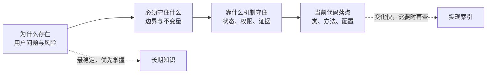

后文出现类名，是为了帮助你从概念找到代码，而不是要求背诵实现。

### 0.1 这份文档假设你已经会什么

默认你已经：

- 能看懂 Controller、Service、Mapper、DTO 等常规分层；
- 写过 Spring Boot 接口、数据库增删改查和简单异常处理；
- 知道线程、线程池、锁、CAS、volatile 等八股概念；
- 使用过 Docker Compose，知道容器、镜像、端口映射；
- 知道大模型可以通过 Tool Calling 请求外部工具。

本文不会从 Java 语法或 Spring 注解开始，而是重点补齐下面的跨度：

```text
会写确定性的 CRUD 业务
→ 理解非确定性的模型输出
→ 管理长时间、多轮、可取消的任务
→ 处理跨进程和远程部分失败
→ 用状态机和持久化事实控制真实副作用
```

### 0.2 学完以后应该达到什么程度

不要求你默写所有实现。完成学习后，你应该能够：

1. 从 Java 后端视角解释每个模块为什么存在；
2. 画出一次 Agent run 和一次 OPS repair 的完整流程；
3. 根据日志判断失败发生在模型、工具、网络、执行还是验证阶段；
4. 解释项目中使用的锁、CAS、append-only journal 和资源管理；
5. 面对追问时说出替代方案为什么不够；
6. 明确哪些能力已实现、哪些只是路线图；
7. 在 AI 协助开发的前提下，对关键设计和验收结论负责。

### 0.3 内容比例

本文按大约 1:1 组织两条主线：

| Java 后端主线 | Agent 主线 |
| --- | --- |
| Maven 多模块和依赖方向 | Tool Calling 与 ReAct |
| record、enum、接口和构造器注入 | Provider 适配与 MCP |
| 并发、锁、CAS、虚拟线程 | 工具权限与上下文 |
| 文件 Journal、CRC、原子写 | Session、Memory 与 Compact |
| 进程、网络和资源生命周期 | Incident、Evidence 与 Diagnosis |
| JUnit、Fake、集成测试和 E2E | Policy Gate、Repair 与 Verification |

OPS Loop 是两条主线的交汇点：Agent 提供推理和工具使用方式，Java 后端提供确定性的状态、权限、持久化和失败恢复。

---

## 1. 先用一句话理解项目

Clawkit 是一个基于 Java 21 自研的智能体执行平台：它以统一引擎组织模型、上下文、记忆和工具调用，让命令行与飞书复用同一套任务流程，再通过远程运维场景验证工具权限、过程追踪和副作用控制是否真正有效。

代码和本文经常使用 `Agent Runtime`。这里的 Runtime 不是 JVM，也不是“程序运行时间”，而是智能体接到任务后真正负责推进任务的**核心执行引擎**：它按 Run 和 Turn 组织循环，准备模型上下文，处理工具调用，传播预算与取消信号，并记录实际发生的过程。

因此项目有两条前后衔接的主线：

```text
通用 Agent 底座
输入 → 核心执行引擎 → 上下文与记忆 → 工具执行 → 运行观测

远程运维落地
SSH 能力接入 → 持续观察 → 诊断建议 → 审批修复 → 独立验证
```

运维场景的完整主线是：

```text
导入已有 SSH 目标
→ 快速查看服务状态
→ 发现异常或主动开始调查
→ 采集只读证据
→ 形成诊断
→ 确定性策略判断是否允许修复
→ 人工审批
→ 执行前重新采证
→ 通过受限账号执行唯一允许的动作
→ 使用新的只读会话独立验证
```

这句话里最重要的不是“模型诊断”，而是后半段：

> 模型可以提出建议，但不能单独决定写操作；执行结果也不能由执行者自己证明。

### 1.1 项目要解决的根本矛盾

传统聊天模型只产生文本。Agent 会调用工具，而工具可能：

- 读取文件；
- 修改代码；
- 执行命令；
- 访问远程服务器；
- 重启服务；
- 改变真实业务状态。

模型越有能力，错误的代价就越大。于是出现一个根本矛盾：

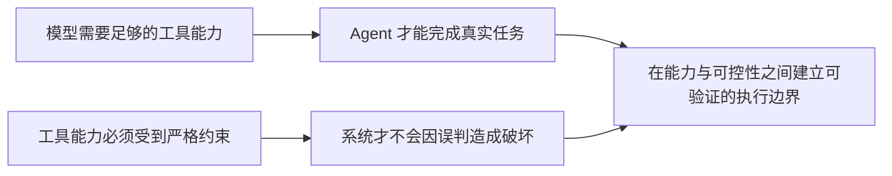

Clawkit 的价值不是让模型“更聪明”，而是让模型的行动：

- 有入口；
- 有边界；
- 有记录；
- 有失败语义；
- 有恢复路径；
- 有独立验收。

### 1.2 为什么选择运维作为示范场景

运维场景天然包含项目最想验证的问题：

- 证据可能缺失、过期或相互冲突；
- 网络和远程进程可能在任意时刻中断；
- “请求失败”不等于“动作没发生”；
- 重复执行一次重启、配置写入或数据库操作可能扩大故障；
- 服务进程重新运行不等于业务真正恢复；
- 权限边界既要在客户端控制，也要在远端主机控制。

因此，OPS Loop 不是项目的全部，而是通用 Agent 底座最完整的验证场景。REMOTE-0 提供可信连接和预定义工具入口，OPS Loop 负责把零散状态组织成 Incident、Evidence、Diagnosis、Action、Approval 和 Verification。前四项简历亮点讲通用能力，SSH 讲能力如何安全延伸到服务器，OPS Loop 再证明这些能力能够组成一个受控闭环。

下一步不是继续横向增加远程工具，而是缩短同一条用户旅程：复用已有 OpenSSH 配置完成接入；日常问题先做 Quick Check；用户明确要求深入排查或系统发现严重异常时，再进入 OPS Loop。Clawkit 仍不扩成通用 SSH 管理平台。

---

## 2. 从全局看系统

### 2.1 总体架构

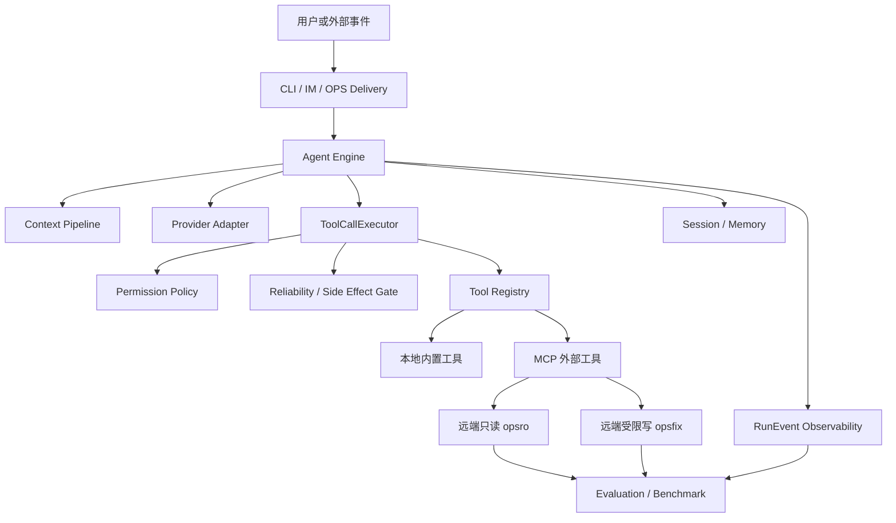

可以把系统理解成五层：

| 层 | 解决的问题 |
| --- | --- |
| 输入层 | 用户或外部事件如何进入系统 |
| Agent 编排层 | 什么时候问模型、什么时候调用工具、何时结束 |
| 工具与权限层 | 哪些工具可见、能否执行、是否需要审批 |
| 可靠性与事实层 | 写操作如何记录、失败如何分类、崩溃后如何恢复 |
| 垂类应用层 | 运维场景中的 Incident、Evidence、Diagnosis、Repair |

如果再从 Runtime 内部看，可以把它分成三个相互配合、但不能混写的平面：

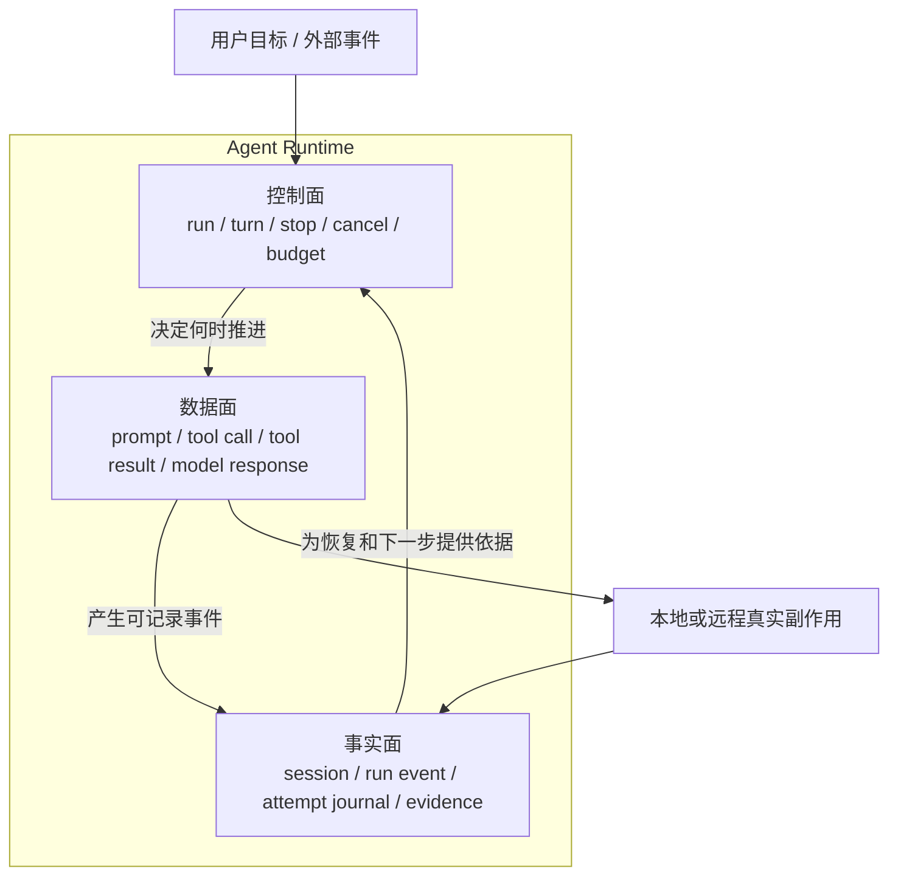

- **控制面**回答“任务还能不能继续、该进入哪一阶段、何时必须停”。
- **数据面**承载模型输入输出和工具参数，但其中内容默认不可信。
- **事实面**保存可追踪、可恢复、可复验的状态，不能只存在于模型上下文里。

Agent 底座的核心价值，就是让这三个平面形成闭环：模型负责提出下一步候选，Runtime 负责决定候选是否能成为真实动作，事实记录负责证明实际发生了什么。

#### 2.1.1 简历中的六条亮点，在架构中分别处于什么位置

六条简历内容不是六个平铺的功能，而是一条从通用底座到领域闭环的递进关系：

| 简历亮点 | 在架构中的职责 | 主要代码入口 | 深挖章节 |
| --- | --- | --- | --- |
| 核心执行引擎 | 组织 Run、Turn、模型和工具的完整生命周期，并让 CLI、飞书复用同一条主链 | [`AgentEngine`](../clawkit-engine/src/main/java/com/clawkit/engine/impl/AgentEngine.java)、[`CancellationTree`](../clawkit-reliability/src/main/java/com/clawkit/reliability/CancellationTree.java)、[`AbstractImChannel`](../clawkit-im/src/main/java/com/clawkit/im/AbstractImChannel.java) | 第 3 章 |
| 上下文与记忆 | 决定每轮模型能看到什么、什么可以跨会话保留、压缩后哪些约束不能丢 | [`DefaultContextPipeline`](../clawkit-context/src/main/java/com/clawkit/context/impl/DefaultContextPipeline.java)、[`ConversationSession`](../clawkit-engine/src/main/java/com/clawkit/engine/impl/ConversationSession.java)、[`DefaultMemoryHooks`](../clawkit-engine/src/main/java/com/clawkit/engine/impl/DefaultMemoryHooks.java) | 第 4 章 |
| 工具安全 | 统一工具注册、可见范围、权限判断、重试和写操作状态 | [`ToolCallExecutor`](../clawkit-engine/src/main/java/com/clawkit/engine/impl/ToolCallExecutor.java)、[`RunToolScope`](../clawkit-tools/src/main/java/com/clawkit/tools/RunToolScope.java)、[`SideEffectGate`](../clawkit-reliability/src/main/java/com/clawkit/reliability/gate/SideEffectGate.java) | 第 3、5 章 |
| 运行观测 | 将模型、工具、审批和压缩过程转成可聚合、可回放的运行事实 | [`FileRunRecorder`](../clawkit-observability/src/main/java/com/clawkit/observability/FileRunRecorder.java)、[`RunAccumulator`](../clawkit-observability/src/main/java/com/clawkit/observability/RunAccumulator.java)、[`RunReader`](../clawkit-observability/src/main/java/com/clawkit/observability/RunReader.java) | 第 6 章 |
| 远程 SSH | 把服务器能力临时挂载到当前任务，并在连接、能力和工具范围三处校验 | [`RemoteConnectionService`](../clawkit-cli/src/main/java/com/clawkit/cli/remote/RemoteConnectionService.java)、[`RemoteMcpSession`](../clawkit-tools/src/main/java/com/clawkit/tools/remote/RemoteMcpSession.java) | 第 8 章 |
| OPS 分层自治 | 将观察、建议和审批执行按风险拆层，让权限随证据逐级开放 | [`ObservationAutomationCoordinator`](../extensions/clawkit-ops-loop/src/main/java/com/clawkit/ops/loop/automation/ObservationAutomationCoordinator.java)、[`DiagnosisReconciler`](../extensions/clawkit-ops-loop/src/main/java/com/clawkit/ops/loop/DiagnosisReconciler.java)、[`RepairOrchestrator`](../extensions/clawkit-ops-loop/src/main/java/com/clawkit/ops/loop/repair/RepairOrchestrator.java) | 第 7、9、15 章 |

这张表也是面试时的讲述顺序：先说明平台如何执行任务，再讲上下文、工具和观测如何约束执行，最后讲这些通用能力怎样落到远程运维与分层自治。这样既不会把项目讲成几个底层类的集合，也不会只剩“AI 运维助手”这一层产品口号。

### 2.2 Maven 模块为什么要这样拆

项目是 Maven 多模块工程。模块拆分不是为了显得复杂，而是为了隔离不同的变化。

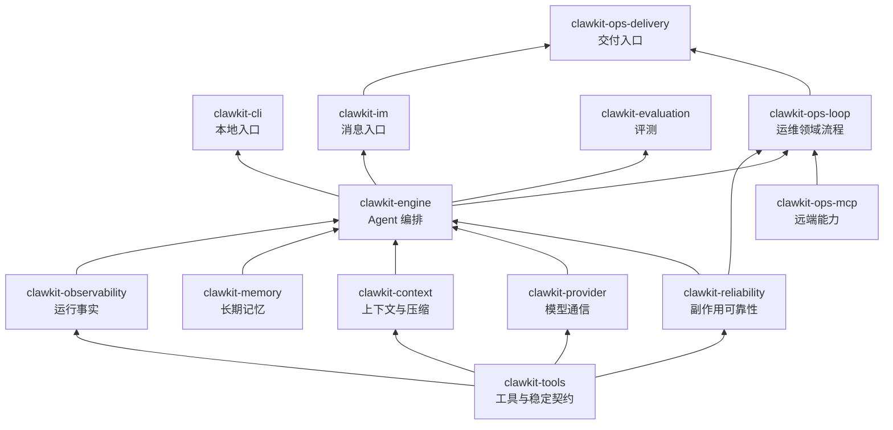

这里的箭头表示“被上层依赖”。几个关键原则：

- `tools` 提供最稳定的工具和动作契约，不知道 Agent 怎么循环。
- `reliability` 只依赖工具契约，不理解具体运维业务。
- `engine` 负责编排，但不直接解析某个模型厂商的 JSON。
- `cli` 只负责组装和交互，不拥有核心安全规则。
- OPS 领域能力放在 `extensions`，避免把 SSH、Docker、Incident 写进通用引擎。

### 2.3 各模块的通俗解释

| 模块 | 可以把它想成 |
| --- | --- |
| `clawkit-tools` | 工具插座和统一安检口 |
| `clawkit-provider` | 不同模型厂商的翻译器 |
| `clawkit-context` | 给模型准备材料的编辑部 |
| `clawkit-memory` | 跨任务保存的笔记本 |
| `clawkit-observability` | 不参与决策的行车记录仪 |
| `clawkit-reliability` | 写操作的保险箱、流水账和事故恢复员 |
| `clawkit-engine` | 控制整个任务推进的导演 |
| `clawkit-cli` | 用户看到的命令行窗口 |
| `clawkit-evaluation` | 用固定题目和规则验收系统的考场 |
| `clawkit-ops-mcp` | 远端只暴露白名单运维能力的服务 |
| `clawkit-ops-loop` | 把采证、诊断、修复、复验串起来的领域层 |
| `clawkit-ops-delivery` | 真正运行远程诊断和修复的入口 |

### 2.4 从苍穹外卖的分层迁移过来

你熟悉的 Spring Boot 项目大致是：

```text
HTTP 请求
→ Controller
→ Service
→ Mapper
→ MySQL
→ HTTP 响应
```

Clawkit 不是 Web CRUD 项目，但很多职责可以类比：

| 常规 Java 后端 | Clawkit 中的对应角色 | 主要差别 |
| --- | --- | --- |
| Controller | CLI、IM、Delivery Main | 输入不一定是 HTTP，请求可能运行很久 |
| Service | AgentEngine、Workflow、Orchestrator | 流程不是一次确定性函数调用，而是多轮决策 |
| DTO/VO | record、enum、sealed interface | 还要表达失败、时效、风险和中间状态 |
| Mapper/Repository | SessionStore、MemoryStore、AttemptStore | 不只存业务数据，还保存恢复所需的控制状态 |
| Interceptor | PermissionPolicy、SafetyInterceptor、SideEffectGate | 不只做登录校验，还阻断危险副作用 |
| 全局异常处理 | 结构化错误、FailureClass、EffectCertainty | 异常发生后还要判断副作用是否已经产生 |
| Spring 容器 | ApplicationBootstrap | 项目选择显式组装依赖，便于看清唯一实例和边界 |
| 定时任务 | OPS-3A Observe-only | 已完成 Registry、fingerprint 去重、同目标互斥、冷却、暂停/恢复、预算和重启恢复；加速 72 小时 Fixture soak 通过，真实墙钟持续运行证据仍待收集 |

最大的认知变化不是目录结构，而是**执行的不确定性**：

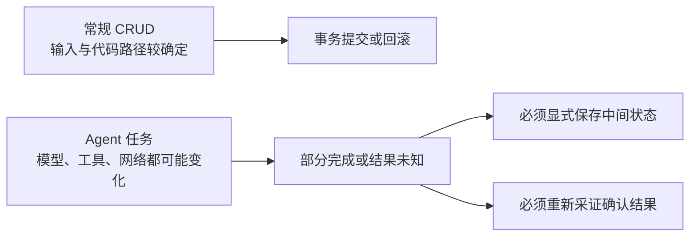

在 CRUD 项目里，抛异常通常意味着这次方法失败；在远程写操作里，抛异常可能发生在服务端已经完成动作之后。正是这个差别，催生了后面的 Attempt 状态机和独立验证。

### 2.5 为什么项目没有把 Spring Boot 当成核心框架

项目并不是反对 Spring，而是 Runtime 核心目前更需要：

- 清楚的对象生命周期；
- 显式依赖关系；
- 可在单元测试中替换时钟、文件 Store、Provider 和 Transport；
- CLI 与本地进程的轻量启动；
- 避免安全关键组件被重复装配。

因此使用构造器注入和 `ApplicationBootstrap` 手动组装。这样阅读代码时，可以直接追踪：

```text
谁创建 AgentEngine
→ 谁把 ToolRegistry 注入进去
→ 谁装配 SideEffectGate
→ 谁提供 RunRecorder
```

未来如果加入 Web API，完全可以在输入层使用 Spring Boot，但不应把 Controller、Spring Bean 或 HTTP DTO 渗透到 Runtime 核心。

### 2.6 项目里最值得学习的 Java 建模方式

#### record：表达不可变数据合同

项目大量使用 record 表达：

- Evidence；
- Diagnosis；
- ToolExecutionResult；
- ApprovalGrant；
- VerificationResult。

它们更接近“值”，而不是带复杂行为的 Service。record 自动提供构造器、访问器、`equals/hashCode`，适合跨模块传递。

但 record 不代表不需要校验。项目会在 compact constructor 中检查：

```text
字段非空
时间顺序合法
集合 defensive copy
枚举状态匹配
默认 schemaVersion
```

#### enum：让有限状态无法随便拼字符串

`AttemptState`、`PermissionMode`、`FailureClass` 等都属于有限集合。使用 enum 的优势：

- 编译器可以检查 switch 是否覆盖；
- 避免 `"VERIFYING"` 拼写错误；
- 可以把合法迁移等行为放进枚举；
- JSON 序列化仍然清晰。

#### sealed interface：表达有限但形态不同的结果

例如审批结果可能是：

```text
Approve
ApproveAllSameType
Reject
ModifyParams
```

它们共享一个上层概念，但字段不同。sealed interface 配合模式匹配，比 `type + Map<String,Object>` 更安全。

#### 接口与实现分离

接口真正有价值的场景是存在变化点：

- `LLMProvider`：不同模型厂商；
- `MemoryStore`：不同存储实现；
- `RunRecorder`：文件记录、组合记录、空记录；
- `McpTransport`：stdio、HTTP/SSE；
- `OpsBackend`：Docker、PostgreSQL 诊断。

如果一个类永远只有一种实现，也没有测试替换需要，不必为了“面向接口编程”机械增加接口。

#### 构造器注入

时钟、Transport、Store、Provider 从构造器传入，使测试能够：

- 使用固定 Clock 测过期边界；
- 使用 Fake Provider；
- 使用临时目录 Store；
- 模拟网络错误；
- 验证资源是否关闭。

这和 Spring 的依赖注入思想相同，只是这里由代码显式完成。

---

## 3. 一次普通 Agent 任务是怎么跑的

### 3.1 先纠正一个认识：模型不会直接执行工具

Tool Calling 的本质是：模型返回一段结构化请求，由宿主程序决定是否执行。

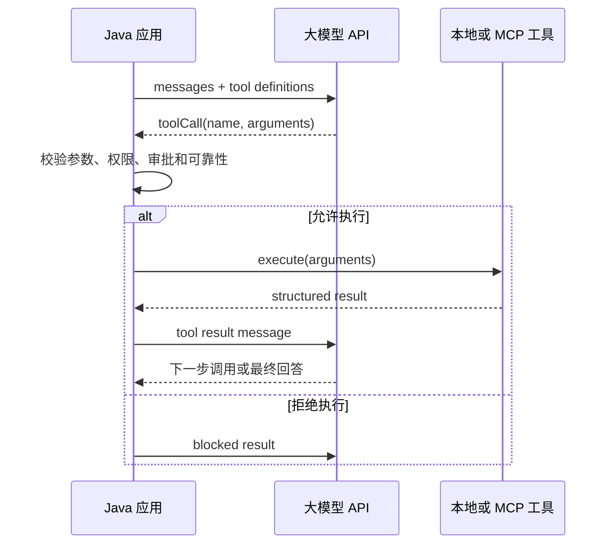

因此模型没有以下能力：

- 直接调用 Java 方法；
- 直接连接 SSH；
- 直接修改文件；
- 自己决定绕过审批。

真正拥有能力的是宿主程序。模型只是生成候选的工具名和参数。这也是为什么工具参数必须按“不可信输入”处理：它和前端提交的 JSON 一样，需要 schema 校验、权限校验和边界检查。

### 3.2 ReAct 循环

ReAct 可以直译成“思考—行动—观察”。模型不是一次性输出最终答案，而是反复：

1. 阅读当前上下文；
2. 决定是否调用工具；
3. 系统执行工具；
4. 将工具结果放回上下文；
5. 模型继续判断；
6. 直到不再调用工具。

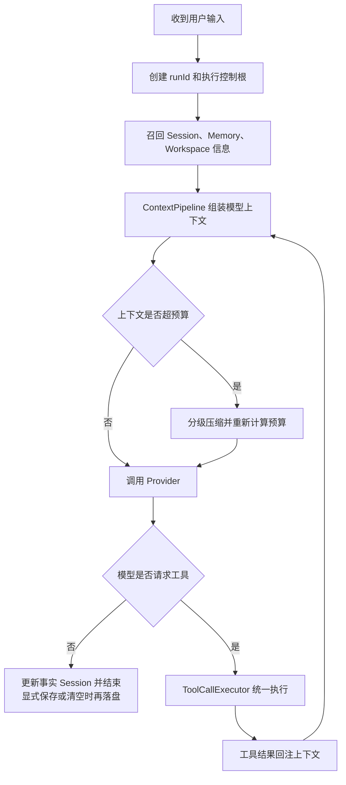

对应的主要入口是：

- [`AgentEngine.run`](../clawkit-engine/src/main/java/com/clawkit/engine/impl/AgentEngine.java)
- [`ToolCallExecutor.executeBatch`](../clawkit-engine/src/main/java/com/clawkit/engine/impl/ToolCallExecutor.java)
- [`DefaultContextPipeline`](../clawkit-context/src/main/java/com/clawkit/context/impl/DefaultContextPipeline.java)

#### 3.2.1 Run、Turn 和 Tool Call 是三个不同层级

把 Agent 理解成“模型和工具反复聊天”还不够。Runtime 至少要管理三个嵌套层级：

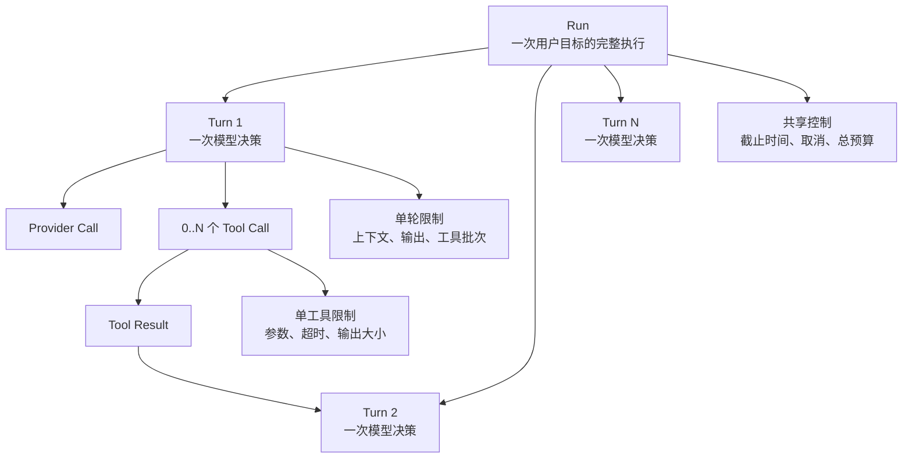

- **Run** 绑定用户目标、`runId`、总预算、取消树和最终结果。
- **Turn** 是模型的一次决策机会；一次 Run 可能包含多个 Turn。
- **Tool Call** 是候选动作；同一 Turn 可以没有工具、调用一个工具，或在规则允许时并行调用多个只读工具。

这样分层后，系统才能准确回答：是整个任务超时，还是某次模型请求失败；是某个工具被拒绝，还是 Run 已经没有预算继续。

#### 3.2.2 模型循环外还有一圈确定性外壳

ReAct 只描述了模型“思考—行动—观察”的认知循环，不能直接充当生产执行模型。Clawkit 在它外面增加了一圈确定性控制：

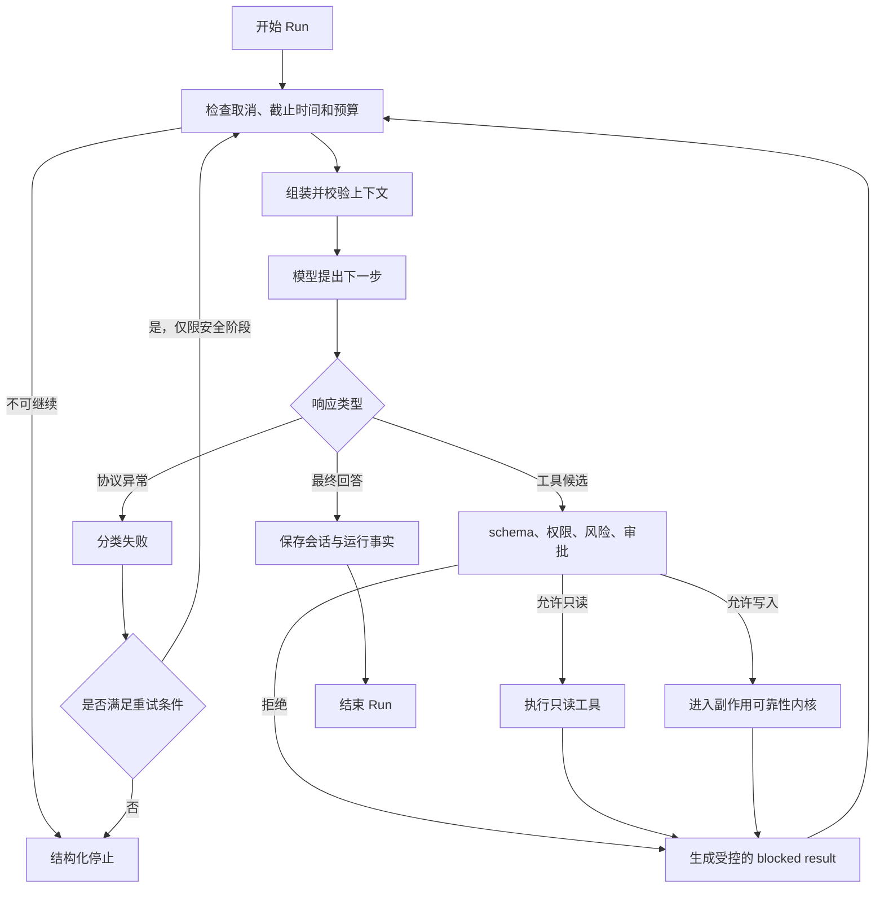

外壳中的判断尽量由代码完成，而不是继续追问模型“你确定吗”。模型可以解释风险，但是否越权、预算是否耗尽、状态能否迁移，必须由确定性规则裁决。

#### 3.2.3 停止条件是 Agent 能力的一部分

一个可靠 Agent 不只要知道“怎样继续”，还要知道“什么时候必须停”。常见停止条件包括：

| 停止原因 | 用户应该看到什么 | 底层应该做什么 |
| --- | --- | --- |
| 已得到最终答案 | 清晰结论和证据引用 | 保存 Session，记录 Run 完成 |
| 需要用户补充信息 | 缺什么、为什么缺、怎样继续 | 保留可恢复状态，不猜参数 |
| 权限或策略拒绝 | 哪项能力被拒绝、可选安全路径 | 不执行工具，记录拒绝原因 |
| 截止时间到达 | 已完成部分和未完成部分 | 级联取消子任务与进程 |
| Token/工作预算耗尽 | 当前结论边界 | 停止继续调用模型或工具 |
| 出现结果未知的写动作 | 明确提示人工接管或重新采证 | 禁止自动重试，保持 sticky 状态 |
| 上下文无法安全压缩 | 说明无法继续而不是丢约束 | 结构化失败，保留原始事实 |

这也是 Agent Runtime 与普通聊天封装的差别：**停止不是异常兜底，而是受设计、可观察、可恢复的正常结果。**

#### 3.2.4 预算与取消必须沿调用树传播

Run 可能启动 Plan、SubAgent、Provider 请求、并行工具和外部进程。如果每一层只管理自己的 timeout，用户按下取消后，后台仍可能继续消耗 Token、占用线程或执行命令。

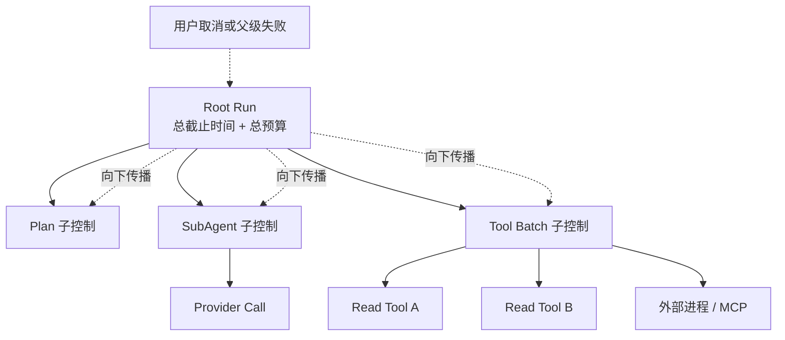

子任务可以拥有更小的局部上限，但不能突破父任务的总预算；父级取消后，所有后代都应尽快停止。这里控制的是“继续工作的资格”，不代表已经派发的远程副作用一定能撤销，所以写操作仍需要第 5 章的独立可靠性语义。

### 3.3 为什么必须有“唯一工具入口”

假设系统有四种执行方式：

- 普通 ReAct；
- 先规划再执行；
- 子 Agent；
- MCP 工具。

如果每种方式各自执行工具，就会产生四套权限逻辑和四套错误处理。即使其中三条路径安全，只要有一条遗漏审批，模型就能绕过安全边界。

因此项目规定：

> 普通工具、MCP、Plan、SubAgent 和内部工具最终都必须进入 `ToolCallExecutor`。

统一入口负责：

1. 校验工具名和参数；
2. 冻结工具元数据；
3. 判断只读还是有副作用；
4. 计算权限；
5. 必要时请求审批；
6. 有副作用时进入 Side Effect Gate；
7. 执行工具；
8. 记录结构化结果；
9. 将结果安全地交回模型。

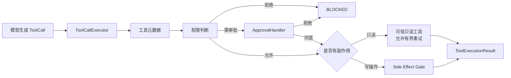

### 3.4 ToolMetadata 为什么是安全事实源

每个工具要声明：

- 是否只读；
- 风险等级；
- 是否有破坏性；
- 是否必须审批；
- 有哪些副作用；
- 是否允许并行；
- 超时和输出限制。

权限系统读取这些元数据，而不是靠工具名字猜风险。

原因很简单：名字不可靠。一个叫 `status` 的工具也可能偷偷写入；一个远程 MCP 工具也可能缺少可信注解。因此未知工具使用保守默认值：

```text
非只读 + 高风险 + 可能破坏 + 需要审批
```

这叫 **fail closed**：系统不确定时选择拒绝，而不是猜测安全。

### 3.5 PLAN、ASK、AUTO 到底有什么区别

| 模式 | 行为 | 仍然不能绕过 |
| --- | --- | --- |
| `PLAN` | 只暴露和执行只读工具 | 工具元数据、路径限制 |
| `ASK` | 写操作执行前必须人工确认 | SafetyInterceptor、可靠性门禁 |
| `AUTO` | 允许自动执行策略允许的操作 | SafetyInterceptor、动作契约、审计 |

容易误解的一点是：

> `AUTO` 不是“模型想做什么就做什么”，而是“不再逐次弹窗，但仍必须通过全部底层安全条件”。

当前 OPS MVP-3 是人工审批闭环。历史测试参数 `--auto-approve` 不等于 OPS-2B 的生产自动修复策略；当前独立远程 repair 启动器已 fail-closed。

### 3.6 Provider Adapter 解决了什么

不同模型厂商的请求和响应并不完全相同：

- 字段名称不同；
- 流式协议不同；
- reasoning 内容不同；
- token usage 统计不同；
- 错误码和重试建议不同；
- finish reason 的表达不同。

如果 `AgentEngine` 直接处理 OpenAI 或 DeepSeek JSON，核心循环会被厂商协议污染。因此 `clawkit-provider` 把它们转换成统一的：

```text
ModelRequest
ModelResponse
ToolCall
TokenUsage
FinishReason
ProviderError
```

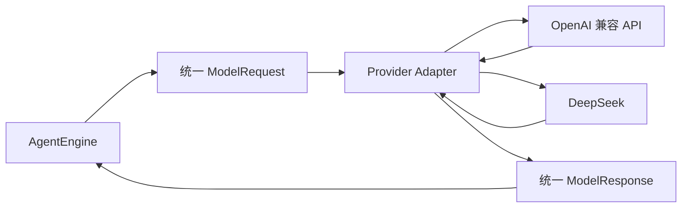

Provider 层只负责通信和协议，不判断运维根因，也不执行工具。可重试的通常是模型推理请求中的限流、部分 5xx 或网络错误；副作用工具不能借用 Provider 的自动重试逻辑。

### 3.7 MCP 在系统中的位置

MCP 可以理解为“模型工具的标准化远程插座”。典型交互是：

```text
initialize
→ notifications/initialized
→ tools/list
→ tools/call
```

Clawkit 作为 MCP Client：

1. 启动或连接 MCP Server；
2. 协商协议和服务信息；
3. 获取工具定义；
4. 将工具适配进统一 Registry；
5. 调用工具并解析 JSON-RPC 响应。

MCP 解决了“如何接入工具”，但不自动解决“工具是否安全”。远端注解可能缺失或不可信，所以 MCP 工具仍必须经过：

- metadata provenance；
- 保守风险映射；
- PermissionPolicy；
- SideEffectGate；
- 领域级 profile 和参数白名单。

### 3.8 Agent、Workflow、Plan 和 SubAgent 的区别

| 方式 | 谁决定下一步 | 适合场景 | 风险 |
| --- | --- | --- | --- |
| ReAct Agent | 模型每轮动态决定 | 开放式探索、代码任务 | 路径不固定，必须统一门禁 |
| TWO_STAGE | 模型先规划，再进入工具阶段 | 需要先整理思路的任务 | 规划文本不能获得额外权限 |
| Plan-and-Execute | 结构化计划和执行器 | 步骤清晰、需要进度状态 | 不能创建第二套工具旁路 |
| SubAgent | 独立子 run | 可拆分或并行子任务 | 需要独立 runId、取消与预算 |
| OPS Workflow | Java 编排器决定关键阶段 | 高风险修复闭环 | 灵活性较低，但安全边界更清晰 |

MVP-3 采用的是混合方式：

- 模型参与诊断解释；
- Java Workflow 固定审批、Precheck、执行和 Verification 顺序；
- 确定性 Policy Gate 决定修复资格。

这是一项重要取舍：高风险流程不必追求“全 Agent 化”。越接近真实副作用，越应该把关键步骤固化成可测试 Workflow。

### 3.9 怎样判断一项能力应该放在底座还是领域层

一个常见设计风险，是看到 OPS 需要某项能力，就直接把 Incident、SSH 或 Docker 写进 `AgentEngine`。更稳妥的判断方式是看它是否跨场景成立：

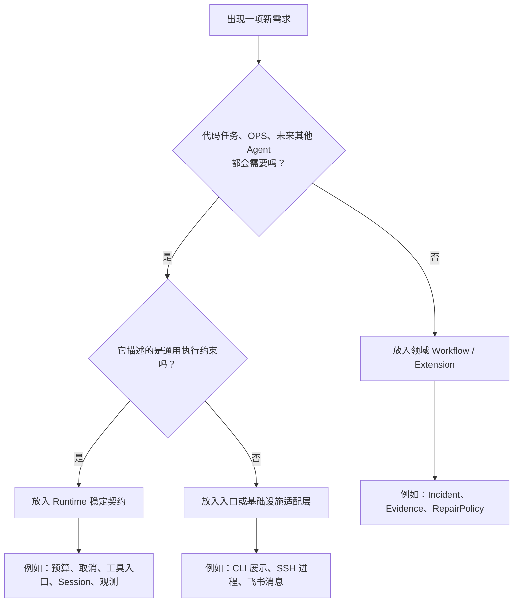

可以用三个问题做快速检查：

1. 去掉“运维”二字，这个概念是否仍然成立？
2. 它是在定义通用不变量，还是在描述某个领域的业务状态？
3. 如果未来增加另一种入口或工具来源，核心契约是否仍能保持不变？

底座不是“所有重要代码的集合”，而是跨场景复用的最小稳定内核。领域层可以依赖底座，底座不能反向理解领域名词。

### 3.10 最近代码为什么增加“意图路由 + RunToolScope”

早期入口把一句自然语言直接交给拥有全部注册工具的 `AgentEngine`。当本地代码工具与远程服务器工具同时存在时，这会出现一个产品和安全上的歧义：用户说“看看 order-api”，究竟是在看本地源码，还是在看服务器上的服务？只靠 system prompt 提醒模型不够，因为提示词属于软约束。

当前工作区在 CLI 前面增加了两层确定性边界：

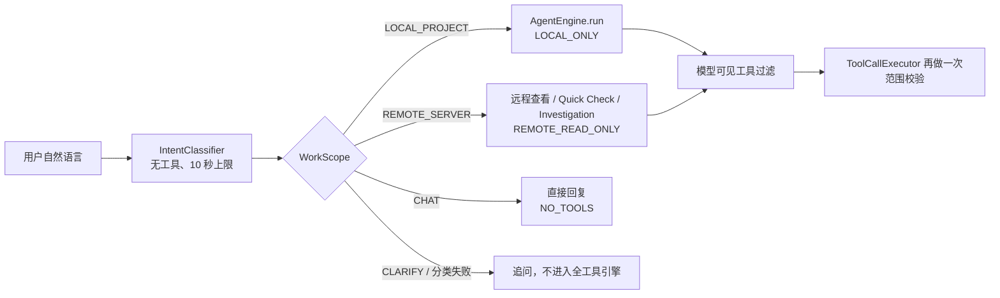

第一层是 [`IntentClassifier`](../clawkit-cli/src/main/java/com/clawkit/cli/intent/IntentClassifier.java)：它只接收用户输入、已登记服务器名和当前连接，不读取本地文件，也不获得任何工具。分类结果只能落在允许的 `WorkScope` 与 `ServerIntent` 枚举中；失败时按当前交互模式做保守回退，无法确定则追问。

第二层是 [`RunToolScope`](../clawkit-tools/src/main/java/com/clawkit/tools/RunToolScope.java)：

| Scope | 本轮允许看到和调用的能力 |
| --- | --- |
| `ALL` | 默认兼容路径，全部已注册工具 |
| `LOCAL_ONLY` | 本地项目工具，不包含远程 MCP 工具 |
| `REMOTE_READ_ONLY` | 当前远程连接中的只读工具，不包含本地文件、Git、Shell 和远程写工具 |
| `NO_TOOLS` | 纯聊天，不提供工具 |

这里故意采用“双门禁”：`AgentEngine` 在把工具定义交给模型前先过滤，`ToolCallExecutor` 在动作描述、审批和执行之前再次检查。即使模型猜到一个被隐藏的工具名，也只能得到 `BLOCKED`，不能借助 Plan、内部工具或直接点名形成旁路。受限 Scope 目前也拒绝 `PLAN_EXECUTE`，因为该协调器尚未把 Scope 逐步传播到每个计划任务；显式拒绝比静默退化到 `ALL` 更安全。

这次变化最值得学习的点不是“多了一个分类模型”，而是：

> 模型可以帮助理解用户意图，但能力边界必须成为随 Run 传播、在执行端重新验证的结构化参数。

---

## 4. 上下文、Session、Memory 为什么不能混在一起

### 4.1 先区分五种生命周期

“模型记得什么”不是一个存储问题，而是五种生命周期共同形成的结果：

| 概念 | 生命周期 | 典型内容 | 是否直接持久化 |
| --- | --- | --- | --- |
| `Run` | 一次用户目标 | `runId`、轮次、取消树、预算、工具 Scope | 通过 RunEvent 记录运行事实 |
| `ModelContext` | 一次 Provider 调用 | system prompt、Session、Memory、Skill、工具定义 | 否，每轮重新组装 |
| `Session` | 一段连续对话，可跨 Run | 用户消息、模型回复、工具调用与结果 | 可保存到 `~/.clawkit/sessions` |
| Working Memory | 当前 Session 内 | 子目标、临时结论、模型主动 `remember` 的键值 | 否，`/new` 后清空 |
| Long-term Memory | 跨 Session | 用户偏好、长期反馈、项目决策、参考资料 | 保存到 `~/.clawkit/memory` |

此外还有 Workspace、Runtime Reminder、相关旧会话摘要和当前 Skill。它们会影响本轮模型决策，却不应因为“发给过模型”就自动变成对话事实。

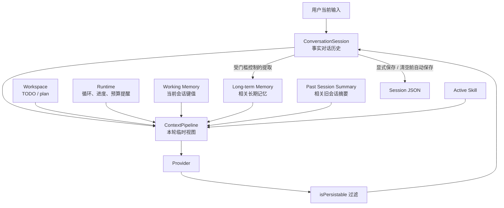

核心不变量是：

> `ModelContext` 是可重建的临时视图；Session 是对话事实；Memory 是经过选择的跨会话知识。三者不能互相充当事实来源。

### 4.2 一次 Run 中，会话上下文如何进入模型

入口在 [`AgentEngine.run`](../clawkit-engine/src/main/java/com/clawkit/engine/impl/AgentEngine.java)。普通 ReAct Run 开始时按以下顺序准备材料：

1. 建立新的 `runId`、取消树、deadline 与预算控制；
2. 从 Workspace 读取可重建信息；
3. 把当前用户输入追加到 `ConversationSession`；
4. 用当前任务召回最多 5 条长期 Memory；
5. 搜索相关历史 Session，最多注入 3 条名称和摘要；
6. 每轮再加入 Working Memory 与 Runtime Reminder；
7. 交给 `ContextPipeline` 统一组装、计数、掩码和压缩；
8. Provider 返回后，只把可持久化的用户/助手/工具事实写回 Session。

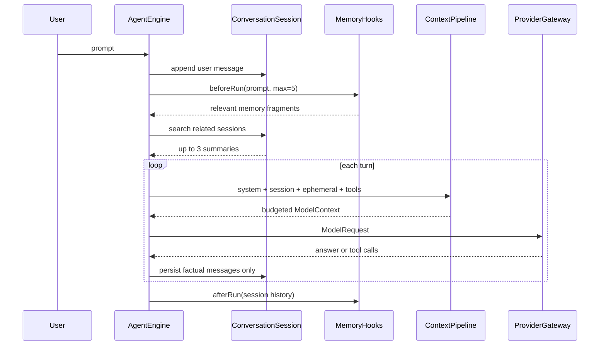

这里有两个容易忽略的细节：

- 稳定 system prompt 不保存在事实 Session 中，而是每轮由五层 [`PromptAssembly`](../clawkit-context/src/main/java/com/clawkit/context/PromptAssembly.java) 重建，避免权限模式、Skill 或 Memory Index 更新后仍带着旧提示词。
- 召回的 Memory、旧会话摘要、运行时提醒都以 system message 形式进入临时上下文，但 `isPersistable` 会过滤稳定 prompt 和 Runtime system message，避免它们在 Session 中自我复制。

### 4.3 ConversationSession 管理的不是“聊天字符串”

[`ConversationSession`](../clawkit-engine/src/main/java/com/clawkit/engine/impl/ConversationSession.java) 封装了内存历史与持久化边界。它负责：

- 追加和替换结构化 `Message`；
- 保存、加载、列出和删除 Session；
- 清空前最多自动保存一次；
- 根据新任务搜索相关旧 Session；
- 在保存和加载两端都应用 `persistable` 过滤。

Session 中保留的不只是 user/assistant 文本，还包括工具调用和与 `toolCallId` 对应的工具结果。这样恢复会话时，模型看到的是完整协议历史，而不是缺少调用原因的一串输出。

`/session load <id>` 不是把旧摘要贴到当前对话末尾。引擎会先执行 `clearSession()`，完成强制记忆提取、自动保存、临时上下文与审批缓存清理，再用加载出的事实消息替换当前历史。这个顺序可以防止两个 Session 的 Working Memory、审批授权或死循环签名串在一起。

### 4.4 Session 怎样落盘、搜索和恢复

生产装配在 [`ApplicationBootstrap`](../clawkit-cli/src/main/java/com/clawkit/cli/ApplicationBootstrap.java)：

```text
~/.clawkit/sessions/
├── index.json
├── <session-id>.json
└── <session-id>.json
```

[`SessionService`](../clawkit-engine/src/main/java/com/clawkit/engine/SessionService.java) 是门面，负责生成短 ID、摘要、搜索、统计和按年龄清理；[`FileSessionStore`](../clawkit-engine/src/main/java/com/clawkit/engine/impl/FileSessionStore.java) 负责文件格式和 I/O。

持久化设计包含几项后端工程细节：

- `SessionDocument` 带 `schemaVersion`、时间、消息和 metadata；高于当前版本时拒绝读取，旧 v0 文件走兼容读取路径。
- Session 文件和 `index.json` 先写同目录临时文件，再尝试 `ATOMIC_MOVE + REPLACE_EXISTING`；文件系统不支持原子移动时降级为替换。
- Session ID 解析后仍通过 `normalize + startsWith(basePath)` 防路径穿越。
- 损坏 JSON、未来版本、文件不存在和普通 I/O 错误使用不同的 `SessionError`，调用方不需要靠异常文本猜原因。
- 保存时通过 `ProviderGateway` 生成 50—150 字摘要；模型不可用或摘要失败时，回退到第一条用户消息，不阻断保存。

搜索不是加载所有完整对话交给模型。`SessionService.search` 只对名称、第一条用户消息和摘要做关键词评分，最多返回 5 条；Run 前的自动相关召回再限制为 3 条摘要。这同时控制了隐私暴露、I/O 和 Token 成本。

需要诚实说明：当前文件锁和原子性主要解决单进程内写入及单文件替换，Session 正文与索引仍不是一个跨文件事务；如果未来允许多个 Clawkit 进程共享同一个 HOME，需要增加进程级锁、索引重建或单一存储服务。

### 4.5 Memory 实际上有三层，不是一张无限增长的聊天表

当前代码中容易混淆的三种“记住”如下：

| 机制 | 入口 | 保存范围 | 适合内容 |
| --- | --- | --- | --- |
| Working Memory | 内部工具 `remember(key, value)` | 当前引擎 Session，内存 `ConcurrentHashMap` | 当前任务的临时子目标、短期结论 |
| Related Session | `session.relatedContext(query)` / `session_context` | 已保存 Session 的摘要索引 | “以前做过类似任务吗” |
| Long-term Memory | `memory_save`、CLI `/remember`、Run 后提取 | `~/.clawkit/memory/*.md` | 跨会话仍成立的偏好、反馈、决策、资料 |

Working Memory 每轮以 `[Working Memory]` 注入，但 `/new`、Session 加载或清空都会删除。它不能代替 Session，因为它没有完整对话顺序；也不能代替长期 Memory，因为没有磁盘持久化。

Related Session 召回的是“旧任务发生过什么”的摘要，不是自动加载旧对话。用户确实要继续那段对话时，才使用 `/session load <id>`。

Long-term Memory 则是一条条带 YAML frontmatter 的 Markdown：

```text
~/.clawkit/memory/
├── MEMORY.md               # 轻量索引：name + filename + description
├── user_prefer-chinese.md  # 完整内容
└── project_project-decision.md
```

`MemoryType` 只允许 `user`、`feedback`、`project`、`reference` 四类。索引可以进入稳定 prompt，让模型知道“有哪些记忆”；真正与当前任务相关的正文由召回流程按需加载。

### 4.6 长期 Memory 如何召回

[`DefaultMemoryHooks.beforeRun`](../clawkit-engine/src/main/java/com/clawkit/engine/impl/DefaultMemoryHooks.java) 当前采用轻量关键词召回：

```text
当前 task
→ 读取 MEMORY.md 索引
→ 用 name + description 建立 KeywordScorer 语料
→ 过滤 score = 0
→ 按相关度排序
→ 最多加载 5 个正文文件
→ 注入 [Relevant Memory: <name>]
```

这样做的好处是本地、透明、无向量数据库依赖，也支持中英文关键词；代价是同义表达、隐含关联和长文本语义召回能力有限。正文不参与第一阶段打分，因此记忆条目的 `name` 与 `description` 不是装饰字段，而是检索质量的一部分。

召回失败采取 best-effort：记录警告并返回空列表，不阻断主 Run。原因是 Memory 是辅助信息，不是工具权限、Attempt Journal 或审批状态那样的控制面事实。反过来，如果业务正确性依赖某条信息，就不应只把它放在 Memory；应该进入配置、策略、Incident 或版本化领域数据。

### 4.7 长期 Memory 如何写入

当前有三条写路径，但最终都进入同一个 `DiskMemoryService`：

1. **模型显式保存**：`memory_save(name, description, type, content)`。它是有副作用的内部工具，仍经过 `ToolCallExecutor`、权限判断、ActionDescriptor 和 Side Effect Gate；PLAN 模式不暴露。
2. **用户显式保存**：CLI `/remember` 先通过 Provider 提取元数据，再调用 `rememberMemory`，复用相同的去重和写入路径。
3. **Run 后自动提取**：`afterRun` 用单独的 `MEMORY_EXTRACT` phase 调用模型，从事实 Session 中提取跨会话信息。

自动提取不是每轮都跑。非强制模式同时要求：

- 累计至少 5 个 Turn；
- 距离上次提取至少新增 10 条消息；
- 格式化后的候选文本达到模型上下文窗口的 60%。

值得特别审查的是第三个条件：Token 检查使用的是已经截断到最多 40 条、每条 300 字的格式化文本。对于 128K 等大窗口，这个 60% 阈值可能长期无法达到，导致普通 Run 的自动提取很少触发，实际更多依赖清空 Session 时的强制提取。这是当前实现的行为边界，后续应让门槛基于未截断历史的预算报告，或改为独立的消息量/Token 上限策略。

清空或切换 Session 时使用 `force=true`，跳过上述门槛，最多保存 5 条。普通 Run 结束最多保存 3 条。候选消息最多 30 条；system message 被排除，过长工具结果截到 200 字，送入提取器的单条内容再限到 300 字、总条数限到 40，避免把整段终端输出当长期记忆。

提取器只允许保留：用户偏好、长期反馈、项目决策和外部资源；临时任务、工具输出以及可从代码重新推导的事实应跳过。同名同内容计为 `skipped`；同名不同内容会覆盖并计为 `conflicts`。提取失败、JSON 非法或存储异常不会让主任务改判失败。

这套策略是在“完全不记”和“把聊天全存下来”之间取中间值，但它不是最终形态：当前冲突只计数、不做语义合并；条目缺少来源引用、可信度、有效期和用户确认状态；`MEMORY.md` 与正文文件也不是跨文件事务。后续若增强，应先补来源、冲突审阅、敏感信息策略和可撤回性，再考虑向量检索。

### 4.8 ContextPipeline 如何阻止临时信息污染 Session

[`DefaultContextPipeline`](../clawkit-context/src/main/java/com/clawkit/context/impl/DefaultContextPipeline.java) 把输入拆成带来源和生命周期的 `ContextFragment`：

| Source | 生命周期 | 可压缩 | 说明 |
| --- | --- | --- | --- |
| `SYSTEM` | `EPHEMERAL` | 否 | 五层稳定提示词，每轮重建 |
| `WORKSPACE` | `EPHEMERAL` | 否 | 当前 TODO / plan 等可重建信息 |
| `SESSION` | `PERSISTED` | 是 | 事实对话历史 |
| `RUNTIME` | `EPHEMERAL` | 否 | 循环检测、进度提醒 |
| `MEMORY` | `EPHEMERAL` | 否 | Working Memory 与相关召回 |
| `SKILL` | `EPHEMERAL` | 否 | 当前激活 Skill |
| `TOOLS` | `EPHEMERAL` | 否 | 不作为 Message，但计入 Token 预算 |

这解释了为什么“它出现在 prompt 中”不等于“它应写入 Session”。持久化过滤只是最后一道防线，真正的边界从 ContextFragment 的来源建模就开始了。

### 4.9 为什么需要上下文压缩

模型上下文有长度限制。简单删除旧消息会丢掉用户约束、文件路径、已发现错误、未完成任务和审批边界。Clawkit 使用分级策略：

| 层级 | 做法 |
| --- | --- |
| L0 | 不处理 |
| L1 | 确定性删除低价值、可重建内容 |
| L2 | 抽取式压缩，尽量保留原文关键片段 |
| L3 | 调用模型生成摘要 |
| L4 | 无法安全压缩时结构化失败 |

关键约束叫 required anchor，可以理解为“绝不能压丢的钉子”。`AnchorSnapshotPlanner` 在压缩前固定 required / optional anchors，压缩后检查规范快照、保留 ID 和丢失范围。压缩失败或压缩后仍超过 95% 硬限制时，`AgentEngine` 返回 `COMPACT_FAILED`，不调用主任务模型，也不把失败结果覆盖进 Session。手动 `/compact` 同样通过这条唯一管线；失败时原 Session 保持不变。

这背后的设计思想是：

> 上下文压缩不是文案优化，而是一种可能改变后续决策的有损操作，因此必须有审计、锚点校验和 fail-closed 终态。

### 4.10 同一条信息为什么要有不同形态

“服务不可用”可能同时出现在对话、工具结果、Evidence、Incident 报告和长期 Memory 中，但它们不是同一份数据的随意复制：

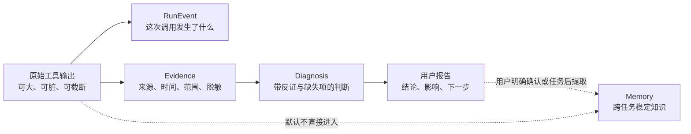

每次转换都在增加约束，同时丢弃不适合长期保留的内容：

- 原始输出用于追查，但可能包含噪声或敏感信息。
- RunEvent 记录运行事实，不负责证明业务结论。
- Evidence 把原始输出变成可引用、带时效的领域事实。
- Diagnosis 是对 Evidence 的解释，不应覆盖原始事实。
- Report 面向用户组织信息，不能反向充当底层状态。
- Memory 只保存跨任务仍成立的知识，不保存某次事故的瞬时状态。

因此“都存成一段聊天记录”看似简单，实际上会让时效、来源、恢复和审计全部失去边界。

---

## 5. 为什么写操作需要单独的可靠性内核

### 5.1 “请求失败”不等于“动作没发生”

考虑一次远程重启：

```text
客户端发出 restart_service
→ 远端已经重启成功
→ 网络在响应返回前断开
→ 客户端收到超时
```

如果系统把超时当成“没有执行”，然后自动重试，就可能重复产生副作用。

因此写操作的结果不能只用成功/失败两个值表达。项目使用 `EffectCertainty` 区分：

| 结果 | 含义 | 后续行为 |
| --- | --- | --- |
| `NOT_DISPATCHED` | 确认没有发出 | 可以安全结束 |
| `NO_EFFECT_CONFIRMED` | 确认没有副作用 | 可以受限重试 |
| `EFFECT_CONFIRMED` | 确认动作产生效果 | 进入独立验证 |
| `PARTIAL_EFFECT` | 只完成了一部分 | 核实并考虑补偿 |
| `EFFECT_UNKNOWN` | 不知道是否发生 | 禁止自动重试，重新采证 |

### 5.2 ActionDescriptor：先描述动作，再允许执行

每个写动作必须先生成不可变的动作描述：

- 动作代码；
- 规范化目标；
- 参数摘要；
- 风险与可逆性；
- 前置条件；
- 预期效果；
- 验证方式；
- 补偿策略；
- 影响范围；
- 幂等信息。

动作描述会形成 fingerprint。参数、目标或验证策略只要变化，指纹就变化，旧审批不能继续使用。

如果工具声明有副作用，却无法生成可信的 `ActionDescriptor`，系统直接拒绝。这避免出现：

```text
“先执行一下，执行完再补审计”
```

### 5.3 durable DISPATCH_INTENT：为什么必须先落盘

写操作最危险的窗口是“准备发送”和“已经发送”之间。

Clawkit 在真正调用工具前，先把 `DISPATCH_INTENT` 强制写入可靠性日志：

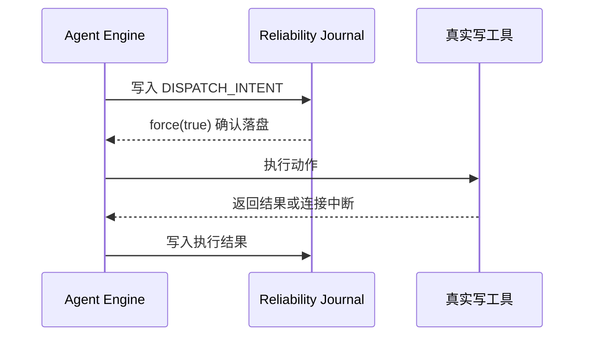

这样进程即使崩溃，重启后也能判断：

- 日志里没有 intent：确认没有派发；
- 有 intent 但没有结果：可能已经派发，进入 `OUTCOME_UNKNOWN`；
- 有执行结果但未验证：重新进入验证。

核心思想是：

> 宁可把一个实际没发出的动作当成“可能发出”，也不能把一个可能已经发出的动作当成“确定没发出”。

### 5.4 Attempt 状态机

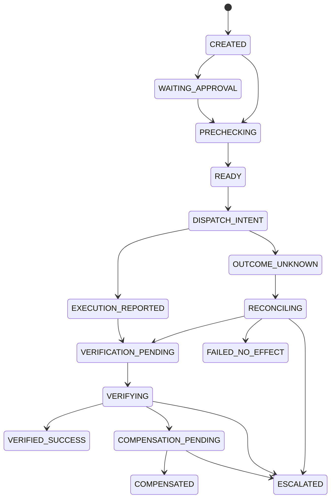

几个最重要的不变量：

1. 只有 `VERIFYING` 才能进入 `VERIFIED_SUCCESS`。
2. `OUTCOME_UNKNOWN` 不释放目标锁。
3. 同一目标不能同时执行两个写 Attempt。
4. `MANUAL_REQUIRED` 不能被程序自动标记成功。
5. 终态和人工接管不能被迟到响应反转。

### 5.5 为什么日志不是普通 JSON 文件

[`FileActionAttemptStore`](../clawkit-reliability/src/main/java/com/clawkit/reliability/attempt/FileActionAttemptStore.java) 使用：

- append-only journal；
- CRC 校验；
- `FileChannel.force(true)` 强制刷盘；
- 跨进程文件锁；
- 版本 CAS；
- 幂等键索引；
- 目标持有者索引。

这些机制分别解决：

| 风险 | 机制 |
| --- | --- |
| 写到一半进程崩溃 | append-only + CRC |
| 操作系统尚未把缓存写到磁盘 | `force(true)` |
| 两个 Java 进程同时操作 | 跨进程文件锁 |
| 迟到响应覆盖新状态 | version CAS |
| 模型换 toolCallId 重复动作 | 内容派生的 logicalActionId |
| 同一目标并发写 | target ownership |

### 5.6 启动恢复不是“重试”

[`RecoveryScanner`](../clawkit-reliability/src/main/java/com/clawkit/reliability/gate/RecoveryScanner.java) 在进程启动后扫描未完成 Attempt：

```mermaid
flowchart TD
    A["发现未完成 Attempt"] --> B{"崩溃前状态"}
    B -->|"intent 之前"| C["CANCELLED_NO_EFFECT"]
    B -->|"DISPATCH_INTENT"| D["OUTCOME_UNKNOWN"]
    B -->|"已报告执行"| E["VERIFICATION_PENDING"]
    B -->|"正在验证"| E
    D --> F["重新采集确定性证据"]
    F -->|"预期效果存在"| E
    F -->|"前置状态仍在"| G["FAILED_NO_EFFECT"]
    F -->|"无法确认"| H["ESCALATED"]
```

恢复扫描做的是“确认现状”，不是“把原动作再执行一次”。

### 5.7 把并发八股放回真实代码

项目中的并发不是为了炫技，主要解决四类问题：

#### 同一个对象被多个线程观察

`AgentEngine` 中的运行模式、取消状态和当前控制对象等使用 `volatile`。它保证一个线程修改后，其他线程能较快看到新值。

但 `volatile` 不保证复合操作原子性。例如：

```java
if (!busy) {
    busy = true;
}
```

两个线程仍可能同时通过判断。因此“是否正在执行任务”使用 `AtomicBoolean.compareAndSet`，把检查和修改合成一个原子动作。

#### 多个线程在同一 JVM 修改 Store

`FileActionAttemptStore` 使用 `ReentrantLock` 保护一次进程内事务。它解决同一 Java 进程中的线程竞争。

#### 两个 JVM 同时修改同一目录

`ReentrantLock` 只对当前 JVM 有效。两个 Clawkit 进程需要 `FileLock`，由操作系统协调跨进程互斥。

#### 多个读工具并行

`ToolCallExecutor` 只并行执行明确只读、允许并发的工具，并使用 Java 21 虚拟线程。写工具和高风险工具保持串行。

```mermaid
flowchart TB
    CALLS["一批 ToolCall"] --> CHECK{"全部只读且允许并行"}
    CHECK -->|"是"| VT["每个任务使用虚拟线程"]
    CHECK -->|"否"| SERIAL["按顺序串行执行"]
    VT --> JOIN["等待、取消、归并异常"]
    SERIAL --> RESULT["按原调用顺序返回"]
    JOIN --> RESULT
```

虚拟线程降低大量阻塞 I/O 任务的线程成本，但不会自动解决：

- 共享变量竞争；
- 任务取消；
- 超时；
- 异常归并；
- 执行顺序；
- 副作用安全。

#### CAS 在状态机中的作用

Attempt 每次迁移都携带 `expectedVersion`：

```text
读取 version=3
→ 准备从 VERIFYING 更新为 VERIFIED_SUCCESS
→ Store 发现当前已经是 version=4
→ 拒绝迟到更新
```

这就是乐观锁。它防止网络迟到响应或并发线程把人工升级后的新状态改回旧状态。

你需要能区分：

| 机制 | 范围 | 项目用途 |
| --- | --- | --- |
| `volatile` | 线程可见性 | 模式、取消和当前引用 |
| `AtomicBoolean` | 单变量原子更新 | busy、只完成一次 |
| `ReentrantLock` | 同 JVM 临界区 | Store 进程内事务 |
| `FileLock` | 跨 JVM/进程 | 同一 Journal 的互斥访问 |
| version CAS | 业务状态并发 | 拒绝迟到状态迁移 |
| target ownership | 领域互斥 | 同一目标禁止并发副作用 |

### 5.8 文件持久化、进程与资源管理

这是普通 CRUD 项目较少遇到、但 Runtime 很重要的一组知识。

#### append-only journal

不反复覆盖整个文件，而是追加每次状态变化。优势是：

- 崩溃时通常只损坏最后一行；
- 可以回放状态历史；
- 更容易定位某次迁移；
- 配合 CRC 判断记录是否完整。

#### CRC 与业务哈希不是一回事

- CRC 用来发现文件内容是否意外损坏；
- SHA-256 等哈希可用于指纹、快照和审批绑定；
- 二者都不是加密，也不能代替访问控制。

#### `force(true)` 与原子写

Java 写入完成不代表数据已经进入稳定磁盘。安全关键日志在返回“已持久化”之前调用 `FileChannel.force(true)`。

普通快照文件可以采用：

```text
写入临时文件
→ flush/close
→ 原子 rename 替换正式文件
```

这样读者不会看到只写了一半的 JSON。

#### stdout 和 stderr 为什么要同时读取

子进程的 stdout/stderr 都有缓冲区。如果程序只读 stdout，而 stderr 写满，子进程可能永远阻塞。`DefaultProcessRunner` 使用两个虚拟线程同时 drain，并在 timeout 后终止进程树。

#### try-with-resources

SSH Session、MCP Transport、FileChannel、AttemptStore 等资源必须在成功和异常路径都关闭。try-with-resources 的价值不只是少写 `finally`，而是把资源所有权写进代码结构：

```java
try (RemoteOpsSession session = ...;
     OpsFixSession fix = ...) {
    // 使用资源
}
```

面试时可以把这部分总结成：

> 项目不只考虑方法返回值，还考虑线程、进程、文件和网络连接在失败路径上的生命周期。

---

## 6. 观测和评测：为什么不能只看最终输出

### 6.1 RunEvent 是运行事实

模型最后说“任务完成”不等于任务真的完成。系统需要知道：

- 一共运行了多少轮；
- 调用了哪些模型；
- 调用了哪些工具；
- 工具是否失败或被拒绝；
- 是否发生审批；
- 是否触发压缩；
- 最终是完成、取消、超时还是预算耗尽。

Clawkit 把这些过程写成 `RunEvent`：

```text
.clawkit/runs/<run-id>/
  events.jsonl
  summary.json
```

- `events.jsonl` 是事实源；
- `summary.json` 是从事件聚合出的索引；
- 指标从事件投影，不再维护第二套相互矛盾的事实。

观测模块只记录，不反向决定 Agent 行为。这样避免“为了让报表好看而改变控制状态”。

#### 6.1.1 一条事件如何同时服务实时查看和事后回放

运行观测的关键不在于“多打日志”，而在于实时摘要和事后回放不能各自维护一套统计逻辑：

```mermaid
flowchart LR
    E["Agent / Provider / Tool\n产生结构化事件"] --> R["FileRunRecorder\n按顺序追加 events.jsonl"]
    R --> A["RunAccumulator\n聚合状态和指标"]
    A --> S["summary.json\n当前任务摘要"]

    F["历史 events.jsonl"] --> RR["RunReader\n读取并校验事件"]
    RR --> A2["同一 RunAccumulator"]
    A2 --> RS["回放后的摘要与指标"]
```

[`FileRunRecorder`](../clawkit-observability/src/main/java/com/clawkit/observability/FileRunRecorder.java) 为同一 Run 分配递增序号，将事件顺序写入 `events.jsonl`，再把 [`RunAccumulator`](../clawkit-observability/src/main/java/com/clawkit/observability/RunAccumulator.java) 的当前结果写成 `summary.json`。事后读取时，[`RunReader`](../clawkit-observability/src/main/java/com/clawkit/observability/RunReader.java) 重新消费相同事件，并复用同一个聚合器。因此“运行时看到的摘要”和“离线重放得到的摘要”遵守同一套计算规则。

事件不只记录成功或失败，还保留 `runId`、`parentRunId`、Turn、模型调用、工具重试、审批决定、输出截断和上下文压缩结果。父子 Run 可以串成调用树；[`RunEventCodec`](../clawkit-observability/src/main/java/com/clawkit/observability/RunEventCodec.java) 处理结构升级和未知事件；[`ObservabilityRedactor`](../clawkit-observability/src/main/java/com/clawkit/observability/ObservabilityRedactor.java) 在参数落盘前遮蔽密钥等敏感值。

这套设计对应简历中的“过程追踪”：它让复杂任务可以定位和比较，但仍属于尽力而为的观测数据。真正决定写操作能否继续的 Attempt Journal 具有更强的持久化要求，不能被 `events.jsonl` 代替。

### 6.2 为什么可靠性日志和 RunEvent 要分开

两类日志的重要性不同：

- RunEvent 写失败：可能损失观测信息，但不应改变工具的真实结果。
- Reliability Journal 写失败：无法证明写操作处于什么状态，必须阻断动作。

这是一条很有价值的工程原则：

> 不是所有日志都一样重要。参与安全决策的日志属于控制面状态，必须 fail closed。

### 6.3 三类 Benchmark 不能混为一谈

```mermaid
flowchart TB
    P["Pipeline Benchmark\n管线是否可靠"] --> C["Closed-loop Benchmark\n修复闭环是否可靠"]
    D["Diagnosis Benchmark\n模型是否会诊断"] --> C

    P --- P1["Fixture、采证、协议、报告、清理"]
    D --- D1["未知故障、缺失/冲突/过期证据"]
    C --- C1["审批、Precheck、执行、验证、补偿"]
```

| Benchmark | 能证明 | 不能证明 |
| --- | --- | --- |
| Pipeline | 工程管线能稳定运行 | 模型会处理未知故障 |
| Diagnosis | 模型在盲测中的判断能力 | 写操作一定安全 |
| Closed-loop | 完整修复流程满足安全门禁 | 可以直接用于生产自动修复 |

如果确定性代码把模型的错误答案改成正确答案，再把结果统计为“模型诊断成功”，就是口径污染。

因此报告必须分别给出：

- requested；
- completed；
- evaluable；
- passed；
- Provider 失败；
- 协议失败；
- Fixture 清理失败；
- 越权、假修复和重复副作用。

### 6.4 从 Java 后端视角理解测试分层

```mermaid
flowchart TB
    U["Unit\n纯函数、状态迁移、schema"] --> C["Component\nStore、Executor、Parser"]
    C --> I["Integration\n跨模块权限和持久化"]
    I --> E["E2E\n真实 SSH、MCP、Docker Fixture"]
    E --> B["Benchmark\n重复样本和统计结论"]
```

#### Unit Test

适合验证：

- `AttemptState` 合法迁移；
- Policy Gate 输入输出；
- Evidence 时效；
- Snapshot hash；
- 错误分类。

这些测试快速、确定，不需要网络。

#### Component Test

适合验证一个完整组件：

- ToolCallExecutor 是否拒绝未知写工具；
- FileActionAttemptStore 是否处理 CRC 损坏；
- McpClient 是否解析 JSON-RPC error；
- ContextPipeline 是否保留 required anchor。

通常使用临时目录、Fake Provider、Fake Transport 和可注入 Clock。

#### Integration Test

验证几个模块之间的合同，例如：

```text
模型生成写 ToolCall
→ 权限要求审批
→ SideEffectGate 记录 Attempt
→ 工具返回
→ RunEvent 完整
```

#### E2E

验证真正的外部边界：

- SSH forced-command；
- MCP initialize/tools/list/tools/call；
- Docker Compose；
- profile 切换与恢复；
- 业务 HTTP 和数据库状态。

E2E 通过不能代替 Unit Test，因为真实环境很难稳定制造每个崩溃窗口；Unit Test 通过也不能代替 E2E，因为 Mock 无法证明远端权限真的生效。

#### 阅读测试的正确方法

不要先看测试数量。优先找一个行为对应的三组用例：

1. 正常成功；
2. 明确失败；
3. 最危险的边界或并发窗口。

例如学习 `OUTCOME_UNKNOWN` 时，应找到：

- 远端明确成功；
- 派发前失败；
- durable intent 后进程被强杀或响应丢失。

测试名称应当像一句需求，而不是 `testMethod1`。当生产代码难懂时，测试往往是最接近“设计意图”的入口。

---

## 7. OPS Loop 与分层自治

### 7.1 演进路线

```mermaid
timeline
    title OPS Loop 演进
    OPS-0A : 本地 App Down
           : 只读采证和报告
    OPS-0B : PostgreSQL 锁等待
           : 业务不变量和盲测
    OPS-1  : 远程 opsro
           : 受限只读诊断
    MVP-2  : 远程报告
           : 飞书单向通知
    MVP-3  : 人工审批修复
           : opsfix 与独立验证
    OPS-3A : 只读持续发现
    OPS-2B : Shadow 后有限 AUTO
    OPS-3B : 版本化 Playbook
```

这个顺序背后有明确因果：

1. 没有稳定 Fixture，就不知道故障是否真的存在。
2. 没有只读证据，就不能安全诊断。
3. 没有远端权限隔离，就不能连接真实主机。
4. 没有 P1-G 可靠性内核，就不能开放写操作。
5. 没有人工审批闭环，就不应该考虑自动修复。
6. 没有持续运行数据，就不应该晋级生产 AUTO。

#### 7.1.1 用户体验不是先创建 Incident

工程上需要 Incident、Evidence 和状态机，但用户的第一句话通常只是“帮我看看服务怎么了”。产品入口应该按问题深度逐级展开：

```mermaid
flowchart TD
    Q["用户：帮我看看 api-prod"] --> TARGET["确定目标并检查连接"]
    TARGET --> QUICK["Quick Check\n服务、容器、HTTP、近期错误"]
    QUICK --> RESULT{"结果怎样？"}

    RESULT -->|"正常"| OK["一句结论\n关键指标 + 证据时间"]
    RESULT -->|"轻微异常"| HINT["说明异常\n给出可执行的下一步"]
    RESULT -->|"严重、冲突或用户要求深入"| INVEST["进入 Investigation"]

    INVEST --> INCIDENT["创建或关联 Incident"]
    INCIDENT --> EVIDENCE["扩大只读采证"]
    EVIDENCE --> DIAGNOSIS["诊断、反证、缺失证据"]
    DIAGNOSIS --> ACTION{"存在审核过的动作？"}
    ACTION -->|"否"| ESC["建议人工处理"]
    ACTION -->|"是"| APPROVAL["解释风险并请求审批"]
```

这条产品旅程目前已经接入普通 CLI：意图层区分本地项目、远程服务器、纯聊天和追问；服务器查询可以停在 Quick Check，也可以按明确调查请求进入 `RemoteDiscoveryWorkflow`、持久化 Incident、人工审批与独立验证。当前重点已从“把入口串起来”转为用真实 dogfood 检查提示是否易懂、结果是否过载以及失败后能否继续。

这条旅程有三个体验原则：

1. **先回答用户当前的问题。** Quick Check 正常时不强迫用户理解 Incident。
2. **逐步披露复杂度。** 只有进入深入调查，才展示证据冲突、根因候选和缺失项。
3. **每一步都能停。** 用户可以停在查看、调查、建议或审批，不会因进入 Agent 流程就被迫执行写操作。

#### 7.1.2 OPS Loop 实际上包含两个闭环

“发现并解释问题”和“审批后处置问题”风险不同，不应塞进一个模糊的大循环：

```mermaid
flowchart LR
    subgraph READ["只读认知闭环"]
        A["发现"] --> B["采证"]
        B --> C["诊断"]
        C --> D["报告"]
        D -->|"证据不足"| B
    end

    subgraph WRITE["受控处置闭环"]
        E["建议动作"] --> F["策略准入"]
        F --> G["人工审批"]
        G --> H["Fresh Precheck"]
        H --> I["受限执行"]
        I --> J["独立验证"]
        J -->|"失败或未知"| K["补偿 / 人工接管"]
    end

    D -->|"存在允许的处置候选"| E
    J -->|"产生新事实"| B
```

前一个闭环可以高频、自动、只读运行；后一个闭环必须低频、强约束、可审计。即使未来增加持续观察，也不等于自动获得写权限；“谁触发任务”和“任务能做什么”是两条独立轴。

#### 7.1.3 分层自治不是一个 AUTO 开关

OPS Loop 没有把“人工处理”和“完全自动”做成一个二选一开关，而是按动作风险拆成五个层级。当前代码已落地 A0—A2 的主闭环，并完成了 A3 的 Fixture-only 反事实闭环；A4 仍是明确的 No-Go：

| 层级 | 系统可以做什么 | 关键约束 | 当前状态 |
| --- | --- | --- | --- |
| A0 观察 | 定时只读采证，识别 APP_DOWN、HEALTHY、UNKNOWN，合并重复事件 | 无写工具；同目标互斥；暂停、预算、冷却和重启恢复均持久化 | 已完成，限可丢弃 Fixture；待真实墙钟证据 |
| A1 建议 | 模型解释证据并生成诊断、处置建议 | 确定性信号校准模型结论；建议对象本身不可执行 | 已完成 |
| A2 审批执行 | 对允许的固定动作展示风险并请求人工批准，执行后独立复核 | Policy Gate、现场快照、fresh precheck、持久化派发意图、结果未知阻断 | 已完成闭环；真实服务器保持只读，写动作在 Fixture 验证 |
| A3 Shadow | 记录系统本来会执行的动作，但不真正派发 | Fixture allowlist、同次快照内的引用与白名单事实双校验、不可变 policy/decision/review、零副作用与人工反事实选择 | Fixture-only 已完成；缺真实 dogfood 人工对账，不能晋级 |
| A4 有限自动 | 仅对 Fixture 或 Canary 中的单一白名单动作自动执行 | 目标、动作、频率和失败处理全部受限，可随时降级 | No-Go |

这里有两条容易混淆的轴：

- **触发自动化**回答任务由人发起还是由 Scheduler 发起；
- **权限自治**回答任务最多能看到、建议或执行到哪一步。

一个定时任务可以自动运行，但仍然只有 A0 只读权限；一次人工发起的调查也可以进入 A2 审批执行。把两条轴分开，才能避免“接入 Cron 就等于自动修复”的权限跃迁。

简历使用“从自动巡检、模型诊断到审批修复逐级放权”，对应的是证据最完整的 A0—A2。A3 可以在追问时说明为“已完成 Fixture-only 的零副作用反事实闭环”，但不写成自动修复或真实效果；A4 不提前算作项目成果。

### 7.2 Fixture：可重复的测试世界

当前主要业务 Fixture：

```mermaid
flowchart LR
    K6["k6 合成流量"] --> G["nginx gateway"]
    G --> API["order-api"]
    API --> PG["PostgreSQL"]
    CTRL["隐藏控制面"] -.->|"注入锁等待或故障"| API
    CTRL -.-> PG
```

它解决两个问题：

- **可重复注入故障**：每次实验知道故障是什么、何时开始。
- **可验证业务结果**：不能只看进程，要检查订单、金额、重复请求、成功率和延迟。

隐藏 Ground Truth 不能暴露给模型。Evaluator 只能在模型提交报告后读取答案，否则测试变成“把答案放在题目里”。

### 7.3 Incident、Evidence、Diagnosis 的关系

```mermaid
flowchart LR
    I["Incident\n一次事故的生命周期"] --> E["Evidence\n带来源和时效的事实"]
    E --> D["Diagnosis\n对事实的判断"]
    D --> S["RepairSuggestion\n不可直接执行的建议"]
    S --> G["Policy Gate\n确定性准入"]
```

#### Incident

Incident 负责表达一次事故的状态，而不是保存全部工具输出。当前只读状态包括：

```text
DISCOVERED
→ COLLECTING
→ EVIDENCE_READY
→ DIAGNOSED / INCONCLUSIVE
→ READ_ONLY_COMPLETE / ESCALATED
```

#### Evidence

每条 Evidence 不只是一个值，还包括：

- 来自哪个工具；
- 观察时间和采集时间；
- 作用范围；
- 是事实还是推测；
- 当前、历史还是过期；
- 是否采集成功；
- 有效期；
- 原始证据引用；
- 是否做过脱敏。

同样一句“服务没运行”，如果来自十分钟前的日志和来自刚刚的容器状态，决策价值完全不同。

#### Diagnosis

Diagnosis 不只是根因名称，还要包含：

- 置信度；
- 支持证据；
- 反证；
- 备选根因；
- 缺失证据；
- 当前仍故障还是已经恢复；
- 是否声称已恢复；
- 恢复应归因于谁。

这让系统可以表达 `INCONCLUSIVE`，而不是证据不足时强行猜一个答案。

### 7.4 模型与确定性代码如何分工

模型擅长：

- 阅读多种证据；
- 解释关联；
- 提出候选原因；
- 生成面向人的说明。

确定性代码擅长：

- 校验 schema；
- 检查证据是否存在、过期或冲突；
- 判断目标和动作是否在白名单；
- 执行状态迁移；
- 统计测试结果；
- 拒绝越权。

```mermaid
flowchart TD
    E["受限 Evidence"] --> M["模型解释与候选诊断"]
    E --> S["确定性 DiagnosticSignals"]
    M --> R["DiagnosisReconciler"]
    S --> R
    R --> G["RepairPolicyGate"]
    G -->|"允许进入审批"| A["Approval"]
    G -->|"证据不足或不合规"| X["拒绝或升级人工"]
```

当前 MVP-3 E2E 中，DeepSeek 可能返回 `INCONCLUSIVE`，随后由确定性证据协调器确认 `APP_DOWN`。因此正确表述是：

> 模型参与诊断解释，最终修复资格由确定性证据和 Policy Gate 决定。

不能表述成“模型自主诊断并修复了故障”。

### 7.5 用户看到的进度与底层状态如何对应

用户不需要看状态机枚举，但需要知道系统现在在做什么、是否安全、能否取消。可以把底层阶段翻译成稳定的体验语言：

| 用户看到的阶段 | 底层主要状态 | 用户最关心的问题 |
| --- | --- | --- |
| 正在连接 | 目标解析、SSH 建连、attestation | 连的是不是我选的服务器？ |
| 正在检查 | Quick Check / `COLLECTING` | 目前检查了哪些范围？ |
| 正在分析 | `EVIDENCE_READY` / Diagnosis | 结论依据是什么？还有什么不知道？ |
| 建议处置 | `PLAN_READY` / Policy Gate | 为什么是这个动作？影响多大？ |
| 等待确认 | `WAITING_APPROVAL` | 我批准的具体是什么？多久有效？ |
| 执行前复核 | `PRECHECKING` | 现场是否已经变化？ |
| 正在执行 | `EXECUTING` / Attempt | 动作是否已经派发？现在能否安全重试？ |
| 正在验证 | `VERIFYING` | 业务是否真的恢复？ |
| 需要接管 | `ESCALATED` / `OUTCOME_UNKNOWN` | 已知事实、未知部分和下一步是什么？ |

这张映射表比直接把内部枚举打印给用户更重要。好的 CLI 不是隐藏底层复杂度，而是把复杂度翻译成用户能做决定的信息。

### 7.6 2026-08-04 工作区把哪些产品闭环补实了

最近改动主要不是增加新的修复动作，而是把已有安全内核变成可独立验收的用户路径：

| 改动 | 代码落点 | 它证明或改善什么 |
| --- | --- | --- |
| `FixSession` 接口 | `ops-loop/repair` | `OpsFixSession` 不再是不可替换的具体类，夹具能注入可控执行结果 |
| 批准路径夹具 | `AppDownApproveFixtureTest` | 覆盖成功、自恢复、快照漂移、执行失败、结果未知、验证失败等 8 条决策路径 |
| 拒绝/取消夹具 | `AppDownRejectFixtureTest` | 证明不创建写 Session、`restart_service` 调用为 0、终态持久化且不能继续 |
| 六类终端展示 | `RejectedTerminalRenderTest` | 区分已拒绝、已取消、已恢复、无需操作、未产生效果和需要人工处理 |
| 证据翻译 | `OpsInvestigationFacade` | 将通用“正常/异常”细化为服务状态、容器状态、HTTP 状态码和近期 5xx 数量 |
| dogfood 记录 | `DogfoodLogger`、`/ops feedback`、手动 `shadow-review` | 记录脱敏任务、动作数、审批阅读时长、反馈，以及 Fixture A3 的人工反事实选择，为 Phase 5 提供原始数据 |

这些测试仍不能替代真实远端批准成功的 dogfood。当前真实 `test-server` 保持只读；写入验收只允许在可丢弃 APP_DOWN Fixture 中使用唯一白名单动作 `restart_service(order-api)`。因此准确状态是：PRODUCT-3 Phase 0—4 已具备夹具闭环，Phase 5 的 7 天个人真实使用仍在进行。

---

## 8. 远程 SSH：从接入体验到底层安全边界

### 8.1 用户实际经历的不是“配置一条 Transport”

用户真正想做的是“看一下我的服务器”，而不是理解 endpoint、合同哈希和 MCP generation。理想接入流程应该复用用户已经配置好的 OpenSSH 能力：

```mermaid
flowchart LR
    DISCOVER["发现 ~/.ssh/config\n中的 Host 别名"] --> CHOOSE["用户选择目标"]
    CHOOSE --> RESOLVE["解析 ssh -G\n只读取非敏感连接信息"]
    RESOLVE --> TRUST{"主机身份是否已信任？"}
    TRUST -->|"首次或变化"| CONFIRM["明确展示 fingerprint\n由用户确认"]
    TRUST -->|"已信任"| CONNECT["连接测试"]
    CONFIRM --> CONNECT
    CONNECT --> CAP["能力握手与 attestation"]
    CAP --> READY["READY\n展示可用只读能力"]
    CAP -->|"不匹配"| DOCTOR["Doctor\n说明原因和下一步"]
```

体验上应坚持：

- 用户选择的是熟悉的 Host 别名，不是复制一长串 SSH 参数。
- 私钥继续由 OpenSSH 或 SSH Agent 管理，Clawkit 不重新保管。
- 首次 host key 信任必须显式确认，不能用“连接失败后自动接受”代替。
- 默认状态只展示“是否可用、可做什么、下一步是什么”；合同哈希、generation 和工具清单放在 `inspect` 或诊断视图。
- 失败提示面向恢复动作，例如“主机身份变化，需要人工核对”，而不只抛出底层异常。

### 8.2 SSH 在这里是受控传输层，不是模型工具

如果 Agent 能发送任意 SSH 命令，那么客户端提示词、代码校验和审批都不是最终安全边界。攻击者只要找到一条旁路，就可能：

- 读取私钥或配置；
- 执行任意 shell；
- 访问 Docker socket；
- 重启数据库；
- 上传文件；
- 建立端口转发。

因此远端能力采用“能力白名单”，而不是“命令黑名单”。

```mermaid
flowchart LR
    MODEL["模型"] --> CALL["结构化 Tool Call"]
    CALL --> LOCAL["本地 ToolCallExecutor\n权限、预算、审计"]
    LOCAL --> PROFILE["预期 Capability Profile"]
    PROFILE --> SSH["OpenSSH 传输"]
    SSH --> FORCED["远端 forced-command"]
    FORCED --> MCP["受限 MCP Server"]
    MCP --> BACKEND["固定后端动作"]

    MODEL -.->|"不可见"| KEY["私钥 / SSH Agent"]
    MODEL -.->|"不可获得"| SHELL["任意 shell / sudo / scp"]
```

关键点是：模型看见的是结构化能力，例如“读取服务状态”，不是 `ssh host "任意字符串"`。SSH 只负责把受限协议送到远端，不能成为新的工具旁路。

### 8.3 一次连接应被建模为临时能力挂载

远程工具不应在连接断开后继续留在全局 Registry 中，也不能因为重连就残留重复工具。更合适的生命周期是：

```mermaid
sequenceDiagram
    actor User as 用户
    participant CLI as 本地 CLI
    participant SSH as OpenSSH 进程
    participant MCP as 远端 MCP
    participant REG as ToolRegistry

    User->>CLI: 选择目标并发起查看
    CLI->>SSH: 使用已解析配置建立连接
    SSH->>MCP: forced-command 启动受限服务
    CLI->>MCP: initialize + tools/list + attestation
    MCP-->>CLI: 真实能力集合
    CLI->>REG: 原子挂载本次会话拥有的工具
    CLI-->>User: READY，可开始查看

    alt 用户退出、连接失败或超时
        CLI->>REG: 卸载该会话拥有的全部工具
        CLI->>MCP: close
        CLI->>SSH: 终止并回收进程与流
    end
```

这里的 owner/mount 思想解决的是资源所有权：谁挂载，谁负责完整卸载。连接成功只是中间状态；只有握手、能力核对和工具挂载全部完成，用户才应该看到 `READY`。

### 8.4 opsro 与 opsfix 分离

```mermaid
flowchart LR
    LOCAL["本地 Clawkit"]

    subgraph REMOTE["远端测试机"]
        SSHD["sshd Match / forced-command"]
        ROGW["opsro gateway"]
        FIXGW["opsfix gateway"]
        ROMCP["只读 MCP Server"]
        FIXMCP["修复 MCP Server"]
        DOCKER["Docker Compose"]
    end

    LOCAL -->|"只读独立密钥"| SSHD
    LOCAL -->|"修复独立密钥"| SSHD
    SSHD --> ROGW
    SSHD --> FIXGW
    ROGW --> ROMCP
    FIXGW --> FIXMCP
    ROMCP -->|"白名单查询"| DOCKER
    FIXMCP -->|"仅 restart_service order-api"| DOCKER
```

#### opsro

- 默认无写权限；
- 无通用 sudo；
- 无 Docker socket；
- 无终端和文件传输；
- 只能通过 forced-command 启动只读 MCP；
- 工具由 profile 固定。

#### opsfix

- 使用另一把 SSH 密钥；
- 无通用 shell；
- gateway 逐条校验 JSON-RPC；
- 只允许 `restart_service(serviceId=order-api)`；
- MCP 服务端再次校验；
- 实际 Docker 动作由受限后端完成。

这里用了两层拒绝：

```text
客户端校验
→ forced-command gateway 校验
→ MCP 服务端再次校验
→ 后端只实现固定动作
```

客户端不是最终信任边界。即使客户端被绕过，远端仍不能执行 `restart_service(postgres)` 或任意命令。

### 8.5 MCP attestation 是什么

建立会话后，本地不能只相信“连接成功”，还要核对：

- server name；
- capability profile；
- toolSetHash；
- `tools/list` 返回的真实工具集合；
- 工具注解和风险信息。

如果预期只读 profile，远端却暴露了写工具，系统应该立即断开。这和 HTTPS 证书检查的思想类似：不仅建立连接，还要确认连接的是预期能力。

### 8.6 把底层失败翻译成用户可恢复的错误

远程链路包含目标解析、网络、SSH 认证、host key、进程、MCP 握手和能力核对。把它们都显示成“连接失败”，用户无法判断下一步。

| 用户提示 | 底层分类 | 合理的下一步 |
| --- | --- | --- |
| 找不到目标 | Host 别名未解析或登记缺失 | 重新选择或检查 OpenSSH config |
| 无法到达服务器 | DNS、网络或端口超时 | 检查网络和安全组，不自动改配置 |
| 身份认证失败 | SSH Agent/密钥/账号问题 | 指向 OpenSSH 自检，不读取私钥 |
| 主机身份需要确认 | known_hosts 缺失 | 展示 fingerprint，等待用户决定 |
| 主机身份发生变化 | host key mismatch | 高风险阻断，要求人工核对 |
| 远端组件不可用 | forced-command 或 MCP 启动失败 | 给出安装/版本检查建议 |
| 能力与预期不符 | profile、toolSetHash 或工具集合不匹配 | 立即断开，不降级为任意 shell |
| 会话中途断开 | SSH/MCP transport EOF | 卸载工具，说明已完成与未完成部分 |

错误分类同时服务两端：用户获得清楚的恢复路径，底层则知道是否允许重试、是否需要重新建立信任，以及是否必须 fail closed。

---

## 9. MVP-3 审批修复闭环

### 9.1 完整时序

```mermaid
sequenceDiagram
    actor User as 人工审批者
    participant Main as Repair Main
    participant RO1 as opsro 诊断会话
    participant Gate as Policy Gate
    participant Store as Attempt Journal
    participant RO2 as fresh opsro
    participant Fix as opsfix
    participant RO3 as verification opsro

    Main->>RO1: 采集现场证据
    RO1-->>Main: Evidence Bundle
    Main->>Main: 模型诊断和确定性协调
    Main->>Gate: Diagnosis + Suggestion
    Gate-->>Main: ALLOWED
    Main->>User: 展示动作、目标、风险和快照
    User-->>Main: ApprovalGrant

    Main->>RO2: 审批后重新采证
    RO2-->>Main: Fresh Evidence
    Main->>Main: 检查前置条件和 snapshot
    Main->>Store: begin + precheck + DISPATCH_INTENT
    Store-->>Main: 已持久化

    Main->>Fix: restart_service order-api
    Fix-->>Main: 结构化执行结果
    Main->>Store: EXECUTION_REPORTED + VERIFYING

    Main->>RO3: 新会话独立验证
    RO3-->>Main: 新 Evidence Bundle
    Main->>Main: 服务、HTTP、日志、业务不变量
    Main->>Store: VERIFIED_SUCCESS
```

#### 9.1.1 用户批准的应该是一张“动作卡片”

审批体验不能只弹出 `Allow? [y/N]`。用户至少要在一个屏幕内理解：

```mermaid
flowchart LR
    WHY["发现了什么\n当前影响"] --> ACTION["建议做什么\n目标与参数"]
    ACTION --> RISK["可能影响什么\n风险与爆炸半径"]
    RISK --> GUARD["执行前保护\nfresh precheck、次数、超时"]
    GUARD --> VERIFY["执行后怎样验证\n失败由谁接管"]
    VERIFY --> DECISION{"批准 / 拒绝"}
```

动作卡片不需要展示所有内部字段，但必须让用户看清“哪次事故、哪台机器、哪个服务、什么动作、凭什么建议、怎样确认恢复”。高级详情可以展开查看 evidence ref、snapshot hash 和 policy 版本。

### 9.2 为什么审批必须绑定具体现场

如果审批只写“允许重启服务”，它可能被重放到：

- 另一个 Incident；
- 另一个服务；
- 参数已经变化的动作；
- 五分钟后的新现场；
- 原故障已经自愈的状态。

因此 `ApprovalGrant` 绑定：

- incidentId；
- canonicalTarget；
- action fingerprint；
- snapshotHash；
- approvedAt / expiresAt；
- 审批者。

审批不是永久权限，而是对“某次事故、某个目标、某个动作、某份现场快照”的短期授权。

### 9.3 fresh precheck 与 TOCTOU

TOCTOU 是“检查时”和“使用时”之间状态发生变化。

```text
12:00 诊断：order-api 已停止
12:01 人工阅读并批准
12:02 服务自行恢复
12:02 系统仍按旧证据重启
```

这会把已经恢复的服务再次中断。

解决办法：

1. 审批后创建新的 opsro 会话；
2. 重新采集必要证据；
3. 检查 Evidence 是否完整且当前；
4. 确认 APP_DOWN 前置条件仍成立；
5. 重新计算 snapshot hash；
6. 与审批时快照比较；
7. 任何漂移都取消写操作。

如果服务已经自愈，结果应是 `CANCELLED_NO_EFFECT`，远端写调用次数必须为 0。

### 9.4 为什么执行成功还不算成功

`docker compose restart` 返回 0，只能证明命令执行完成，不能证明：

- 容器持续运行；
- HTTP 接口正常；
- gateway 能访问 order-api；
- 没有新增错误；
- 业务指标没有恶化。

因此 `IndependentVerifier` 使用新的 opsro 会话和新的 verificationRunId，重新检查：

1. service status；
2. container status；
3. HTTP probe；
4. 原 APP_DOWN 症状是否消失；
5. 是否出现新错误；
6. 业务不变量。

执行会话不能把自己的输出直接当成验证证据。

### 9.5 终态设计决定用户是否敢再次使用

对用户来说，“失败”不是一个足够精确的结论。审批后的主要终态应能区分：

```mermaid
stateDiagram-v2
    [*] --> Approved
    Approved --> CancelledNoEffect: Precheck 发现现场漂移
    Approved --> Dispatched: durable intent 后派发
    Dispatched --> VerifiedSuccess: 新会话确认业务恢复
    Dispatched --> VerificationFailed: 动作完成但业务未恢复
    Dispatched --> OutcomeUnknown: 无法确认远端是否执行
    VerificationFailed --> Compensated: 预定义补偿成功
    VerificationFailed --> ManualRequired: 无安全补偿
    OutcomeUnknown --> ManualRequired: 重新采证仍无法确认
```

| 终态 | 可以告诉用户什么 | 绝对不能做什么 |
| --- | --- | --- |
| `CANCELLED_NO_EFFECT` | 现场已变化，未执行写操作 | 把它包装成修复成功 |
| `VERIFIED_SUCCESS` | 新证据证明目标已恢复 | 只凭命令返回码下结论 |
| `VERIFICATION_FAILED` | 动作已执行，但恢复条件未满足 | 自动重复原动作 |
| `OUTCOME_UNKNOWN` | 目前无法确认动作是否发生 | 乐观假设失败并重试 |
| `MANUAL_REQUIRED` | 已知事实、风险和接管步骤 | 留下模糊的“系统错误” |

可靠性内核的 Attempt 终态不会原样暴露给普通用户。`OpsInvestigationFacade` 会把它们投影成面向 Incident 的 `UserIncidentStatus`：

| 用户终态 | 含义 | 终端必须明确展示 |
| --- | --- | --- |
| `REJECTED` | 用户明确拒绝 | 未创建写会话、未执行任何操作、可查看 Incident |
| `CANCELLED` | 用户取消或审批流程中止 | 未执行写操作，与“拒绝”使用不同标题 |
| `NO_ACTION_REQUIRED` | fresh precheck 发现服务已恢复 | 是现场自恢复，不冒充 Clawkit 修复成功 |
| `FAILED_NO_EFFECT` | 漂移或执行前失败，已确认无远端副作用 | 服务器状态未被改变，建议人工检查 |
| `RESOLVED` | 写动作已执行且新只读会话验证恢复 | 展示完整“诊断→执行→验证”链与 inspect 入口 |
| `NEEDS_HUMAN` | 结果未知或验证失败 | 已执行/可能执行了什么、哪里未知、禁止自动重试 |

当前终端渲染测试不只断言状态枚举，还检查标题、动作、零副作用说明、观察事实和 `/ops inspect <incidentId>` 入口。用户真正需要的是“现在还能不能安全继续”，而不是内部对象序列化结果。

用户信任来自准确表达边界：系统可以承认不知道，但不能把“不知道”伪装成“没发生”或“已恢复”。

---

## 10. 当前代码阅读地图

### 10.1 第一阶段：先看主循环

按顺序阅读：

1. [`README.md`](../README.md)：项目入口。
2. [`DESIGN.md`](../DESIGN.md)：长期设计边界。
3. [`AgentEngine`](../clawkit-engine/src/main/java/com/clawkit/engine/impl/AgentEngine.java)：一次任务如何循环。
4. [`ToolCallExecutor`](../clawkit-engine/src/main/java/com/clawkit/engine/impl/ToolCallExecutor.java)：工具统一入口。
5. [`ToolMetadata`](../clawkit-tools/src/main/java/com/clawkit/tools/ToolMetadata.java)：权限依据。
6. [`DefaultContextPipeline`](../clawkit-context/src/main/java/com/clawkit/context/impl/DefaultContextPipeline.java)：上下文如何生成。
7. [`IntentClassifier`](../clawkit-cli/src/main/java/com/clawkit/cli/intent/IntentClassifier.java)：用户目的如何变成工作范围。
8. [`RunToolScope`](../clawkit-tools/src/main/java/com/clawkit/tools/RunToolScope.java)：能力范围如何随单次 Run 传播。

阅读目标不是理解每行，而是能回答：

- 模型在哪里被调用？
- 工具在哪里被执行？
- PLAN 为什么看不到写工具？
- 工具结果如何回到下一轮？
- Session 保存的是什么？
- 为什么隐藏工具后，执行端还要再拦一次？

### 10.2 第二阶段：会话、上下文和记忆

1. [`ConversationSession`](../clawkit-engine/src/main/java/com/clawkit/engine/impl/ConversationSession.java)
2. [`SessionService`](../clawkit-engine/src/main/java/com/clawkit/engine/SessionService.java)
3. [`FileSessionStore`](../clawkit-engine/src/main/java/com/clawkit/engine/impl/FileSessionStore.java)
4. [`DefaultMemoryHooks`](../clawkit-engine/src/main/java/com/clawkit/engine/impl/DefaultMemoryHooks.java)
5. [`DiskMemoryService`](../clawkit-memory/src/main/java/com/clawkit/memory/impl/DiskMemoryService.java)
6. [`InternalToolSuite`](../clawkit-engine/src/main/java/com/clawkit/engine/impl/InternalToolSuite.java)
7. [`LadderedCompactor`](../clawkit-context/src/main/java/com/clawkit/context/impl/LadderedCompactor.java)

配套测试至少各看一组：

- `SessionServiceTest` / `FileSessionStoreTest`：搜索、摘要回退、损坏文件和版本边界；
- `DefaultMemoryHooksTest` / `DiskMemoryServiceTest`：召回、提取门槛、去重、冲突和索引；
- `AgentEngineTest` / `PromptAssemblyTest`：临时上下文不会写回事实 Session。

阅读时始终追问：这条信息属于当前 Turn、当前 Session、跨 Session Memory，还是控制面事实？如果进程退出、用户 `/new` 或加载旧 Session，它应该留下还是消失？

### 10.3 第三阶段：可靠性

1. [`ActionDescriptor`](../clawkit-tools/src/main/java/com/clawkit/tools/action/ActionDescriptor.java)
2. [`AttemptState`](../clawkit-reliability/src/main/java/com/clawkit/reliability/attempt/AttemptState.java)
3. [`ActionAttemptCoordinator`](../clawkit-reliability/src/main/java/com/clawkit/reliability/attempt/ActionAttemptCoordinator.java)
4. [`FileActionAttemptStore`](../clawkit-reliability/src/main/java/com/clawkit/reliability/attempt/FileActionAttemptStore.java)
5. [`SideEffectGate`](../clawkit-reliability/src/main/java/com/clawkit/reliability/gate/SideEffectGate.java)
6. [`RecoveryScanner`](../clawkit-reliability/src/main/java/com/clawkit/reliability/gate/RecoveryScanner.java)

阅读时用一个问题贯穿：

> 如果远端已经执行，但客户端没有收到结果，系统会怎么做？

### 10.4 第四阶段：OPS 只读诊断

1. [`OpsCapabilityProfile`](../extensions/clawkit-ops-mcp/src/main/java/com/clawkit/ops/mcp/OpsCapabilityProfile.java)
2. [`OpsMcpServer`](../extensions/clawkit-ops-mcp/src/main/java/com/clawkit/ops/mcp/OpsMcpServer.java)
3. [`RemoteOpsSession`](../extensions/clawkit-ops-loop/src/main/java/com/clawkit/ops/loop/RemoteOpsSession.java)
4. [`RemoteDiscoveryCoordinator`](../extensions/clawkit-ops-loop/src/main/java/com/clawkit/ops/loop/RemoteDiscoveryCoordinator.java)
5. [`Evidence`](../extensions/clawkit-ops-loop/src/main/java/com/clawkit/ops/loop/Evidence.java)
6. [`DiagnosisReconciler`](../extensions/clawkit-ops-loop/src/main/java/com/clawkit/ops/loop/DiagnosisReconciler.java)
7. [`RemoteDiscoveryWorkflow`](../extensions/clawkit-ops-loop/src/main/java/com/clawkit/ops/loop/RemoteDiscoveryWorkflow.java)

目标是解释：

- 为什么不能开放自由 SQL 或自由 Docker 命令？
- Evidence 为什么需要 observedAt 和 validUntil？
- 证据不足时为什么不调用模型？
- 模型与确定性诊断如何分工？

### 10.5 第五阶段：MVP-3

1. [`RepairPolicyGate`](../extensions/clawkit-ops-loop/src/main/java/com/clawkit/ops/loop/repair/RepairPolicyGate.java)
2. [`ApprovalGrant`](../extensions/clawkit-ops-loop/src/main/java/com/clawkit/ops/loop/repair/ApprovalGrant.java)
3. [`SnapshotHasher`](../extensions/clawkit-ops-loop/src/main/java/com/clawkit/ops/loop/repair/SnapshotHasher.java)
4. [`RepairOrchestrator`](../extensions/clawkit-ops-loop/src/main/java/com/clawkit/ops/loop/repair/RepairOrchestrator.java)
5. [`OpsFixSession`](../extensions/clawkit-ops-loop/src/main/java/com/clawkit/ops/loop/repair/OpsFixSession.java)
6. [`IndependentVerifier`](../extensions/clawkit-ops-loop/src/main/java/com/clawkit/ops/loop/repair/IndependentVerifier.java)
7. [`OpsInvestigationFacade`](../extensions/clawkit-ops-delivery/src/main/java/com/clawkit/ops/delivery/OpsInvestigationFacade.java)
8. [`clawkit-ops-fix-gateway`](../ops-fixtures/remote/clawkit-ops-fix-gateway)
9. [`AppDownApproveFixtureTest`](../extensions/clawkit-ops-delivery/src/test/java/com/clawkit/ops/delivery/AppDownApproveFixtureTest.java)
10. [`AppDownRejectFixtureTest`](../extensions/clawkit-ops-delivery/src/test/java/com/clawkit/ops/delivery/AppDownRejectFixtureTest.java)
11. [`RejectedTerminalRenderTest`](../clawkit-cli/src/test/java/com/clawkit/cli/ops/RejectedTerminalRenderTest.java)

目标是能从头讲完一次 Fixture 内的 `VERIFIED_SUCCESS`，并指出每一步防止什么风险。独立的
`RemoteIncidentRepairMain` 只保留为 fail-closed 兼容入口，不能作为远程写入或 A4 的实现入口。

---

## 11. 秋招项目故事怎么讲

### 11.1 简历完整版本

**Clawkit｜Java 智能体执行平台**

基于 Java 21 自研的智能体平台，围绕任务执行、上下文记忆、工具安全与过程追踪构建通用底座，并在远程运维场景中探索分层自治。

- 设计智能体核心执行引擎，统一调度模型、上下文、记忆与工具；按任务和轮次管理执行生命周期，承载命令行与飞书入口，支持父子任务预算共享与级联取消。
- 分层管理临时上下文、会话状态、工作记忆与长期记忆，按相关性召回并注入模型上下文；采用分级压缩与关键锚点校验，重要约束丢失或压缩后仍超限时阻断执行。
- 统一内置与外部工具的注册、风险元数据和执行入口，按任务过滤可见范围并在调用前二次校验；只读工具支持并行与受控重试，写工具需审批并进入副作用状态机。
- 以追加事件记录模型、工具、审批和上下文压缩过程，由同一聚合逻辑生成实时摘要并支持离线回放；结合父子任务关联、版本兼容和敏感参数脱敏定位复杂执行链路。
- 复用系统 SSH 配置接入远程工具，握手时校验协议、工具清单与能力指纹，不一致即拒绝；按任务临时挂载白名单只读能力，连接结束自动卸载。
- 面向远程服务故障构建分层自治的运维闭环，从自动巡检、模型诊断到审批修复逐级放权；通过事件去重、执行前复查和独立验证，避免重复修复与误操作。

这六条按照“平台主干—关键控制—场景落地”排列。前四条回答智能体本身怎样执行、怎样保留信息、怎样使用工具、怎样留下证据；第五条回答能力如何安全延伸到服务器；第六条回答这些能力如何组成有业务目标的运维闭环。

### 11.2 30 秒版本

> 我设计并实现了一个基于 Java 21 的智能体执行平台。核心引擎按任务和轮次统一组织模型、上下文、记忆和工具，并由命令行与飞书复用；上下文过长时通过分级压缩和关键锚点保护任务约束，工具调用则经过可见范围过滤、执行前复查和写操作审批。系统会把模型、工具和审批过程记录成可回放事件。在此基础上，我通过 SSH 接入受限的远程工具，并把运维能力拆成自动观察、诊断建议和审批修复三个层级，形成从发现异常到独立验证的闭环。

这段话先说明它是通用智能体平台，再用运维证明平台能力可以承受真实工具和远程副作用。不要一开场只讲 SSH，否则面试官很容易把项目理解成“给模型套了一层远程命令”。

### 11.3 三分钟版本

按照下面的因果顺序讲，而不是逐个背模块名：

1. **项目目标**：聊天模型只能给答案，智能体还要跨多轮使用工具，因此需要一个负责执行生命周期、权限和事实记录的通用底座。
2. **核心引擎**：`AgentEngine` 以 Run、Turn 和 Tool Call 组织任务，CLI 与飞书只负责输入输出；预算、截止时间和取消信号沿父子任务传播。
3. **上下文与记忆**：Session 保存事实对话，Working Memory 保存当前任务状态，Long-term Memory 保存跨会话知识；每轮上下文重新组装，过长时按层级压缩并校验关键锚点。
4. **工具安全**：模型看到工具前先按 Run Scope 过滤，`ToolCallExecutor` 执行前再次校验；只读调用可以并行与重试，写操作进入审批和副作用状态机。
5. **运行观测**：模型、工具、审批和压缩产生结构化事件，实时摘要与事后回放共用同一个聚合器，因此可以还原复杂任务而不只相信最终文本。
6. **远程接入**：复用 OpenSSH 配置建立连接，MCP 握手后核对工具集合和能力指纹；远程能力按任务临时挂载，连接结束即卸载。
7. **分层自治**：A0 自动观察负责持续采证和事件合并，A1 模型诊断经确定性规则校准后形成建议，A2 修复必须人工审批、执行前重新采证并独立验证。
8. **验收边界**：真实服务器已完成只读端到端链路；写操作闭环在可丢弃 Fixture 中验证。A3 Shadow 已有 Fixture-only 的零副作用决策与人工反事实记录，仍缺真实 dogfood 对账；A3 和 A4 都不能描述为生产自动修复。

### 11.4 每条简历内容应该引出什么追问

| 简历内容 | 面试官可能追问 | 回答必须落到的代码事实 |
| --- | --- | --- |
| 核心执行引擎 | Run 和 Turn 有什么区别？为什么需要级联取消？ | `AgentEngine.run`、`CancellationTree`、Provider/Tool/SubAgent 共用控制信号 |
| 上下文与记忆 | Session、Context、Memory 为什么不能合并？压缩怎样避免丢约束？ | `ContextPipeline` 每轮重建；L0—L4；required anchor 丢失时 fail-closed |
| 工具安全 | 把工具从提示词里隐藏不就够了吗？ | 模型可见列表过滤与 `ToolCallExecutor` 执行前校验是两道独立门禁 |
| 运行观测 | 为什么不用普通日志？怎样保证回放结果一致？ | 结构化 RunEvent；实时和离线复用 `RunAccumulator`；观测数据不替代安全 Journal |
| 远程 SSH | 为什么不直接开放 Shell？连接成功为什么还要验工具？ | forced-command、预定义 MCP 工具、profile/tool hash 校验、临时挂载与卸载 |
| 分层自治 | 自动巡检和自动修复有什么区别？当前做到哪一级？ | Scheduler 与权限等级是两条轴；A0—A2 已闭环，A3 仅 Fixture 反事实，A4 No-Go |

### 11.5 强叙事必须守住的事实边界

- 上下文压缩和记忆机制已经完成代码建设与针对性测试，但尚无长会话稳定性数据；简历写设计和保护机制，不写“支撑百万 Token”或长期运行指标。
- ReAct、两阶段推理、计划执行和 SubAgent 都有实现，但不是当前最有说服力的使用证据；面试中作为引擎扩展能力说明，不作为项目主卖点堆砌。
- 飞书完成过真实端到端运行和基础体验优化，可以证明入口复用了同一引擎；当前是单一关联用户的轻量实现，不描述成多租户 IM 会话平台。
- 真实服务器保持只读。审批修复、结果未知和独立验证已形成完整代码闭环，但真实写动作只在可丢弃 APP_DOWN Fixture 中验证。
- 当前“分层自治”指 A0 观察、A1 建议、A2 审批执行已经落地；A3 已完成 Fixture-only Shadow，但缺真实 dogfood 对账；A4 有限自动化尚未开放，不提前写成成果。

不建议写“生产级自动运维”“未知故障诊断准确率 100%”或“远程写入 exactly-once”。当前系统通过现场快照、持久化派发意图、目标互斥和未知结果阻断降低重复副作用风险，但不能仅靠客户端保证通用分布式环境中的 exactly-once。

---

## 12. 高频面试问题与回答思路

### 12.1 为什么不用一个大模块写完？

因为模型协议、上下文策略、工具执行和运维业务的变化频率不同。模块化的目的不是增加抽象，而是防止具体 Provider、CLI 或 SSH 逻辑进入通用执行内核。

### 12.2 为什么工具风险不能按名字判断？

名字没有安全语义，远程工具还可能提供错误注解。风险必须来自可信元数据；未知来源使用保守默认值。

### 12.3 为什么有了人工审批还需要 fresh precheck？

审批期间现场可能变化。审批的是某个快照，不是永久允许某个动作。执行前重新采证可以避免对已经恢复或目标改变的服务执行旧计划。

### 12.4 为什么超时不能直接重试？

超时只说明客户端没收到结果，不说明服务端没执行。自动重试可能产生重复副作用，所以进入 `OUTCOME_UNKNOWN` 并重新采证。

### 12.5 durable intent 是否会把没执行的动作误判成已执行？

会把它标成“可能执行”，这是有意的保守策略。误判会导致人工确认成本，但不会冒险重复写。安全系统通常允许保守拒绝，不允许无证据乐观重试。

### 12.6 为什么验证必须是新会话？

复用执行会话可能继承旧缓存、旧日志窗口、模型上下文或执行者提供的状态。新会话和新 runId 可以降低自证和证据污染。

### 12.7 幂等键和目标互斥有什么区别？

- 幂等键：识别“是不是同一个逻辑动作”。
- 目标互斥：避免不同动作同时修改同一目标。

两者解决的问题不同，不能互相替代。

### 12.8 为什么 RunEvent 写失败不阻断任务，Journal 写失败却阻断？

RunEvent 主要用于观测；Journal 直接参与判断动作是否已派发。失去观测可以降级运行，失去控制面状态会造成重复副作用风险。

### 12.9 为什么模型返回 INCONCLUSIVE 仍能识别 APP_DOWN？

受限证据中存在可机械判断的容器停止状态。确定性协调器可以校准根因，模型负责解释。修复资格仍由 Policy Gate 决定，不能把这计作模型独立诊断成功。

### 12.10 为什么 Context、Session 和 Memory 不能合并？

三者的事实责任和生命周期不同：Context 是每次模型调用前临时组装的视图，Session 保存连续对话中真实发生的消息，Memory 保存经过筛选、希望跨会话复用的信息。把它们混在一起，会让运行提醒、旧摘要和召回内容被反复写回，最终无法判断一条信息来自用户事实、模型推测还是系统临时注入。

### 12.11 为什么上下文压缩还需要关键锚点？

普通摘要关注“内容大意”，但 Agent 更需要保住目标、未完成步骤、已确认事实和安全约束。Clawkit 先为这些信息生成有来源约束的 canonical snapshot，再执行确定性清理、抽取或生成式摘要；压缩后校验 required anchor，丢失关键锚点或仍超出硬限制时停止 Run。这里优先保证约束完整性，而不是勉强继续回答。

### 12.12 为什么实时摘要和离线回放共用一个聚合器？

如果运行时统计和离线分析分别实现，字段含义和边界条件迟早会漂移。`FileRunRecorder` 在写事件时用 `RunAccumulator` 生成实时摘要，`RunReader` 回放历史事件时复用同一个聚合器，使两条路径遵守相同的状态迁移和统计口径。事件仍是事实源，摘要只是可重建视图。

### 12.13 分层自治如何避免从定时巡检直接跳到自动修复？

系统把触发方式和权限等级分开：Scheduler 只决定任务何时运行，A0—A4 决定任务最多能观察、建议还是执行。当前 A0 自动观察、A1 诊断建议和 A2 审批执行已经落地；Shadow 只记录不执行，有限自动化只允许单一白名单动作，两者都需要额外证据才能晋级。

### 12.14 项目目前最大的不足是什么？

可以坦诚回答：

- 上下文和记忆机制有完整测试，但没有长期真实会话数据，不能把机制建设等同于长任务效果；
- 飞书入口完成了端到端运行，但仍是轻量单用户关联，不是多租户会话平台；
- 长期记忆以关键词召回为主，语义召回、来源引用、可信度和有效期仍不完整；
- 真实服务器保持只读，写操作闭环主要在 Fixture 中验证，首个动作也只允许重启 `order-api`；
- OPS-3A 已完成调度、事件去重、暂停、预算、冷却和恢复，但还缺真实墙钟持续运行证据；
- A3 Shadow 已完成 Fixture-only 契约、100 例合成边界评测和人工反事实记录，但缺真实 dogfood 对账；A4 有限自动化仍未开放，模型未知故障能力也需要与工程管线通过率分开评估；
- 产品体验仍在 dogfood，接入提示、调查结果密度和失败后的下一步引导还需要真实使用反馈。

能准确说出边界，比声称“什么都做完了”更像真正的项目负责人。

---

## 13. AI 协作下怎样真正拥有这个项目

AI 写了很多代码，不等于项目与你无关；但只有“能运行”也不等于你已经拥有它。

可以把掌握程度分成四层：

```mermaid
flowchart LR
    A["看过\n知道有这个类"] --> B["看懂\n能解释主流程"]
    B --> C["能验证\n知道证据和失败路径"]
    C --> D["能决策\n能比较方案并承担取舍"]
```

秋招至少要达到第三层，核心部分尽量达到第四层。

### 13.1 你必须亲自掌握的内容

- 项目解决的核心问题；
- 模块边界和完整主链；
- 权限模型；
- Attempt 状态机；
- `OUTCOME_UNKNOWN` 为什么不能重试；
- opsro/opsfix 为什么分离；
- fresh precheck 和独立验证；
- 测试结论能证明什么、不能证明什么；
- 当前未完成范围。

### 13.2 可以边用边查的内容

- 每个 DTO 的全部字段；
- Maven 插件的细节参数；
- 某个脚本的具体路径；
- Jackson、JLine、Picocli 的冷门 API；
- 所有测试类和错误码。

面试官通常不要求背仓库，但会追问核心决策。如果你能解释为什么这样设计，并能快速定位代码，就已经比“背类名”更有说服力。

### 13.3 每次接受 AI 改动前问五个问题

1. 它修改了哪条生产路径？
2. 它引入了什么新的状态或副作用？
3. 失败时系统会处于什么状态？
4. 哪个测试证明了这一点？
5. 报告里的数字是否来自真实证据？

如果这五个问题答不上来，先不要继续堆下一项功能。

### 13.4 面试中如何诚实表达

推荐表达：

> 项目使用 AI 辅助完成了大量编码和测试生成，我负责需求拆解、安全边界、验收门禁和多轮反向评审。为了避免只会运行不会解释，我又按主链、状态机和故障场景重新走读代码，并用结构化 E2E 证据核对结论。

不必假装每一行都由自己手写。真正值得展示的是：

- 能发现 AI 给出的 E2E 汇总存在假计数；
- 能区分功能通过和证据可信；
- 能主动停止盲目扩展 OPS-2B/OPS-3；
- 能把系统边界和残余风险说清楚。

### 13.5 判断自己是否真正掌握

随便抽一个核心流程，不看文档完成：

```text
画图
→ 说出输入输出
→ 说出三个失败点
→ 指出代码入口
→ 指出对应测试
→ 说明为什么没有选择更简单的方案
```

如果只能复述名词，说明还停留在第一层；如果能根据新故障推演状态变化，才说明真正理解。

---

## 14. 个人学习计划

### 第一阶段：能画图讲主链

完成标准：

- 不看代码画出第 2.1 节总体架构；
- 能讲清 `AgentEngine → Provider → ToolCallExecutor → Tool Result → 下一轮`；
- 能解释 PLAN、ASK、AUTO；
- 能区分 Context、Session、Memory。

练习：

1. 用自己的话重画一次 ReAct 图。
2. 找出模型调用和工具执行对应的两个方法。
3. 手动跟踪一次只读 `grep` 调用。

### 第二阶段：吃透副作用可靠性

完成标准：

- 能解释为什么超时不等于无副作用；
- 能画 Attempt 状态机；
- 能解释 durable intent、目标互斥、CAS 和 RecoveryScanner；
- 能说明 `VERIFIED_SUCCESS` 的唯一合法来源。

练习：

1. 假设进程分别在 intent 前、intent 后、执行结果后崩溃，写出恢复状态。
2. 阅读对应测试，而不是只读生产代码。
3. 为“网络断开但远端已执行”画时序图。

### 第三阶段：吃透 OPS

完成标准：

- 能解释 opsro/opsfix 为什么必须分离；
- 能解释 Evidence 时效；
- 能从 Incident 一直讲到 Verification；
- 能说明模型与确定性规则的边界。

练习：

1. 手画一次 MVP-3 完整链路。
2. 列出每个步骤防御的风险。
3. 用反例解释为什么缺少该步骤会出问题。

### 第四阶段：面试演练

完成标准：

- 30 秒说清项目定位；
- 3 分钟讲完核心难点；
- 10 分钟深入可靠性或 OPS；
- 面对“不就是调用大模型 API 吗”能给出结构化回答；
- 面对“为什么不直接自动修复”能说明晋级门槛。

建议每次只练一个主题，录音后检查：

- 是否堆了太多英文词；
- 是否先讲问题再讲类名；
- 是否给出具体失败场景；
- 是否把未来路线说成了已实现；
- 是否能说出验证证据。

### 四周执行安排

按每天 1.5—2 小时设计：

| 周次 | Java 后端主线 | Agent 主线 | 周末产出 |
| --- | --- | --- | --- |
| 第 1 周 | Maven 模块、构造器注入、record/enum、异常契约 | Tool Calling、ReAct、Provider、MCP | 手画总体架构和普通 run |
| 第 2 周 | volatile、AtomicBoolean、锁、CAS、虚拟线程 | 权限、ToolMetadata、Context/Session/Memory | 走读一次工具调用 |
| 第 3 周 | Journal、CRC、force、进程与资源生命周期 | Incident、Evidence、Diagnosis、Policy Gate | 推演三个崩溃窗口 |
| 第 4 周 | JUnit 分层、Fake、临时目录、E2E | MVP-3、独立验证、Benchmark 口径 | 完成 3 分钟讲解和模拟追问 |

每天不要贪多，采用下面的闭环：

```text
读一个小节
→ 画一张小图
→ 找到两个关键类
→ 看一个正常测试和一个失败测试
→ 不看文档复述五分钟
```

---

## 15. 当前路线图该怎么理解

路线图现在按用户旅程推进，而不是按模块数量推进。详细产品基线见 [product-direction.md](product-direction.md)。

### 15.1 PRODUCT-1：先让服务器接入变得自然

REMOTE-0 已经证明本地 CLI 可以通过严格合同连接远端、挂载预定义工具并在断开后清理资源。PRODUCT-1 随后把第一次使用路径接入了普通 CLI：

```text
发现已有 SSH Host
→ 选择目标并检查连接
→ 明确展示 host key 确认
→ 自动匹配受支持的远端能力清单
→ 给出 READY 或可执行的修复建议
```

普通用户不手写 YAML、密钥路径和工具合同哈希。实现上复用 OpenSSH config、SSH Agent、known_hosts 和 `ssh -G` 的解析结果；Clawkit 只保存目标别名与非秘密元数据。详细 hash、generation、profile 和工具清单进入 `inspect`，不占据默认 `status`。PRODUCT-1 的本地产品 E2E、跨模块合同测试和真实远端 v2 产品 E2E 已通过；后续只在 dogfood 中继续收集首次接入摩擦，不再扩展 SSH 抽象。

### 15.2 PRODUCT-2：把 Quick Check 和 OPS 调查连起来

日常查看不应强制创建 Incident；深入调查也不应另造一套诊断链：

```text
“看看 api-prod 怎么样”
→ Quick Check：服务、容器、HTTP、近期错误
→ 正常：给出简短结论和证据时间
→ 严重异常或用户要求深入分析
→ 进入现有 RemoteDiscoveryWorkflow
→ Incident / Evidence / Diagnosis
```

REMOTE 负责“连到哪里、允许调用什么”，OPS Loop 负责“问题是什么、证据是否充分、下一步怎么办”。这是同一个产品的入口和核心，而不是两条竞争路线。

这条链已经完成：自然语言意图层将 `QUICK_CHECK` 与 `INVESTIGATE_SERVICE` 分开；Quick Check 可以只返回简短状态而不创建 Incident，明确调查或严重异常则进入现有 OPS Workflow。工具范围同时被限制为 `REMOTE_READ_ONLY`，避免服务器问题误用本地文件、Git 或 Shell 猜测。当前工作不再是补功能入口，而是验证真实使用中的目标识别、证据表达和下一步提示。

### 15.3 PRODUCT-3：让审批闭环真正可用

PRODUCT-3 Phase 0—4 已将审批流程做成可独立验收的产品路径，非作者需要在 30 秒内看懂：

- 发现了什么；
- 为什么建议这个动作；
- 会影响哪个目标；
- 执行前还有哪些保护；
- 执行后如何验证；
- 失败或结果未知时谁来接管。

当前 Phase 5 正在进行至少 7 天个人真实使用。`DogfoodLogger` 只记录脱敏任务、动作数、审批阅读时长和反馈；用户手动输入的 Fixture `shadow-review` 会独立记录不可变 decision/policy/evidence hash、反事实选择和零副作用计数；`/ops feedback` 追加用户主观感受。完成条件不是“再通过一轮单测”，而是形成连续使用记录和按影响排序的摩擦清单。真实 `test-server` 保持只读；受控写成功只在可丢弃 APP_DOWN Fixture 验证。

### 15.4 OPS-3 与 OPS-2B：持续观察后再分级自治

如果 MVP-3 解决的是“人在场时，如何安全地执行一次修复”，那么 OPS-3A 要回答的是另一个问题：**人在不盯着屏幕时，系统能不能稳定地观察，而不把正常波动放大成事故？**

这一步故意没有接到任何修复能力。持续触发会放大偶发故障、网络抖动和状态延迟；若把“检测到异常”直接连到 `restart_service`，一次不完整观测就可能变成一连串错误重启。因此 OPS-3A 先把自动化限制为“看、记、合并、报告”，用持续数据回答一个更基础的问题：它能否长时间保持克制。

#### 15.4.1 一次异常在 Observe-only 中如何流动

可以把它想成凌晨的一段值守记录：02:00 首次发现 `order-api` 停止，系统创建一条 ACTIVE Incident；02:01 同一异常再次出现，只增加 observationCount；02:03 网络中断，结果是 UNKNOWN，原 Incident 保持 ACTIVE；02:05 完整健康证据到达，Incident 才被关闭；02:06 服务再次抖动，因为仍在冷却窗口内，系统保留这次观察但不制造新 Incident。即使此时进程重启，Registry 和调度状态也会从磁盘恢复，而不是从零开始猜测。

这段故事对应下面的执行链。它只接收可丢弃 Fixture 的 Discovery 结果；真实 `test-server` 不加入 scheduler，也不会被授予 Cron 或写权限：

```mermaid
flowchart TD
    T["scheduler 触发 target"] --> G{"持久化门禁"}
    G -->|"暂停 / 预算耗尽 / 同 target 忙"| SKIP["记录跳过原因\n不创建 run，不调用 Provider"]
    G -->|"允许"| OBS["ObservationRunner\n只读 Discovery"]
    OBS --> CLASSIFY{"ObservationToIncidentBridge\n确定性分类"}

    CLASSIFY -->|"APP_DOWN"| FP["IncidentFingerprint\ntarget + service + profile + signal + version"]
    FP --> REG["IncidentRegistry\n同 target 互斥 + 持久化"]
    REG -->|"已有 ACTIVE"| MERGE["合并 observation\n不创建第二条 Incident"]
    REG -->|"已关闭且在冷却期"| COOL["COOLDOWN_SKIPPED\n保留观察证据，不触发 Provider"]
    REG -->|"首次或冷却结束"| CREATE["创建 ACTIVE Incident"]

    CLASSIFY -->|"HEALTHY"| CLOSE["关闭匹配 ACTIVE\nHEALTHY_RECOVERED"]
    CLASSIFY -->|"UNKNOWN"| KEEP["不关闭 ACTIVE\n不把未知伪装成恢复"]
```

代码上，[`ObservationAutomationCoordinator`](../extensions/clawkit-ops-loop/src/main/java/com/clawkit/ops/loop/automation/ObservationAutomationCoordinator.java) 把“允许执行”作为一次持久化提交：暂停、Discovery 预算、requested/started 和 in-flight 标记必须先落盘，才会调用 `ObservationRunner`。[`ObservationToIncidentBridge`](../extensions/clawkit-ops-loop/src/main/java/com/clawkit/ops/loop/automation/ObservationToIncidentBridge.java) 不使用模型自然语言做分类或去重；它只从当前 Evidence 得到 `APP_DOWN`、`HEALTHY` 或 `UNKNOWN`。[`IncidentRegistry`](../extensions/clawkit-ops-loop/src/main/java/com/clawkit/ops/loop/automation/IncidentRegistry.java) 保存 fingerprint 与 Incident 的关系，[`AutomationStateStore`](../extensions/clawkit-ops-loop/src/main/java/com/clawkit/ops/loop/automation/AutomationStateStore.java) 保存调度状态、预算和中断中的 run。二者都在损坏、未知 schema 或锁失败时停止继续运行，而不是猜测状态后继续。

建议按这条顺序读源码：

```text
ObservationAutomationCoordinator：何时允许启动一次观察
→ AutomationStateStore：暂停、预算和 in-flight 如何持久化
→ ObservationToIncidentBridge：证据如何变成确定性信号
→ IncidentFingerprint / IncidentRegistry：如何去重、关闭和冷却
→ AutomationSoakTest：这些状态如何跨 72 个逻辑小时协作
```

这里有三个刻意保守的决定：

1. **UNKNOWN 不是 HEALTHY。** 网络中断、证据过期或收集失败时，不关闭已有 Incident；否则短暂断网会掩盖真实故障。
2. **HEALTHY 也不是“什么都没发生”。** 它只在确定性证据充分时关闭匹配的 ACTIVE Incident，并启动冷却窗口；随后再次 APP_DOWN 在窗口内只留下可追溯观察，不制造新 Incident 或 Provider 工作。
3. **预算不是性能优化。** Discovery 与 Provider 预算分开持久化。任何预算不明、耗尽或落盘失败都先停在门外，防止故障时反而把外部依赖打满。

#### 15.4.2 72 小时 soak 证明了什么，又没有证明什么

OPS-3A A-D 已在可丢弃 Fixture 内完成。[`AutomationSoakTest`](../extensions/clawkit-ops-loop/src/test/java/com/clawkit/ops/loop/automation/AutomationSoakTest.java) 让可注入时钟前进 72 个逻辑小时，并真实读写 `AutomationStateStore` 与 `IncidentRegistry` 文件：稳定异常、恢复、抖动、暂停、重启与预算耗尽都经过同一条协调链。原始结果是 requested=68、Discovery=35、merged=22、failed=0、Provider=0、写调用=0。

这些数字有价值，但不能被包装成比它们更强的结论：

| 证据层级 | 已经证明 | 不能替代 |
| --- | --- | --- |
| 单元与并发测试 | 去重、锁、损坏 fail-closed、暂停和预算的局部不变量 | 跨时间的状态衔接 |
| 加速 72 小时 Fixture soak | 状态落盘、重启恢复和多个异常阶段能在同一条链中协作 | 真实进程长时间存活、外部环境抖动 |
| 下一步的真实墙钟 Fixture 运行 | scheduler 生命周期、文件系统与真实时间下的原始 run/evidence 记录 | 用户是否看得懂建议、是否会正确审批 |
| PRODUCT-3 七天 dogfood | 真实任务、审批阅读时间、动作数与使用摩擦 | 自动修复策略本身的安全性 |

因此当前结论不是“OPS-3A 已通过，所以可以自动修复”，而是“Observe-only 的功能闭环已通过，正在补权限升级所需的运行证据”。PRODUCT-3 dogfood 也不能被省略：OPS-3A 证明系统是否稳定克制，dogfood 证明人是否看得懂并愿意信任，两条证据链缺任何一条都不应晋级权限。

#### 15.4.3 为什么先完成 Fixture Shadow，再保持 AUTO No-Go

Shadow 的意思不是“后台偷偷修”，而是把系统本来会作出的动作**记录下来但不执行**，再让人审阅它是否过于激进、是否遗漏反例、是否能在每次判定中说明依据。当前已把这一步限制在可丢弃 Fixture：策略、决策和人工反事实选择均持久化，且所有记录的 `sideEffectCalls=0`；它不接入真实目标、不创建 ApprovalGrant，也不派发修复。

```text
A0 Observe
→ A1 Recommend
→ A2 Ask：当前审批修复主链
→ A3 Shadow：Fixture-only，只记录“如果自动化会怎么决定”
→ A4 Limited Auto：No-Go
```

第一个 Shadow 候选也被故意缩得很小：只有确定性证据确认的 `APP_DOWN → restart_service(order-api)`。它仍必须受 target/action allowlist、fresh precheck、TOCTOU、durable intent、目标互斥、结果未知 sticky 与独立 Verification 约束。模型只能解释，不得扩大授权；证据冲突、profile 漂移、预算耗尽、传输中断或模型反对时，一律保持 ASK。

当前仍是 No-Go：A3 仅完成 Fixture Shadow，A4 AUTO 更不具备准入条件。历史测试用 `--auto-approve` 不能成为生产策略，当前独立远程 repair 启动器已 fail-closed。固定 100 例合成矩阵已经覆盖自恢复、证据缺失、错误目标、过期证据与传输中断等反例，并验证越权副作用为 0；但它不等于真实命中率或人工采纳率。未来评审 A4 时，还必须补齐真实 dogfood 对账、真实墙钟运行、安全门禁和独立验证。

触发方式、远程能力和自治等级必须分开：Cron 自动触发只读分析仍然可以只是 A1，不能因为“持续运行”就默认获得写权限。

这段路线可以用下面 30 秒讲清楚：

> 我没有把定时发现直接接到自动重启，而是先实现 Observe-only。系统用稳定 fingerprint 合并重复异常，用 HEALTHY/UNKNOWN 区分恢复和不确定，用持久化状态控制暂停、预算和重启恢复。加速 72 小时 Fixture soak 证明了这条链能跨阶段协作，但它不能替代真实墙钟运行和用户 dogfood。两类证据齐备后先进入只记录、不执行的 Shadow，最后才评审单动作 Limited Auto。因为一旦拥有写权限，错误就不再只是错误结论，而是外部副作用。

一句话概括：**先让系统连续“看”，再让系统解释“本会怎么做”，最后才在可丢弃 Fixture 上验证它能否安全地“动”。**

---

## 16. 文档随代码更新的方法

以后代码变化时，不需要重写全文。按下面清单同步：

1. **模块变化**：更新第 2 章模块图和职责表。
2. **主循环变化**：更新第 3 章 ReAct 流程。
3. **Attempt 状态变化**：更新第 5.4 节状态图和不变量。
4. **OPS profile/tool 变化**：更新第 8 章远端边界。
5. **Repair 流程变化**：更新第 9 章时序图。
6. **测试结果变化**：只在证据完成后更新项目阶段，不复制未经核验的汇总。
7. **路线图完成**：把第 15 章中的未来能力移动到已实现章节。
8. **产品方向变化**：先更新 [product-direction.md](product-direction.md)，再同步 README、TODO 和本文，避免产品承诺与工程路线分裂。

建议每次更新在文档开头修改：

```text
代码快照日期
当前 commit
已实现范围
正在进行范围
```

这样读者不会把旧结论误认为当前事实。

---

## 17. 最后需要真正记住的十二句话

1. Clawkit 首先是通用智能体执行平台，OPS Loop 是验证平台能力的垂直场景。
2. 核心执行引擎按 Run 和 Turn 组织任务，命令行、飞书与领域入口不应复制主循环。
3. ModelContext 是本轮临时视图，Session 是对话事实，Memory 是经过选择的跨会话知识。
4. 上下文压缩首先要保住目标、事实和安全约束，保不住时宁可停止执行。
5. 工具权限既要限制模型可见范围，也要在真正执行前再次校验。
6. 运行事件用于还原过程，Attempt Journal 用于控制副作用，两者不能互相替代。
7. 远程连接不是获得 Shell，而是为当前任务临时挂载经过核验的工具能力。
8. 自动触发和自治权限是两条轴；定时巡检不等于自动修复。
9. 模型可以解释证据和提出建议，但不能代替确定性策略决定写操作。
10. 人工审批必须绑定具体 Incident、目标、动作和现场快照。
11. 远程超时不代表动作没有发生，执行返回成功也不代表业务已经恢复。
12. 当前落地的是观察、建议和审批执行三级，测试闭环不能被包装成生产有限自治。

如果你能脱离文档，把这十二句话的前因后果讲清楚，就已经掌握了这个项目最有价值的部分。

---

## 附录 A：常用验证命令

全量构建与测试：

```powershell
mvn clean verify
```

检查空白和补丁格式：

```powershell
git diff --check
```

只运行 OPS Loop：

```powershell
mvn test -pl extensions/clawkit-ops-loop -am
```

只运行 OPS MCP：

```powershell
mvn test -pl extensions/clawkit-ops-mcp -am
```

查看当前改动：

```powershell
git status --short
git diff --stat
```

注意：远端 E2E 会改变 Fixture 状态和 profile，只能使用带 finally/trap 恢复、证据隔离和密钥脱敏的正式脚本。

## 附录 B：进一步阅读

- [`DESIGN.md`](../DESIGN.md)：长期工程约束
- [`TODO.md`](../TODO.md)：当前真实路线图
- [`docs/p1-g-design.md`](p1-g-design.md)：写操作可靠性定版设计
- [`docs/ops-loop.md`](ops-loop.md)：OPS 架构与演进
- [`docs/ops-mvp1-secure-remote-discovery-design.md`](ops-mvp1-secure-remote-discovery-design.md)：远程只读安全设计
- [`docs/ops-mvp2-business-fixture-report-feishu-plan.md`](ops-mvp2-business-fixture-report-feishu-plan.md)：业务 Fixture、报告与通知
- [`docs/p2-design.md`](p2-design.md)：成本、路由、压缩和缓存的后续设计
